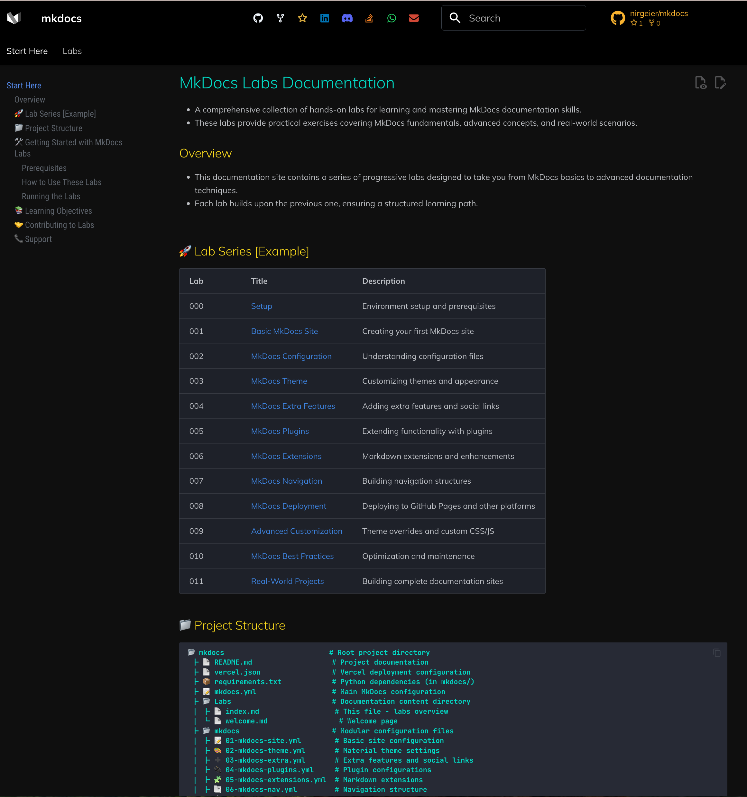

# MkDocs Template Project

- A comprehensive and feature-rich MkDocs template designed for creating beautiful documentation sites with GitHub Pages integration.
- This template provides a modular configuration system, automated setup scripts, and a professional Material Design theme.
- The template is based on the Material for MkDocs theme.

## Demo

[Live Demo](https://nirgeier.github.io/mkdocs/)



---


## 🚀 Features

| Feature                   | Description                                                               |
| ------------------------- | ------------------------------------------------------------------------- |
| **Material Design Theme** | Modern, responsive design with dark/light mode toggle                     |
| **Modular Configuration** | Organized configuration files for easy customization                      |
| **Automated Setup**       | Intelligent initialization script that detects Git repository information |
| **GitHub Integration**    | Pre-configured for GitHub Pages deployment                                |
| **Rich Plugin Ecosystem** | Includes 20+ useful MkDocs plugins                                        |
| **Advanced Navigation**   | Support for tabs, sections, and table of contents integration             |
| **Code Highlighting**     | Syntax highlighting with copy-to-clipboard functionality                  |
| **Search**                | Enhanced search capabilities with highlighting and suggestions            |
| **Social Integration**    | GitHub buttons and social media links                                     |
| **PDF Export**            | Optional PDF generation for documentation                                 |
| **Git Integration**       | Automatic author attribution and revision dates                           |

## 📁 Project Structure

```text
📂 [project-root]                  # Root project directory
 ┣ 📄 README.md                   # This file - project documentation
 ┣ 📝 mkdocs.yml                  # Generated configuration file
 ┣ 📄 vercel.json                 # Vercel deployment configuration
 ┣ 📂 Labs                        # Your documentation content
 ┃ ┣ 📄 index.md                  # Homepage content
 ┃ ┗ 📄 welcome.md                # Welcome page
 ┣ 📂 mkdocs                      # Modular configuration files
 ┃ ┣ 📝 01-mkdocs-site.yml        # Basic site configuration
 ┃ ┣ 🎨 02-mkdocs-theme.yml       # Material theme settings
 ┃ ┣ ➕ 03-mkdocs-extra.yml       # Extra features and social links
 ┃ ┣ 🔌 04-mkdocs-plugins.yml     # Plugin configurations
 ┃ ┣ 🧩 05-mkdocs-extensions.yml  # Markdown extensions
 ┃ ┣ 📑 06-mkdocs-nav.yml         # Navigation structure
 ┃ ┣ 📦 requirements.txt          # Python dependencies
 ┃ ┣ 📂 overrides                 # Theme customizations
 ┃ ┃ ┣ 🏠 home.html               # Custom homepage
 ┃ ┃ ┣ 📂 assets                  # Static assets
 ┃ ┃ ┣ 📂 partials                # Custom partial templates
 ┃ ┃ ┗ 📂 stylesheets             # Custom stylesheets
 ┃ ┗ 📂 scripts                   # Utility scripts
 ┃   ┣ 🧭 build_nav.sh            # Dynamic navigation builder
 ┃   ┣ 🏗️ build-multiarch.sh      # Multi-architecture build script
 ┃   ┣ ⚙️ init_site.sh            # Automated setup script
 ┃   ┗ ⚙️ init_vercel.sh          # Vercel deployment initializer
 ┗ 📂 mkdocs-site                 # Built documentation site (generated)
   ┣ 📄 index.html                # Main site files
   ┣ 📂 assets                    # Compiled assets
   ┣ 📂 search                    # Search index
   ┗ 📂 welcome                   # Welcome page
```

## 🛠️ Quick Start

### Prerequisites

- Python 3.8 or higher
- Git repository with remote origin configured
- (Optional) Virtual environment tool

### Option 1: Automated Setup (Recommended)

1. **Clone or download this template to your project directory**

2. **Navigate to your project directory**

   ```bash
   cd your-project-directory
   ```

3. **Run the automated setup script**

   ```bash
   ./mkdocs/scripts/init_site.sh
   ```

The script will automatically:

- Detect your GitHub repository information
- Generate appropriate URLs for GitHub Pages
- Set up a Python virtual environment
- Install all required dependencies
- **Build dynamic navigation** based on your content structure
- Build and serve your documentation site

### Option 2: Manual Setup

1. **Create and activate a virtual environment**

   ```bash
   python3 -m venv .venv
   source .venv/bin/activate  # On Windows: .venv\Scripts\activate
   ```

2. **Install dependencies**

   ```bash
   uv pip install -r mkdocs/requirements.txt
   ```

3. **Configure your site**

   - Edit the configuration files in the `mkdocs/` directory
   - Update repository URLs, site name, and other settings

4. **Build the final configuration**

   ```bash
   cat mkdocs/*.yml > mkdocs.yml
   ```

5. **Serve your documentation**

   ```bash
   mkdocs serve
   ```

## ⚙️ Configuration

### Modular Configuration System

This template uses a modular approach to configuration, splitting MkDocs settings across multiple files:

#### 1. Site Configuration (`01-mkdocs-site.yml`)

- Site name and URL
- Repository information
- Basic site metadata

#### 2. Theme Configuration (`02-mkdocs-theme.yml`)

- Material theme settings
- Color schemes (light/dark mode)
- Navigation features
- Fonts and icons

#### 3. Extra Features (`03-mkdocs-extra.yml`)

- Social media links
- GitHub integration
- Custom CSS and JavaScript

#### 4. Plugins (`04-mkdocs-plugins.yml`)

- Search functionality
- Git integration (authors, revision dates)
- PDF export capabilities
- Site optimization

#### 5. Markdown Extensions (`05-mkdocs-extensions.yml`)

- Code highlighting
- Admonitions (callouts)
- Tables and lists
- Mermaid diagrams

#### 6. Navigation (`06-mkdocs-nav.yml`)

- Site navigation structure
- Page organization

### Customization

To customize your site:

1. **Update basic information** in `mkdocs/01-mkdocs-site.yml`:

   ```yaml
   site_name: Your Site Name
   site_description: Your site description
   site_author: Your Name
   ```

2. **Modify theme colors** in `mkdocs/02-mkdocs-theme.yml`:

   ```yaml
   theme:
     palette:
       primary: indigo  # Change to your preferred color
   ```

3. **Add your content** in the `Labs/` directory:

   - Create Markdown files for your documentation
   - Add images and assets to `Labs/assets/`
   - Update navigation in `mkdocs/06-mkdocs-nav.yml`

## 🚀 Deployment

### GitHub Pages (Automatic)

1. **Push your repository to GitHub**

2. **Enable GitHub Pages** in your repository settings:
   - Go to Settings → Pages
   - Select "GitHub Actions" as the source

3. **Create a deployment workflow** (`.github/workflows/deploy.yml`):

   ```yaml
   name: Deploy MkDocs to GitHub Pages

   on:
     push:
       branches: [ main ]

   jobs:
     deploy:
       runs-on: ubuntu-latest
       steps:
       - uses: actions/checkout@v5
       - uses: actions/setup-python@v4
         with:
           python-version: 3.x
       - run: uv pip install -r requirements.txt
       - run: cat mkdocs/*.yml > mkdocs.yml
       - run: mkdocs gh-deploy --force
   ```

### Manual Deployment

```bash
# Build and deploy to GitHub Pages
mkdocs gh-deploy

# Build for other hosting providers
mkdocs build
# Upload contents of mkdocs-site/ to your hosting provider
```

### Vercel Deployment (Automatic)

1. **Install Vercel CLI** (if not already installed)

   ```bash
   npm install -g vercel
   ```

2. **Login to Vercel**

   ```bash
   vercel login
   ```

3. **Run the Vercel initialization script**

   ```bash
   ./mkdocs/scripts/init_vercel.sh
   ```

   Or manually:

   ```bash
   vercel --prod
   ```

The `vercel.json` configuration file is already set up for automatic builds on Vercel.

## 🔧 Advanced Usage

### Setup Script Options

The `init_site.sh` script supports several options:

```bash
./mkdocs/scripts/init_site.sh --help           # Show help
./mkdocs/scripts/init_site.sh --no-serve       # Build but don't start server
./mkdocs/scripts/init_site.sh --clean          # Clean build directory first
./mkdocs/scripts/init_site.sh --verbose        # Enable verbose output
```

### Environment Variables

Create a `.env` file to override default settings:

```bash
REPO_OWNER=your-username
REPO_NAME=your-repo-name
SITE_URL=https://your-custom-domain.com
```

## 🧭 Dynamic Navigation Builder

This template includes a powerful navigation builder script (`build_nav.sh`) that automatically generates navigation structure based on your content.

### Features

- **Automatic Discovery**: Scans the `Labs/` directory for Markdown files and folders
- **Smart Titles**: Extracts titles from file headers or generates them from filenames
- **Multiple Sort Options**: Alphabetical, numeric, or date-based sorting
- **Draft Support**: Option to include or exclude draft files (starting with `_`)
- **Hierarchical Structure**: Maintains directory structure in navigation
- **YAML Validation**: Ensures generated navigation is valid

### Usage

```bash
# Generate navigation with default settings
./mkdocs/scripts/build_nav.sh

# Preview what would be generated
./mkdocs/scripts/build_nav.sh --dry-run

# Sort using numeric prefixes (01-, 02-, etc.)
./mkdocs/scripts/build_nav.sh --sort numeric

# Include draft files
./mkdocs/scripts/build_nav.sh --include-drafts

# Show all available options
./mkdocs/scripts/build_nav.sh --help
```

### Integration

The navigation builder is automatically called by `init_site.sh`, but you can run it manually anytime to update your navigation based on new content.

### Plugin Configuration

Enable/disable plugins by editing `mkdocs/04-mkdocs-plugins.yml`:

```yaml
plugins:
  - search                    # Enable search
  - git-authors              # Show page authors
  # - pdf-export             # Uncomment to enable PDF export
```

## 📚 Included Plugins

This template includes the following MkDocs plugins:

- **awesome-pages**: Simplified navigation
- **git-authors**: Author attribution from Git
- **git-revision-date-localized**: Last modified dates
- **search**: Enhanced search functionality
- **minify**: Optimize HTML/CSS/JS
- **print-site**: Print-friendly pages
- **section-index**: Section landing pages

## 🎨 Theme Features

- **Responsive Design**: Works on all devices
- **Dark/Light Mode**: Automatic and manual toggle
- **Navigation**: Tabs, sections, and instant loading
- **Code Blocks**: Syntax highlighting with copy button
- **Admonitions**: Info boxes, warnings, and tips
- **Search**: Fast client-side search
- **Social Integration**: GitHub stars and forks
- **Customizable**: Easy color and font changes

## 🤝 Contributing

1. Fork this repository
2. Create your feature branch (`git checkout -b feature/amazing-feature`)
3. Commit your changes (`git commit -m 'Add amazing feature'`)
4. Push to the branch (`git push origin feature/amazing-feature`)
5. Open a Pull Request

## 📄 License

This project is licensed under the MIT License - see the [LICENSE](LICENSE) file for details.

## 🙏 Acknowledgments

- [MkDocs](https://www.mkdocs.org/) - Fast, simple static site generator
- [Material for MkDocs](https://squidfunk.github.io/mkdocs-material/) - Beautiful Material Design theme
- [PyMdown Extensions](https://facelessuser.github.io/pymdown-extensions/) - Markdown extensions
- All the amazing plugin authors who make MkDocs extensible

## 📞 Support

If you encounter any issues or have questions:

1. Check the [MkDocs documentation](https://www.mkdocs.org/)
2. Review the [Material theme documentation](https://squidfunk.github.io/mkdocs-material/)
3. Open an issue in this repository
4. Check existing issues for solutions

---

**Happy documenting!** 📖✨
