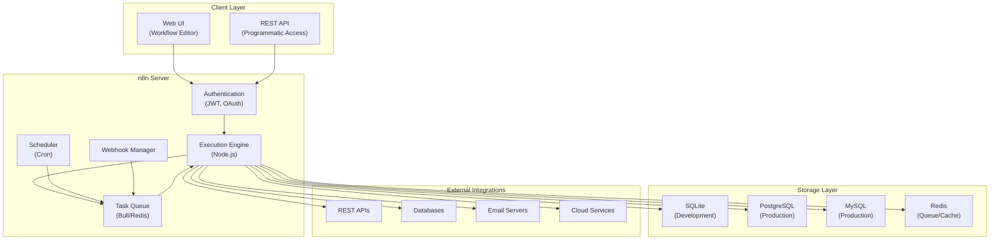
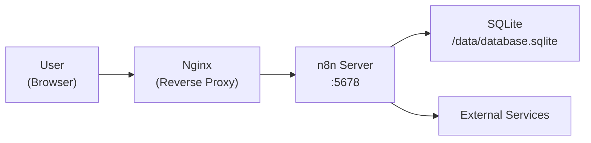
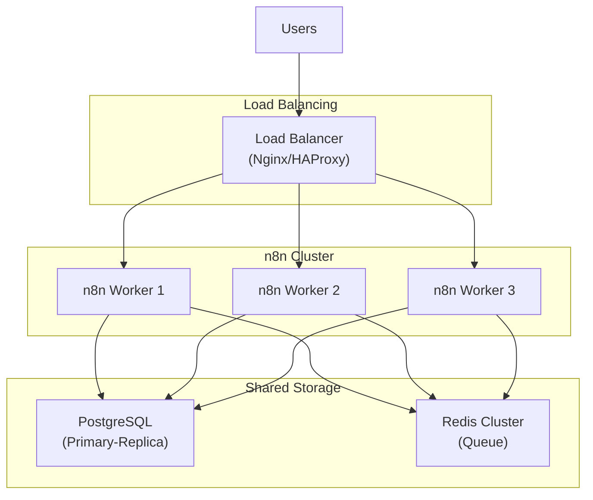

# Installation & Architecture

## Overview

- Master n8n installation across Docker, self-hosted, and cloud environments
- Understand the complete n8n architecture and component interactions
- Configure security, environment variables, and database connections
- Deploy multiple n8n instances with different orchestration strategies
- Learn architectural best practices for production environments

## Prerequisites

- Docker and Docker Compose installed on macOS/Linux or WSL2 on Windows
- Basic understanding of terminals and command-line interfaces
- 2GB+ available disk space for Docker images
- A code editor (VS Code recommended)
- Knowledge of JSON and basic YAML syntax

## Learning Objectives

1. Understand n8n's core architecture: web UI, execution engine, database, and task queue
2. Install n8n using Docker Compose with persistent storage and networking
3. Configure environment variables, authentication, and security settings
4. Connect n8n to external databases (PostgreSQL, MySQL) for workflow storage
5. Implement multiple n8n instances with load balancing and failover
6. Understand deployment options: self-hosted, cloud, and hybrid architectures
7. Configure logging, monitoring, and error tracking for production
8. Set up automated backups and disaster recovery procedures

## Background

## N8n Architecture Overview



## Deployment Topologies

#### Single Instance (Development)



#### Production High Availability



## Key Components Explained

| Component            | Purpose                                              | Notes                                            |
| -------------------- | ---------------------------------------------------- | ------------------------------------------------ |
| **Web UI**           | Visual workflow builder and management               | Runs on port 5678 by default                     |
| **Execution Engine** | Processes workflow nodes sequentially or in parallel | Multi-threaded, handles retries                  |
| **Task Queue**       | Manages workflow execution order and concurrency     | Uses Bull library, requires Redis for clustering |
| **Database**         | Persists workflows, credentials, execution history   | SQLite for dev, PostgreSQL/MySQL for production  |
| **Scheduler**        | Triggers workflows on schedule (cron expressions)    | Built on node-cron                               |
| **Webhook Manager**  | Handles HTTP trigger events and external webhooks    | Stateless, scales horizontally                   |

---

## Lab Exercises

## Exercise 1: Docker Installation - Single Instance

**Objective:** Install n8n using Docker with persistent storage.

**Steps:**

1. Create project directory:

```bash
mkdir n8n-lab && cd n8n-lab
```

2. Create `docker-compose.yml`:

```yaml
version: "3.8"

services:
  n8n:
    image: n8nio/n8n:latest
    container_name: n8n
    restart: always
    ports:
      - "5678:5678"
    environment:
      - N8N_HOST=localhost
      - N8N_PORT=5678
      - N8N_PROTOCOL=http
      - NODE_ENV=production
      - GENERIC_TIMEZONE=America/New_York
    volumes:
      - n8n_data:/home/node/.n8n
    networks:
      - n8n_network

volumes:
  n8n_data:

networks:
  n8n_network:
    driver: bridge
```

3. Start container:

```bash
docker-compose up -d
```

4. Verify installation: `http://localhost:5678`

5. Create initial admin user

**Expected Result:** n8n running with persistent storage

---

## Exercise 2: PostgreSQL Integration for Production

**Objective:** Configure n8n to use PostgreSQL instead of SQLite.

**Steps:**

1. Update `docker-compose.yml`:

```yaml
version: "3.8"

services:
  postgres:
    image: postgres:15-alpine
    container_name: n8n_postgres
    restart: always
    environment:
      POSTGRES_DB: n8n
      POSTGRES_USER: n8n_user
      POSTGRES_PASSWORD: ${DB_PASSWORD:-SecurePassword123!}
    volumes:
      - postgres_data:/var/lib/postgresql/data
    networks:
      - n8n_network
    ports:
      - "5432:5432"

  n8n:
    image: n8nio/n8n:latest
    container_name: n8n
    restart: always
    ports:
      - "5678:5678"
    environment:
      - N8N_HOST=0.0.0.0
      - N8N_PORT=5678
      - DB_TYPE=postgresdb
      - DB_POSTGRESDB_HOST=postgres
      - DB_POSTGRESDB_PORT=5432
      - DB_POSTGRESDB_DATABASE=n8n
      - DB_POSTGRESDB_USER=n8n_user
      - DB_POSTGRESDB_PASSWORD=${DB_PASSWORD:-SecurePassword123!}
      - GENERIC_TIMEZONE=America/New_York
      - N8N_SECURE_COOKIE=true
    volumes:
      - n8n_data:/home/node/.n8n
    depends_on:
      - postgres
    networks:
      - n8n_network

volumes:
  postgres_data:
  n8n_data:

networks:
  n8n_network:
    driver: bridge
```

2. Create `.env`:

```bash
DB_PASSWORD=YourSecurePassword123!
```

3. Deploy:

```bash
docker-compose down && docker-compose up -d
```

4. Verify PostgreSQL connection in Settings

**Expected Result:** n8n uses PostgreSQL for data persistence

---

## Exercise 3: Environment Variables and Security

**Objective:** Configure production-grade security settings.

**Steps:**

1. Create comprehensive `.env`:

```bash
# Core Configuration
N8N_HOST=localhost
N8N_PORT=5678
N8N_PROTOCOL=https
NODE_ENV=production
GENERIC_TIMEZONE=America/New_York

# Database
DB_TYPE=postgresdb
DB_POSTGRESDB_HOST=postgres
DB_POSTGRESDB_PORT=5432
DB_POSTGRESDB_DATABASE=n8n_prod
DB_POSTGRESDB_USER=n8n
DB_POSTGRESDB_PASSWORD=ComplexPassword123!@#

# Security
N8N_SECURE_COOKIE=true
N8N_JWT_AUTH_EXPIRED=7d
N8N_SESSION_SECRET=$(openssl rand -hex 32)
ENCRYPTION_KEY=$(openssl rand -hex 32)

# Execution
EXECUTIONS_PROCESS=main
N8N_EXECUTION_MODE=queue
QUEUE_TYPE=redis
QUEUE_HOST=redis
QUEUE_PORT=6379
```

2. Generate secure keys:

```bash
echo "N8N_SESSION_SECRET=$(openssl rand -hex 32)" >> .env
echo "ENCRYPTION_KEY=$(openssl rand -hex 32)" >> .env
```

3. Update docker-compose to use `.env`

4. Restart: `docker-compose restart n8n`

5. Verify: `docker-compose exec n8n n8n info`

**Expected Result:** Production security settings activated

---

## Exercise 4: Multi-Worker Cluster with Redis

**Objective:** Set up scalable architecture with task queuing.

**Steps:**

1. Create `docker-compose-cluster.yml`:

```yaml
version: "3.8"

services:
  postgres:
    image: postgres:15-alpine
    environment:
      POSTGRES_DB: n8n
      POSTGRES_USER: n8n_user
      POSTGRES_PASSWORD: SecurePass123
    volumes:
      - postgres_data:/var/lib/postgresql/data
    networks:
      - n8n_network

  redis:
    image: redis:7-alpine
    restart: always
    ports:
      - "6379:6379"
    volumes:
      - redis_data:/data
    networks:
      - n8n_network

  n8n_main:
    image: n8nio/n8n:latest
    restart: always
    ports:
      - "5678:5678"
    environment: N8N_HOST=0.0.0.0
      N8N_PORT=5678
      NODE_ENV=production
      DB_TYPE=postgresdb
      DB_POSTGRESDB_HOST=postgres
      DB_POSTGRESDB_DATABASE=n8n
      DB_POSTGRESDB_USER=n8n_user
      DB_POSTGRESDB_PASSWORD=SecurePass123
      N8N_EXECUTION_MODE=queue
      QUEUE_TYPE=redis
      QUEUE_HOST=redis
      QUEUE_PORT=6379
    depends_on:
      - postgres
      - redis
    networks:
      - n8n_network

  n8n_worker_1:
    image: n8nio/n8n:latest
    restart: always
    environment: N8N_HOST=0.0.0.0
      NODE_ENV=production
      DB_TYPE=postgresdb
      DB_POSTGRESDB_HOST=postgres
      DB_POSTGRESDB_DATABASE=n8n
      DB_POSTGRESDB_USER=n8n_user
      DB_POSTGRESDB_PASSWORD=SecurePass123
      N8N_EXECUTION_MODE=queue
      QUEUE_TYPE=redis
      QUEUE_HOST=redis
      QUEUE_PORT=6379
    depends_on:
      - postgres
      - redis
    networks:
      - n8n_network
    command: n8n start-worker --concurrency=5

  n8n_worker_2:
    image: n8nio/n8n:latest
    restart: always
    environment: N8N_HOST=0.0.0.0
      NODE_ENV=production
      DB_TYPE=postgresdb
      DB_POSTGRESDB_HOST=postgres
      DB_POSTGRESDB_DATABASE=n8n
      DB_POSTGRESDB_USER=n8n_user
      DB_POSTGRESDB_PASSWORD=SecurePass123
      N8N_EXECUTION_MODE=queue
      QUEUE_TYPE=redis
      QUEUE_HOST=redis
      QUEUE_PORT=6379
    depends_on:
      - postgres
      - redis
    networks:
      - n8n_network
    command: n8n start-worker --concurrency=5

volumes:
  postgres_data:
  redis_data:

networks:
  n8n_network:
    driver: bridge
```

2. Deploy: `docker-compose -f docker-compose-cluster.yml up -d`

3. Monitor: `docker-compose exec redis redis-cli MONITOR`

4. Scale workers:

```bash
docker-compose -f docker-compose-cluster.yml up -d --scale n8n_worker_1=3
```

**Expected Result:** Multiple workers processing workflows concurrently

---

## Exercise 5: SSL/TLS with Nginx Reverse Proxy

**Objective:** Secure n8n with HTTPS.

**Steps:**

1. Create `nginx.conf`:

```nginx
upstream n8n {
    server n8n:5678;
}

server {
    listen 80;
    server_name n8n.example.com;
    return 301 https://$server_name$request_uri;
}

server {
    listen 443 ssl http2;
    server_name n8n.example.com;

    ssl_certificate /etc/nginx/certs/cert.pem;
    ssl_certificate_key /etc/nginx/certs/key.pem;
    ssl_protocols TLSv1.2 TLSv1.3;
    ssl_ciphers HIGH:!aNULL:!MD5;
    ssl_prefer_server_ciphers on;

    client_max_body_size 50M;

    location / {
        proxy_pass http://n8n;
        proxy_http_version 1.1;
        proxy_set_header Upgrade $http_upgrade;
        proxy_set_header Connection "upgrade";
        proxy_set_header Host $host;
        proxy_set_header X-Real-IP $remote_addr;
        proxy_set_header X-Forwarded-For $proxy_add_x_forwarded_for;
        proxy_set_header X-Forwarded-Proto $scheme;
    }
}
```

2. Add to `docker-compose.yml`:

```yaml
services:
  nginx:
    image: nginx:alpine
    restart: always
    ports:
      - "80:80"
      - "443:443"
    volumes:
      - ./nginx.conf:/etc/nginx/conf.d/default.conf
      - ./certs:/etc/nginx/certs
    depends_on:
      - n8n
    networks:
      - n8n_network
```

3. Generate certificate:

```bash
mkdir -p certs
openssl req -x509 -newkey rsa:4096 -nodes -out certs/cert.pem -keyout certs/key.pem -days 365
```

4. Deploy: `docker-compose up -d`

**Expected Result:** n8n accessible via HTTPS

---

## Exercise 6: Backup and Recovery

**Objective:** Implement automated backups.

**Steps:**

1. Create `backup.sh`:

```bash
#!/bin/bash
BACKUP_DIR="./backups"
TIMESTAMP=$(date +%Y%m%d_%H%M%S)
DB_CONTAINER="n8n_postgres"

mkdir -p $BACKUP_DIR

# Backup database
docker exec $DB_CONTAINER pg_dump -U n8n_user n8n | gzip > $BACKUP_DIR/n8n_db_${TIMESTAMP}.sql.gz

# Backup data directory
docker run --rm -v n8n_data:/data -v $(pwd)/$BACKUP_DIR:/backup alpine tar czf /backup/n8n_data_${TIMESTAMP}.tar.gz -C /data .

echo "Backup completed: $BACKUP_DIR/n8n_db_${TIMESTAMP}.sql.gz"
```

2. Create `restore.sh`:

```bash
#!/bin/bash
BACKUP_FILE=$1
DB_CONTAINER="n8n_postgres"

if [ -z "$BACKUP_FILE" ]; then
    echo "Usage: ./restore.sh <backup_file>"
    exit 1
fi

gunzip < $BACKUP_FILE | docker exec -i $DB_CONTAINER psql -U n8n_user -d n8n
echo "Restore completed"
```

3. Make executable:

```bash
chmod +x backup.sh restore.sh
```

4. Schedule backups:

```bash
crontab -e
# Add: 0 2 * * * /path/to/backup.sh
```

**Expected Result:** Daily automated backups

---

## Exercise 7: Monitoring with Prometheus and Grafana

**Objective:** Set up observability stack.

**Steps:**

1. Create `docker-compose-monitoring.yml`:

```yaml
version: "3.8"

services:
  prometheus:
    image: prom/prometheus:latest
    volumes:
      - ./prometheus.yml:/etc/prometheus/prometheus.yml
      - prometheus_data:/prometheus
    command:
      - "--config.file=/etc/prometheus/prometheus.yml"
    ports:
      - "9090:9090"
    networks:
      - n8n_network

  grafana:
    image: grafana/grafana:latest
    environment: GF_SECURITY_ADMIN_PASSWORD=admin
    ports:
      - "3000:3000"
    volumes:
      - grafana_data:/var/lib/grafana
    networks:
      - n8n_network

volumes:
  prometheus_data:
  grafana_data:

networks:
  n8n_network:
    driver: bridge
```

2. Create `prometheus.yml`:

```yaml
global:
  scrape_interval: 15s

scrape_configs:
  - job_name: "n8n"
    static_configs:
      - targets: ["localhost:5678"]
```

3. Deploy: `docker-compose -f docker-compose-monitoring.yml up -d`

4. Access Grafana: `http://localhost:3000` (admin/admin)

**Expected Result:** Monitoring dashboard operational

---

## Exercise 8: Kubernetes Deployment (Optional)

**Objective:** Deploy on Kubernetes for enterprise scaling.

**Steps:**

1. Create `n8n-deployment.yaml`:

```yaml
apiVersion: apps/v1
kind: Deployment
metadata:
  name: n8n
  namespace: n8n
spec:
  replicas: 1
  selector:
    matchLabels:
      app: n8n
  template:
    metadata:
      labels:
        app: n8n
    spec:
      containers:
        - name: n8n
          image: n8nio/n8n:latest
          ports:
            - containerPort: 5678
          resources:
            requests:
              memory: "512Mi"
              cpu: "250m"
            limits:
              memory: "2Gi"
              cpu: "1000m"
```

2. Deploy:

```bash
kubectl create namespace n8n
kubectl apply -f n8n-deployment.yaml
```

3. Port forward: `kubectl port-forward svc/n8n 5678:80 -n n8n`

**Expected Result:** n8n running on Kubernetes

---

## Lab Tasks

## Task 1: Elcon Supplier Database Setup

**Objective:** Complete production n8n environment for supplier management.

**Requirements:**

- PostgreSQL with supplier schema
- n8n with production security
- Encrypted credentials
- All 10+ environment variables configured
- SSL/TLS enabled
- Backup script tested and scheduled

**Acceptance Criteria:**

- ✅ PostgreSQL initialized with n8n schema
- ✅ n8n accessing database with encryption
- ✅ All environment variables configured
- ✅ SSL/TLS functional
- ✅ Backup script tested

---

## Task 2: High Availability Cluster Deployment

**Objective:** Production-grade cluster setup with failover.

**Requirements:**

- 3 n8n worker instances
- Redis queue distribution
- Load balancer (Nginx)
- Monitoring dashboard
- Scaling documentation

**Acceptance Criteria:**

- ✅ All workers healthy and connected
- ✅ Workflows executing across workers
- ✅ Load balancer operational
- ✅ Monitoring dashboard active
- ✅ Scaling procedures documented

---

## Task 3: Security Hardening

**Objective:** Implement production security practices.

**Requirements:**

- SSL/TLS with valid certificates
- RBAC configuration
- Audit logging
- Credential encryption at rest
- Network segmentation

**Acceptance Criteria:**

- ✅ HTTPS working properly
- ✅ User roles configured
- ✅ Credentials encrypted
- ✅ Audit logs active
- ✅ Security checklist completed

---

## Summary

## Key Takeaways

- n8n architecture: Web UI, Execution Engine, Storage, External Integrations
- Deployment options: Single instance → Cluster → Enterprise Kubernetes
- Production deployments require PostgreSQL, Redis, SSL/TLS, and monitoring
- Scalability through workers and task queues
- Security: encryption, authentication, RBAC, audit logging

## Checklist

- [ ] Single Docker instance running (Exercise 1)
- [ ] PostgreSQL configured (Exercise 2)
- [ ] Security settings applied (Exercise 3)
- [ ] Multi-worker cluster deployed (Exercise 4)
- [ ] Nginx reverse proxy with SSL/TLS (Exercise 5)
- [ ] Backups automated (Exercise 6)
- [ ] Prometheus/Grafana monitoring (Exercise 7)
- [ ] (Optional) Kubernetes deployment (Exercise 8)
- [ ] Supplier database setup completed (Task 1)
- [ ] High availability cluster deployed (Task 2)
- [ ] Security hardening finished (Task 3)
- [ ] Production runbooks documented
- [ ] Team trained on procedures

---

## Additional Resources

- **n8n Official Docs:** https://docs.n8n.io/
- **Docker Best Practices:** https://docs.docker.com/develop/dev-best-practices/
- **PostgreSQL Deployment:** https://www.postgresql.org/docs/current/
- **Kubernetes Documentation:** https://kubernetes.io/docs/
- **SSL/TLS Configuration:** https://certbot.eff.org/
- **Nginx Documentation:** https://nginx.org/en/docs/

Create a simple "Hello World" workflow:

1. Click **+** → Add **Schedule Trigger** (every minute for testing)
2. Add a **Set** node → Set `message` = "Hello from n8n!"
3. Add a **Function** node → Transform the message
4. Click **Execute Workflow** to test

## Step 5 - Important Configuration

```bash
# Environment variables for production
N8N_ENCRYPTION_KEY=       # Required! Encrypts credentials
WEBHOOK_URL=              # External URL for webhooks
N8N_LOG_LEVEL=info        # debug, info, warn, error
N8N_METRICS=true          # Enable Prometheus metrics
EXECUTIONS_DATA_PRUNE=true # Auto-delete old executions
EXECUTIONS_DATA_MAX_AGE=168 # Hours to keep (7 days)
```

---

## Tasks

!!! note "Task 1"
Install n8n using Docker. Verify you can access the UI at `localhost:5678`.

!!! note "Task 2"
Create your first workflow: Schedule → Set → Function → Log. Test it and examine the execution log.

!!! note "Task 3"
Set up the production Docker Compose configuration with PostgreSQL. Restart and verify data persists.

---

## Summary

In this lab you:

- [x] Understood n8n's architecture and components
- [x] Installed n8n with Docker and Docker Compose
- [x] Explored the UI: canvas, nodes, executions, credentials
- [x] Created your first workflow
- [x] Configured production environment variables
