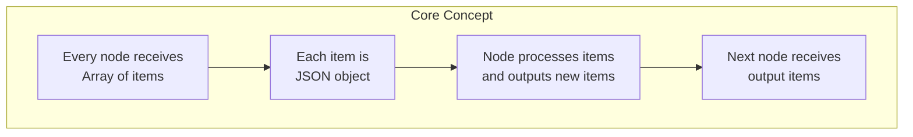
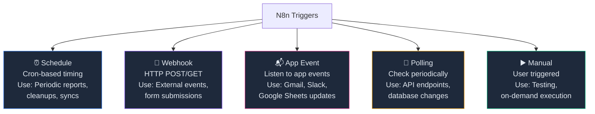

# Triggers & Data Flow

## Overview

- Master all n8n trigger types: schedule, webhook, polling, app events, and manual triggers
- Understand the n8n data flow model: items, fields, and transformations
- Learn expressions, data mapping, and advanced transformation techniques
- Build workflows with multiple trigger types and complex routing logic
- Implement data validation, filtering, and enrichment patterns

## Prerequisites

- n8n running (Lab 001)
- Basic JSON understanding
- Familiarity with cron expressions
- Access to Elcon supplier data examples

## Learning Objectives

1. Understand all n8n trigger types and when to use each
2. Master n8n's items-based data flow model
3. Use expressions and data references to access values across nodes
4. Implement complex data transformations with JavaScript
5. Build workflows with multiple triggers and parallel processing
6. Create branching logic with IF conditions and Switch nodes
7. Handle data validation and error cases
8. Optimize workflows for performance and readability

## Background

## N8n Data Flow Model



## Trigger Types Reference



## Common Cron Expressions

```
Every minute:           */1 * * * *
Every 5 minutes:        */5 * * * *
Every hour:             0 * * * *
Daily at 8 AM:          0 8 * * *
Daily at 8 AM + 6 PM:   0 8,18 * * *
Every Monday 9 AM:      0 9 * * 1
Every weekday 9 AM:     0 9 * * 1-5
First day of month:     0 0 1 * *
Last day of month:      0 0 L * *
```

## Data Flow Example

```json
// Trigger produces items
[
  { "id": 1, "name": "TechParts Ltd", "country": "USA", "rating": 4 },
  { "id": 2, "name": "MechSupply", "country": "Germany", "rating": 5 },
  { "id": 3, "name": "SensorWorld", "country": "China", "rating": 3 }
]

// After transformation
[
  { "id": 1, "display": "TechParts Ltd (USA)", "tier": "Premium", "stars": "⭐⭐⭐⭐" },
  { "id": 2, "display": "MechSupply (Germany)", "tier": "Premium", "stars": "⭐⭐⭐⭐⭐" },
  { "id": 3, "display": "SensorWorld (China)", "tier": "Standard", "stars": "⭐⭐⭐" }
]
```

---

## Lab Exercises

## Exercise 1: Schedule Trigger and Data Extraction

**Objective:** Create a workflow triggered on a schedule that extracts and transforms data.

**Steps:**

1. Create new workflow "Daily Supplier Report"

2. Add Schedule Trigger:
   - Trigger type: Schedule
   - Cron expression: `0 8 * * 1-5` (weekdays at 8 AM)

3. Add Set node:

   ```json
   {
     "report_date": "2024-01-15",
     "suppliers": [
       { "id": 1, "name": "ElectroTech", "orders": 42, "revenue": 180000 },
       { "id": 2, "name": "MechParts", "orders": 35, "revenue": 150000 },
       { "id": 3, "name": "SensorCorp", "orders": 28, "revenue": 125000 }
     ]
   }
   ```

4. Add Code node for transformation:

   ```javascript
   const data = $input.first().json;

   return data.suppliers.map((supplier) => ({
     json: {
       id: supplier.id,
       name: supplier.name,
       orders: supplier.orders,
       revenue: supplier.revenue,
       avg_order_value: Math.round(supplier.revenue / supplier.orders),
       report_date: data.report_date,
       generated_at: new Date().toISOString(),
     },
   }));
   ```

5. Add Set node to add metadata:
   - Add field: `category = "daily_report"`
   - Add field: `status = "pending_review"`

6. Test execution and verify all items processed

**Expected Result:** Schedule trigger runs at specified time, data flows through nodes, each supplier gets calculated metrics

---

## Exercise 2: Webhook Trigger with Validation

**Objective:** Build a webhook that receives PO data, validates it, and returns status.

**Steps:**

1. Add Webhook trigger:
   - Method: POST
   - Path: `/purchase-orders/submit`
   - Response: Auto

2. Add Validation (Code node):

   ```javascript
   const order = $input.first().json;
   const errors = [];

   if (!order.supplier_id) errors.push("supplier_id required");
   if (!order.items || order.items.length === 0) errors.push("items required");
   if (!order.delivery_date) errors.push("delivery_date required");
   if (order.total_amount <= 0) errors.push("total_amount must be positive");

   return [
     {
       json: {
         original_data: order,
         is_valid: errors.length === 0,
         errors: errors,
         validated_at: new Date().toISOString(),
       },
     },
   ];
   ```

3. Add IF node:
   - Condition: `json.is_valid === true`

4. True path - Set node:

   ```json
   {
     "status": "accepted",
     "message": "PO submitted successfully",
     "po_id": "PO-{{ $json.supplier_id }}-{{ Date.now() }}"
   }
   ```

5. False path - Set node:

   ```json
   {
     "status": "rejected",
     "errors": "{{ $json.errors }}"
   }
   ```

6. Add Respond to Webhook node:
   - Response: `{{ $json }}`

7. Test with cURL:
   ```bash
   curl -X POST http://localhost:5678/webhook/purchase-orders/submit \
     -H "Content-Type: application/json" \
     -d '{
       "supplier_id": 1,
       "items": [{"sku": "BOLT-001", "qty": 100}],
       "delivery_date": "2024-02-01",
       "total_amount": 5000
     }'
   ```

**Expected Result:** Webhook validates incoming data and returns appropriate JSON response

---

## Exercise 3: Expressions and Data References

**Objective:** Master n8n expression syntax for data access.

**Steps:**

1. Manual Trigger

2. Set node with sample supplier:

   ```json
   {
     "id": 1,
     "name": "ElectroTech",
     "contacts": [
       { "email": "john@electro.com", "role": "manager" },
       { "email": "sarah@electro.com", "role": "account" }
     ],
     "rating": 4.5,
     "created": "2023-01-15"
   }
   ```

3. Create expression reference table (Code node):

   ```javascript
   return [
     {
       json: {
         expression: "$json.name",
         result: "{{ $json.name }}",
         description: "Access current item field",
       },
     },
     {
       json: {
         expression: "$json.contacts[0].email",
         result: "{{ $json.contacts[0].email }}",
         description: "Access nested array element",
       },
     },
     {
       json: {
         expression: "$json.rating > 4",
         result: "{{ $json.rating > 4 }}",
         description: "Boolean comparison",
       },
     },
     {
       json: {
         expression: "$now.format('YYYY-MM-DD')",
         result: "{{ $now.format('YYYY-MM-DD') }}",
         description: "Current date formatted",
       },
     },
     {
       json: {
         expression: "$input.all().length",
         result: "{{ $input.all().length }}",
         description: "Count of all items",
       },
     },
   ];
   ```

4. Add Set node demonstrating each expression in field mapping

**Expected Result:** Understanding of expression syntax and proper data access patterns

---

## Exercise 4: Complex Data Transformation

**Objective:** Build multi-step data transformation pipeline.

**Steps:**

1. Manual Trigger

2. Set node with raw supplier data:

   ```json
   {
     "suppliers": [
       {
         "id": 1,
         "name": "techparts ltd",
         "country": "us",
         "orders_count": 42,
         "active": true
       },
       {
         "id": 2,
         "name": "MECHSUPPLY GMBH",
         "country": "de",
         "orders_count": 0,
         "active": false
       },
       {
         "id": 3,
         "name": "sensorcorp",
         "country": "cn",
         "orders_count": 156,
         "active": true
       }
     ]
   }
   ```

3. Transformation step 1 (Code - Normalize):

   ```javascript
   const data = $input.first().json;

   return data.suppliers.map((s) => ({
     json: {
       id: s.id,
       name: s.name.trim().toUpperCase(),
       country: s.country.toUpperCase(),
       country_name:
         {
           US: "United States",
           DE: "Germany",
           CN: "China",
         }[s.country.toUpperCase()] || "Unknown",
       orders_count: s.orders_count,
       status: s.active ? "ACTIVE" : "INACTIVE",
     },
   }));
   ```

4. Transformation step 2 (Code - Enrich):

   ```javascript
   return items.map((item) => ({
     json: {
       ...item.json,
       tier:
         item.json.orders_count > 100
           ? "PREMIUM"
           : item.json.orders_count > 0
             ? "STANDARD"
             : "INACTIVE",
       rating_stars: "⭐".repeat(
         Math.min(5, Math.ceil(item.json.orders_count / 40)),
       ),
       last_updated: new Date().toISOString(),
     },
   }));
   ```

5. Filter step (Code - Filter):
   ```javascript
   return items.filter((item) => item.json.status === "ACTIVE");
   ```

**Expected Result:** Data progressively cleaned, enriched, and filtered through pipeline

---

## Exercise 5: Branching Logic with IF and Switch

**Objective:** Route data to different paths based on conditions.

**Steps:**

1. Manual Trigger

2. Set node with supplier list

3. Loop over items (use For Each or Split node)

4. IF node - Primary branching:
   - Condition: `json.tier === "PREMIUM"`

5. True branch (Premium):
   - Set: `priority = "HIGH"`, `review_required = false`

6. False branch (Standard):
   - IF node 2: `json.orders_count === 0`

7. Switch node for multi-way routing:

   ```
   Case 1: tier = "PREMIUM" → Send to expedited path
   Case 2: tier = "STANDARD" → Send to normal path
   Case 3: tier = "INACTIVE" → Send to reactivation path
   ```

8. Each path:
   - Set different fields
   - Route to different database tables

**Expected Result:** Data flows to appropriate paths based on conditions

---

## Exercise 6: Polling Trigger for API Changes

**Objective:** Create workflow that polls an API for changes.

**Steps:**

1. Add Polling Trigger:
   - Node: HTTP Request
   - Method: GET
   - URL: `https://api.example.com/suppliers?updated_since={{ $json.last_check }}`
   - Polling interval: Every 5 minutes

2. Add Code node to track timestamp:

   ```javascript
   const lastCheck = new Date().toISOString();
   return items.map((item, index) => ({
     json: {
       ...item.json,
       batch_number: index + 1,
       fetched_at: lastCheck,
       is_new:
         !item.json.last_updated ||
         new Date(item.json.last_updated) > new Date(lastCheck),
     },
   }));
   ```

3. IF node - Filter only new/changed items

4. Process changed items

**Expected Result:** Workflow polls API regularly and processes new/changed data

---

## Exercise 7: Advanced Data Merging and Splitting

**Objective:** Master complex data operations.

**Steps:**

1. Manual Trigger

2. Set node with multiple data sources:

   ```json
   {
     "suppliers": [...],
     "orders": [...],
     "payments": [...]
   }
   ```

3. Split node - Expand each array:
   - Split: "suppliers" → Multiple items (one per supplier)

4. Merge node pattern:
   - Join with orders: Map supplier_id
   - Join with payments: Match via order

5. Code node for final merge:

   ```javascript
   // Merge multiple inputs into single enriched item
   const supplier = $input.first().json;
   const orders = $input.item(0).json.orders || [];
   const payments = $input.item(0).json.payments || [];

   return [
     {
       json: {
         supplier_id: supplier.id,
         supplier_name: supplier.name,
         total_orders: orders.length,
         total_revenue: payments.reduce((sum, p) => sum + p.amount, 0),
         avg_payment_days: "...", // calculate
       },
     },
   ];
   ```

**Expected Result:** Complex data from multiple sources merged into unified records

---

## Exercise 8: Error Handling in Workflows

**Objective:** Implement robust error handling.

**Steps:**

1. Manual Trigger

2. Try Block (Execute node with error handler)

3. Intentional error point - e.g., Code node:

   ```javascript
   if (!$json.required_field) {
     throw new Error("Missing required field");
   }
   ```

4. Error handling:
   - Add Catch node
   - Log error details
   - Send notification
   - Set fallback value

5. Continue node to resume execution

**Expected Result:** Workflows handle errors gracefully without stopping

---

## Lab Tasks

## Task 1: Multi-Trigger Supplier Monitoring Workflow

**Objective:** Build workflow triggered by multiple events with complex data flow.

**Requirements:**

- Create triggers: Schedule (daily) + Webhook (real-time) + Polling (API changes)
- Merge data from all three sources
- Apply complex filtering and transformation
- Route to different destinations based on data type
- Implement comprehensive error handling

**Acceptance Criteria:**

- ✅ All three triggers configured and tested
- ✅ Data from all sources flows through pipeline
- ✅ Complex transformations applied
- ✅ Routing logic verified with different data inputs
- ✅ Error cases handled gracefully

---

## Task 2: Data Validation and Enrichment Pipeline

**Objective:** Build production-grade data validation and enrichment.

**Requirements:**

- Validate incoming data against schema
- Enrich with lookups from external sources
- Create audit trail of all changes
- Flag suspicious records for review
- Generate validation report

**Acceptance Criteria:**

- ✅ All validation rules working
- ✅ Data enriched from external sources
- ✅ Audit trail populated
- ✅ Suspicious records identified
- ✅ Report generated automatically

---

## Task 3: Real-Time Supplier Status Dashboard Update

**Objective:** Implement real-time dashboard updates via webhooks.

**Requirements:**

- Webhook receives supplier status changes
- Transform and validate data
- Update database and cache
- Trigger dashboard refresh via websocket/webhook
- Maintain history of all changes

**Acceptance Criteria:**

- ✅ Webhook processes status changes
- ✅ Database updated immediately
- ✅ Dashboard reflects changes in < 1 second
- ✅ Change history maintained
- ✅ No data loss in high-volume scenarios

---

## Summary

## Key Takeaways

- Triggers initiate workflows: Schedule, Webhook, App events, Polling, Manual
- Data flows through n8n as arrays of items (item = JSON object)
- Expressions with `{{ }}` access data from previous nodes
- Complex transformations possible with JavaScript Code nodes
- Branching with IF/Switch allows conditional routing
- Error handling with Try/Catch prevents workflow failures
- Multiple triggers can be combined for flexible architectures

## Checklist

- [ ] All trigger types demonstrated (Exercise 1-6)
- [ ] Schedule trigger working with cron expressions (Exercise 1)
- [ ] Webhook endpoint created and tested (Exercise 2)
- [ ] Expression syntax mastered (Exercise 3)
- [ ] Multi-step transformations working (Exercise 4)
- [ ] Conditional branching implemented (Exercise 5)
- [ ] Polling trigger processing API changes (Exercise 6)
- [ ] Complex merging/splitting operations completed (Exercise 7)
- [ ] Error handling in place (Exercise 8)
- [ ] Multi-trigger monitoring workflow built (Task 1)
- [ ] Validation and enrichment pipeline complete (Task 2)
- [ ] Real-time dashboard updates working (Task 3)
- [ ] All workflows tested with production data
- [ ] Documentation updated with examples

---

## Advanced Trigger Patterns

## Idempotent Webhook Processing

```javascript
// Ensure webhook events processed only once
const eventId = $json.event_id;
const processed = await checkDatabase("processed_events", eventId);
if (processed) return [];
await logEvent("processed_events", eventId);
return items;
```

## Distributed Rate Limiting

```javascript
// Implement rate limiting across cluster
const supplier_id = $json.supplier_id;
const key = `rate_limit:${supplier_id}`;
const count = await redis.incr(key);
if (count === 1) await redis.expire(key, 60);
if (count > 100) throw new Error("Rate limit exceeded");
```

## Adaptive Polling Backoff

```javascript
// Increase polling interval if no changes detected
const lastResult = await getLastExecutionData();
const noChanges = lastResult && lastResult.item_count === 0;
const backoff = noChanges ? 10 : 1; // 10 min vs 1 min
```

---

## Additional Resources

- **n8n Expressions:** https://docs.n8n.io/code/expressions/
- **Cron Expressions:** https://crontab.guru/
- **n8n Triggers:** https://docs.n8n.io/workflows/triggers/
- **Data Structure:** https://docs.n8n.io/data/data-structure/
- **Webhook Best Practices:** https://zapier.com/engineering/webhook-guide/
