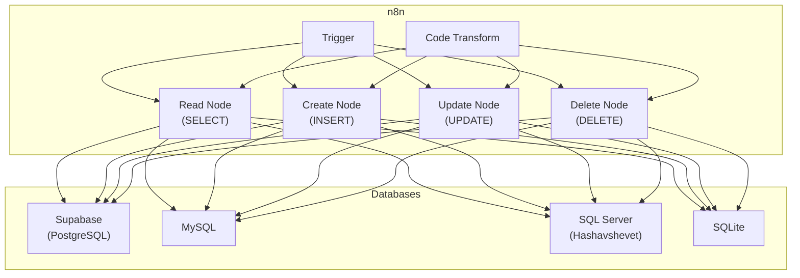
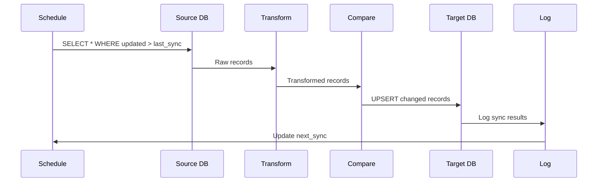

# Database Operations

## Overview

- Connect n8n to multiple database systems (PostgreSQL, MySQL, Supabase, SQL Server)
- Implement all CRUD operations: Create, Read, Update, Delete at scale
- Execute raw SQL queries and stored procedures
- Synchronize data between databases with conflict resolution
- Optimize bulk operations and handle transactions properly

## Prerequisites

- n8n running (Lab 001)
- Supabase account or PostgreSQL database
- Understanding of SQL basics
- Sample Elcon supplier and order databases

## Learning Objectives

1. Connect n8n to PostgreSQL, MySQL, and Supabase with credentials
2. Execute SELECT queries with filtering and pagination
3. Implement INSERT operations with validation
4. Build UPDATE and DELETE workflows with safety checks
5. Execute complex raw SQL with joins and aggregations
6. Implement UPSERT (insert or update) logic
7. Build database-to-database synchronization workflows
8. Handle transactions and bulk operations efficiently

## Background

## Database Connectivity Model



## CRUD Operation Matrix

| Operation  | SQL                  | When to Use     | Use Case                 |
| ---------- | -------------------- | --------------- | ------------------------ |
| **CREATE** | INSERT               | Add new records | New supplier, new order  |
| **READ**   | SELECT               | Fetch data      | Get all active suppliers |
| **UPDATE** | UPDATE               | Modify records  | Change supplier status   |
| **DELETE** | DELETE               | Remove records  | Archive old records      |
| **UPSERT** | INSERT...ON CONFLICT | Add or update   | Sync external data       |

## Data Synchronization Pattern



---

## Lab Exercises

## Exercise 1: Connect to PostgreSQL/Supabase

**Objective:** Establish secure database connection.

**Steps:**

1. In n8n, go to **Credentials** → **New** → Search "PostgreSQL"

2. For Supabase:
   - Host: `your-project.supabase.co`
   - Database: `postgres`
   - User: `postgres` or `your-user`
   - Password: Your database password
   - Port: `5432`
   - SSL: Enable for production

3. For direct PostgreSQL:

   ```
   Host: localhost or IP
   Port: 5432
   Database: elcon_db
   User: elcon_user
   Password: ***
   ```

4. For MySQL:

   ```
   Host: localhost
   Port: 3306
   Database: elcon_db
   User: root
   Password: ***
   ```

5. Test connection in workflow:
   - Add **PostgreSQL** node
   - Query: `SELECT 1 as connection_test`
   - Execute and verify

**Expected Result:** n8n successfully connects to database

---

## Exercise 2: SELECT - Read Operations

**Objective:** Master data retrieval with filtering and pagination.

**Steps:**

1. Create workflow "Get Active Suppliers"

2. Manual trigger

3. PostgreSQL node - Get all active suppliers:

   ```sql
   SELECT
     id,
     name,
     country,
     contact_email,
     rating,
     is_active,
     created_at
   FROM suppliers
   WHERE is_active = true
   ORDER BY rating DESC, name ASC
   LIMIT 100;
   ```

4. Code node to paginate:

   ```javascript
   const page = $json.page || 1;
   const per_page = $json.per_page || 20;
   const offset = (page - 1) * per_page;

   return [
     {
       json: {
         page,
         per_page,
         offset,
         query: `LIMIT ${per_page} OFFSET ${offset}`,
       },
     },
   ];
   ```

5. PostgreSQL node - With pagination:

   ```sql
   SELECT * FROM suppliers
   WHERE is_active = true
   LIMIT {{ $json.per_page }} OFFSET {{ $json.offset }};
   ```

6. Additional queries for common patterns:

   **Count active suppliers:**

   ```sql
   SELECT COUNT(*) as total_active
   FROM suppliers
   WHERE is_active = true;
   ```

   **Group by country:**

   ```sql
   SELECT country, COUNT(*) as supplier_count
   FROM suppliers
   WHERE is_active = true
   GROUP BY country
   ORDER BY supplier_count DESC;
   ```

   **Complex join with orders:**

   ```sql
   SELECT
     s.id,
     s.name,
     COUNT(o.id) as order_count,
     SUM(o.total_amount) as total_revenue,
     MAX(o.order_date) as last_order_date
   FROM suppliers s
   LEFT JOIN purchase_orders o ON s.id = o.supplier_id
   WHERE s.is_active = true
   GROUP BY s.id, s.name
   HAVING COUNT(o.id) > 0
   ORDER BY total_revenue DESC;
   ```

**Expected Result:** Multiple query patterns for data retrieval

---

## Exercise 3: INSERT - Create Operations

**Objective:** Add new records with validation.

**Steps:**

1. Create workflow "Submit New Supplier"

2. Webhook trigger:

   ```json
   {
     "name": "New Supplier Ltd",
     "country": "UK",
     "contact_email": "contact@newsupplier.co.uk",
     "rating": 4,
     "supplier_type": "manufacturer"
   }
   ```

3. Validation (Code node):

   ```javascript
   const data = $input.first().json;
   const errors = [];

   if (!data.name || data.name.trim().length === 0)
     errors.push("name required");
   if (!data.country || data.country.length !== 2)
     errors.push("country must be 2-letter code");
   if (!data.contact_email || !data.contact_email.includes("@"))
     errors.push("invalid email");
   if (data.rating < 1 || data.rating > 5) errors.push("rating must be 1-5");

   return [
     {
       json: {
         ...data,
         is_valid: errors.length === 0,
         validation_errors: errors,
         created_at: new Date().toISOString(),
         is_active: true,
       },
     },
   ];
   ```

4. IF node - Check validity

5. PostgreSQL node (INSERT):

   ```sql
   INSERT INTO suppliers (
     name, country, contact_email, rating, supplier_type, created_at, is_active
   ) VALUES (
     '{{ $json.name }}',
     '{{ $json.country }}',
     '{{ $json.contact_email }}',
     {{ $json.rating }},
     '{{ $json.supplier_type }}',
     '{{ $json.created_at }}',
     {{ $json.is_active }}
   ) RETURNING id, name, created_at;
   ```

6. Set node - Success response

7. Test with:
   ```bash
   curl -X POST http://localhost:5678/webhook/new-supplier \
     -H "Content-Type: application/json" \
     -d '{
       "name": "TechSupply Ltd",
       "country": "DE",
       "contact_email": "info@techsupply.de",
       "rating": 5,
       "supplier_type": "distributor"
     }'
   ```

**Expected Result:** New supplier records created with validation

---

## Exercise 4: UPDATE and DELETE Operations

**Objective:** Modify and remove records safely.

**Steps:**

1. Webhook trigger for update:

   ```json
   {
     "supplier_id": 1,
     "field": "rating",
     "new_value": 3.5
   }
   ```

2. Safety check (Code node):

   ```javascript
   const data = $input.first().json;

   // Verify supplier exists
   const query = `SELECT id FROM suppliers WHERE id = ${data.supplier_id}`;

   return [
     {
       json: {
         ...data,
         action_type: data.new_value === null ? "DELETE" : "UPDATE",
         requires_approval: false,
         approved: true,
       },
     },
   ];
   ```

3. UPDATE operation:

   ```sql
   UPDATE suppliers
   SET
     {{ $json.field }} = '{{ $json.new_value }}',
     updated_at = NOW()
   WHERE id = {{ $json.supplier_id }}
   RETURNING id, {{ $json.field }}, updated_at;
   ```

4. Soft DELETE (update status instead of removing):

   ```sql
   UPDATE suppliers
   SET
     is_active = false,
     deleted_at = NOW()
   WHERE id = {{ $json.supplier_id }}
   RETURNING id, name, deleted_at;
   ```

5. Hard DELETE (only when authorized):

   ```sql
   DELETE FROM suppliers
   WHERE id = {{ $json.supplier_id }}
   RETURNING id, name;
   ```

6. Add audit logging:

   ```javascript
   return [
     {
       json: {
         action: "UPDATE",
         supplier_id: $json.supplier_id,
         field_changed: $json.field,
         old_value: $json.old_value,
         new_value: $json.new_value,
         changed_by: $json.changed_by || "system",
         changed_at: new Date().toISOString(),
       },
     },
   ];
   ```

7. PostgreSQL - Insert audit log:
   ```sql
   INSERT INTO audit_log (action, supplier_id, details)
   VALUES ('{{ $json.action }}', {{ $json.supplier_id }}, '{{ JSON.stringify($json) }}');
   ```

**Expected Result:** Safe update/delete operations with audit trail

---

## Exercise 5: UPSERT - Insert or Update

**Objective:** Implement idempotent insert-or-update pattern.

**Steps:**

1. Scenario: Sync external supplier data (could be new or existing)

2. Prepare data (Code node):

   ```javascript
   return [
     {
       json: {
         external_id: $json.supplier_id,
         name: $json.name,
         country: $json.country,
         rating: $json.rating,
         last_sync: new Date().toISOString(),
       },
     },
   ];
   ```

3. PostgreSQL - UPSERT (Standard pattern):

   ```sql
   INSERT INTO suppliers (external_id, name, country, rating, last_sync)
   VALUES (
     '{{ $json.external_id }}',
     '{{ $json.name }}',
     '{{ $json.country }}',
     {{ $json.rating }},
     '{{ $json.last_sync }}'
   )
   ON CONFLICT (external_id) DO UPDATE SET
     name = EXCLUDED.name,
     country = EXCLUDED.country,
     rating = EXCLUDED.rating,
     last_sync = EXCLUDED.last_sync,
     updated_at = NOW()
   RETURNING id, name, action_type;
   ```

4. Alternative for MySQL (doesn't support ON CONFLICT):
   ```sql
   INSERT INTO suppliers (external_id, name, country, rating, last_sync)
   VALUES (
     '{{ $json.external_id }}',
     '{{ $json.name }}',
     '{{ $json.country }}',
     {{ $json.rating }},
     '{{ $json.last_sync }}'
   )
   ON DUPLICATE KEY UPDATE
     name = VALUES(name),
     country = VALUES(country),
     rating = VALUES(rating),
     last_sync = VALUES(last_sync),
     updated_at = NOW();
   ```

**Expected Result:** UPSERT operations working on both PostgreSQL and MySQL

---

## Exercise 6: Database Synchronization

**Objective:** Build complete data sync workflow.

**Steps:**

1. Schedule Trigger - Every hour:

   ```
   Cron: 0 * * * *
   ```

2. Get last sync timestamp:

   ```sql
   SELECT MAX(synced_at) as last_sync
   FROM sync_log
   WHERE table_name = 'suppliers';
   ```

3. Read from source database (PostgreSQL):

   ```sql
   SELECT *
   FROM suppliers
   WHERE updated_at > '{{ $json.last_sync || '2020-01-01' }}'
   ORDER BY updated_at DESC;
   ```

4. Transform for target (Code node):

   ```javascript
   const items = $input.all();
   return items.map((item, index) => ({
     json: {
       ...item.json,
       sync_batch: $json.batch_id,
       sync_order: index,
       ready_for_insert: true,
     },
   }));
   ```

5. Write to target database (Supabase):
   - Use UPSERT for each item

6. Log sync (PostgreSQL):

   ```sql
   INSERT INTO sync_log (table_name, synced_at, record_count, status)
   VALUES ('suppliers', NOW(), {{ items.length }}, 'completed');
   ```

7. Error handling - If sync fails:
   ```sql
   INSERT INTO sync_log (table_name, synced_at, status, error_message)
   VALUES ('suppliers', NOW(), 'failed', '{{ $error.message }}');
   ```

**Expected Result:** Hourly database synchronization with error logging

---

## Exercise 7: Bulk Operations and Batch Processing

**Objective:** Efficiently handle large datasets.

**Steps:**

1. CSV import scenario - 10,000 supplier records

2. Read CSV file

3. Batch processing (Code node):

   ```javascript
   const batch_size = 100;
   const items = $input.all();
   const batches = [];

   for (let i = 0; i < items.length; i += batch_size) {
     batches.push({
       json: {
         batch_number: Math.floor(i / batch_size) + 1,
         batch_size: Math.min(batch_size, items.length - i),
         items: items.slice(i, i + batch_size),
         total_batches: Math.ceil(items.length / batch_size),
       },
     });
   }

   return batches;
   ```

4. Loop over batches - For each batch:

5. Bulk insert with transactions (PostgreSQL):

   ```sql
   BEGIN TRANSACTION;

   INSERT INTO suppliers (name, country, contact_email, rating)
   VALUES
     ('{{ $json.items[0].name }}', '{{ $json.items[0].country }}', '{{ $json.items[0].contact_email }}', {{ $json.items[0].rating }}),
     ('{{ $json.items[1].name }}', '{{ $json.items[1].country }}', '{{ $json.items[1].contact_email }}', {{ $json.items[1].rating }}),
     ...;

   COMMIT;
   ```

6. Track progress:

   ```javascript
   return [
     {
       json: {
         batch: $json.batch_number,
         total_batches: $json.total_batches,
         progress_percent: Math.round(
           ($json.batch_number / $json.total_batches) * 100,
         ),
         status: "processing",
       },
     },
   ];
   ```

7. Summary report:
   ```sql
   SELECT
     COUNT(*) as total_imported,
     COUNT(CASE WHEN created_at > NOW() - INTERVAL '1 hour' THEN 1 END) as recent,
     COUNT(CASE WHEN is_active THEN 1 END) as active
   FROM suppliers;
   ```

**Expected Result:** Efficient bulk import with transaction handling

---

## Exercise 8: Complex Queries and Aggregations

**Objective:** Advanced SQL patterns for analytics.

**Steps:**

1. Supplier analytics:

   ```sql
   SELECT
     s.id,
     s.name,
     s.country,
     COUNT(DISTINCT o.id) as total_orders,
     COUNT(DISTINCT EXTRACT(YEAR FROM o.order_date)) as years_active,
     SUM(o.total_amount) as lifetime_value,
     AVG(o.total_amount) as avg_order_value,
     MIN(o.order_date) as first_order_date,
     MAX(o.order_date) as last_order_date,
     CASE
       WHEN COUNT(o.id) > 100 THEN 'Platinum'
       WHEN COUNT(o.id) > 50 THEN 'Gold'
       WHEN COUNT(o.id) > 10 THEN 'Silver'
       ELSE 'Bronze'
     END as supplier_tier
   FROM suppliers s
   LEFT JOIN purchase_orders o ON s.id = o.supplier_id
   WHERE s.is_active = true
   GROUP BY s.id, s.name, s.country
   ORDER BY lifetime_value DESC;
   ```

2. Payment analysis:

   ```sql
   SELECT
     s.id,
     s.name,
     COUNT(*) as invoice_count,
     SUM(CASE WHEN p.status = 'paid' THEN 1 ELSE 0 END) as paid_count,
     SUM(CASE WHEN p.status = 'pending' THEN 1 ELSE 0 END) as pending_count,
     AVG(EXTRACT(DAY FROM p.paid_date - p.invoice_date)) as avg_payment_days,
     SUM(p.amount) as total_amount
   FROM suppliers s
   JOIN purchase_orders o ON s.id = o.supplier_id
   JOIN payments p ON o.id = p.order_id
   WHERE EXTRACT(YEAR FROM p.invoice_date) = 2024
   GROUP BY s.id, s.name;
   ```

3. Create views for reuse:

   ```sql
   CREATE VIEW v_supplier_performance AS
   SELECT
     s.id,
     s.name,
     COUNT(o.id) as orders,
     SUM(o.total_amount) as revenue
   FROM suppliers s
   LEFT JOIN purchase_orders o ON s.id = o.supplier_id
   GROUP BY s.id, s.name;
   ```

4. Query the view:
   ```sql
   SELECT * FROM v_supplier_performance
   WHERE revenue > 10000
   ORDER BY revenue DESC;
   ```

**Expected Result:** Complex analytics queries returning insights

---

## Lab Tasks

## Task 1: Elcon Supplier Data Migration

**Objective:** Migrate 50,000 supplier records from legacy system to PostgreSQL.

**Requirements:**

- Export from source system (CSV or API)
- Validate all records against schema
- Handle duplicates and conflicts
- Transform data to match new schema
- Verify data integrity post-migration
- Create audit trail of all migrations

**Acceptance Criteria:**

- ✅ All 50,000 records migrated
- ✅ Zero data loss or corruption
- ✅ Validation passed for all records
- ✅ Migration log created
- ✅ Audit trail complete
- ✅ Performance: < 2 hours for full migration

---

## Task 2: Real-Time Order Sync Between Databases

**Objective:** Implement bidirectional sync between Elcon's primary and backup databases.

**Requirements:**

- Detect changes in real-time
- Bidirectional sync with conflict resolution
- Transaction integrity
- Rollback on failure
- Monitor sync status
- Alert on sync failures

**Acceptance Criteria:**

- ✅ Changes sync within < 5 seconds
- ✅ No data loss or duplication
- ✅ Conflict resolution working
- ✅ Transaction rollback functional
- ✅ Monitoring dashboard updated
- ✅ Alerts triggered on failures

---

## Task 3: Advanced Analytics and Reporting Pipeline

**Objective:** Build daily analytics pipeline for supplier performance.

**Requirements:**

- Execute complex aggregation queries
- Calculate KPIs (order count, revenue, payment terms)
- Generate trend analysis
- Create automated reports
- Store historical data for trending
- Email reports to stakeholders

**Acceptance Criteria:**

- ✅ Analytics queries optimized (< 30 seconds)
- ✅ All KPIs calculated correctly
- ✅ Trend analysis accurate
- ✅ Reports generated daily
- ✅ Email delivery confirmed
- ✅ Historical data maintained

---

## Summary

## Key Takeaways

- n8n connects to PostgreSQL, MySQL, SQL Server, and many other databases
- CRUD operations: SELECT, INSERT, UPDATE, DELETE via dedicated nodes
- UPSERT pattern (INSERT...ON CONFLICT) for idempotent operations
- Raw SQL queries for complex operations, joins, and aggregations
- Bulk operations with batching for large datasets
- Database sync with timestamp tracking and conflict resolution
- Transactions ensure data integrity in critical operations
- Always validate data and maintain audit logs
- Performance optimization: indexes, pagination, batch processing

## Checklist

- [ ] Successfully connected to PostgreSQL (Exercise 1)
- [ ] SELECT queries with filtering and pagination working (Exercise 2)
- [ ] INSERT with validation implemented (Exercise 3)
- [ ] UPDATE and DELETE with audit logging (Exercise 4)
- [ ] UPSERT pattern working (Exercise 5)
- [ ] Database sync workflow complete (Exercise 6)
- [ ] Bulk operations and batching functional (Exercise 7)
- [ ] Complex analytics queries tested (Exercise 8)
- [ ] Supplier migration completed (Task 1)
- [ ] Real-time bidirectional sync operational (Task 2)
- [ ] Analytics and reporting pipeline active (Task 3)
- [ ] All connections use SSL/TLS
- [ ] Backup databases tested
- [ ] Performance optimized for production

---

## Performance Optimization

## Index Optimization

```sql
CREATE INDEX idx_suppliers_active ON suppliers(is_active) WHERE is_active = true;
CREATE INDEX idx_orders_supplier ON purchase_orders(supplier_id, order_date);
CREATE INDEX idx_sync_log ON sync_log(table_name, synced_at DESC);
```

## Connection Pooling

```yaml
# In database credentials
max_connections: 10
connection_timeout: 30s
idle_timeout: 300s
```

## Query Performance

```javascript
// Use EXPLAIN to analyze query
const explain =
  "EXPLAIN ANALYZE SELECT * FROM suppliers WHERE is_active = true";
// Check execution plan for missing indexes
```

---

## Additional Resources

- **PostgreSQL Docs:** https://www.postgresql.org/docs/
- **MySQL Documentation:** https://dev.mysql.com/doc/
- **Supabase Docs:** https://supabase.com/docs
- **n8n Database Nodes:** https://docs.n8n.io/nodes/n8n-nodes-base.PostgreSQL/
- **SQL Tutorial:** https://www.w3schools.com/sql/
- **Database Design:** https://www.postgresql.org/docs/current/ddl.html
