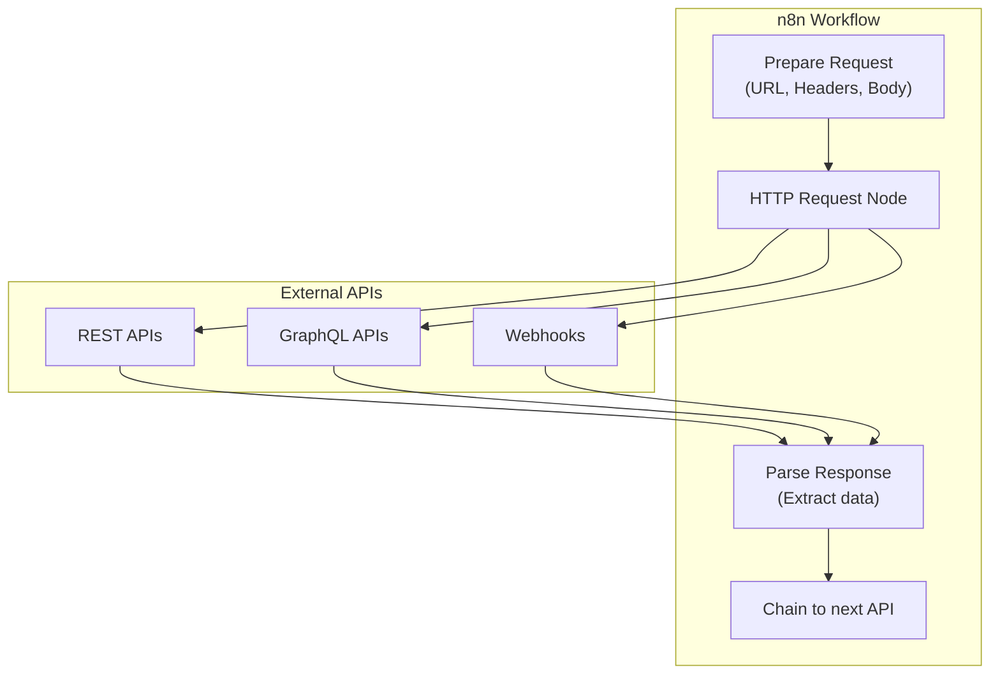
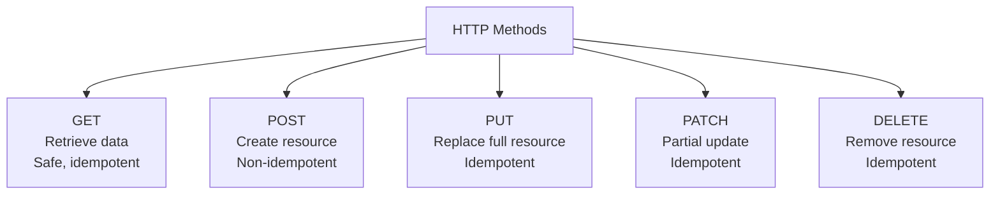

# HTTP APIs & Webhooks

## Overview

- Master the HTTP Request node for integrating with any REST API
- Implement all HTTP methods: GET, POST, PUT, PATCH, DELETE
- Configure authentication: API Keys, Bearer tokens, OAuth, Basic Auth
- Build robust webhook endpoints for receiving and processing external events
- Implement rate limiting, retry logic, and comprehensive error handling
- Chain multiple API calls for complex integration workflows

## Prerequisites

- n8n running (Lab 001)
- API keys for services (Resend, Slack, GitHub, etc.)
- Basic understanding of REST APIs and HTTP methods
- cURL or Postman for testing webhooks

## Learning Objectives

1. Use HTTP Request node for all CRUD operations
2. Configure authentication methods: API Key, Bearer, OAuth, Basic, Digest
3. Handle request headers, query parameters, and request bodies
4. Parse and transform JSON responses
5. Implement rate limiting and retry logic
6. Build scalable webhook endpoints with validation
7. Chain multiple API calls with data passing
8. Handle errors and implement circuit breakers

## Background

## HTTP Request Architecture



## HTTP Methods in Context



## Authentication Methods Comparison

| Method           | Use Case                          | Format                                   |
| ---------------- | --------------------------------- | ---------------------------------------- |
| **API Key**      | Simple APIs, third-party services | Header: `X-API-Key: key123`              |
| **Bearer Token** | OAuth 2.0, JWT tokens             | Header: `Authorization: Bearer token123` |
| **Basic Auth**   | Legacy systems, simple auth       | Header: `Authorization: Basic user:pass` |
| **OAuth 2.0**    | Third-party integrations          | Code flow with tokens                    |
| **Digest Auth**  | Secure HTTP auth                  | Challenge-response mechanism             |
| **Mutual TLS**   | Enterprise security               | Client certificate authentication        |

---

## Lab Exercises

## Exercise 1: GET Requests and Data Retrieval

**Objective:** Fetch data from public APIs and process responses.

**Steps:**

1. Create workflow "Fetch Exchange Rates"

2. Schedule Trigger - Daily at 6 AM:

   ```
   Cron: 0 6 * * *
   ```

3. HTTP Request node - Get rates:
   - Method: GET
   - URL: `https://api.exchangerate-api.com/v4/latest/USD`
   - Headers: (none required for this public API)

4. Code node - Extract and transform:

   ```javascript
   const data = $input.first().json;
   const rates = data.rates;

   return [
     {
       json: {
         base_currency: data.base,
         timestamp: data.time_last_updated,
         important_rates: {
           usd_to_eur: rates.EUR,
           usd_to_gbp: rates.GBP,
           usd_to_ils: rates.ILS,
           usd_to_aed: rates.AED,
         },
         fetched_at: new Date().toISOString(),
       },
     },
   ];
   ```

5. Supabase node - Save rates:

   ```sql
   INSERT INTO exchange_rates (base, rates, fetched_at)
   VALUES ('USD', '{{ JSON.stringify($json.important_rates) }}', NOW())
   ```

6. Slack notification - Alert if rates change > 2%

**Expected Result:** Daily exchange rate fetch with transformation and storage

---

## Exercise 2: POST Requests and Creating Resources

**Objective:** Create resources in external systems via API.

**Steps:**

1. Webhook Trigger:

   ```json
   {
     "supplier_name": "NewTech Ltd",
     "email": "contact@newtech.com",
     "phone": "+1-555-1234"
   }
   ```

2. Validation Code node:

   ```javascript
   const data = $input.first().json;
   const errors = [];

   if (!data.supplier_name) errors.push("supplier_name required");
   if (!data.email || !data.email.includes("@")) errors.push("invalid email");
   if (!data.phone) errors.push("phone required");

   return [
     {
       json: {
         ...data,
         valid: errors.length === 0,
         errors,
       },
     },
   ];
   ```

3. HTTP Request node - Create in CRM:
   - Method: POST
   - URL: `https://api.crm.example.com/v1/suppliers`
   - Authentication: Bearer Token
   - Headers:
     ```
     Content-Type: application/json
     Authorization: Bearer your_api_key
     ```
   - Body:
     ```json
     {
       "name": "{{ $json.supplier_name }}",
       "email": "{{ $json.email }}",
       "phone": "{{ $json.phone }}",
       "created_source": "n8n",
       "metadata": {
         "workflow_id": "supplier_onboarding",
         "created_at": "{{ $now.toISOString() }}"
       }
     }
     ```

4. Extract response:

   ```javascript
   return [
     {
       json: {
         crm_id: $input.first().json.id,
         status: "created",
         sync_timestamp: new Date().toISOString(),
       },
     },
   ];
   ```

5. Respond to Webhook with created resource ID

**Expected Result:** POST requests create resources in external systems

---

## Exercise 3: Authentication Methods Configuration

**Objective:** Implement different authentication strategies.

**Steps:**

1. **API Key Authentication** (Example: Resend Email API):

   ```
   HTTP Request Node:
   - URL: https://api.resend.com/emails
   - Method: POST
   - Authentication: Select "Header Auth"
   - Name: Authorization
   - Value: Bearer your_resend_api_key
   - Body: Email data
   ```

2. **Bearer Token** (Example: Supabase REST API):

   ```
   - URL: https://your-project.supabase.co/rest/v1/suppliers
   - Method: GET
   - Authentication: Bearer Token
   - Token: your_supabase_anon_key
   ```

3. **Basic Authentication** (Example: Legacy ERP):

   ```
   - URL: https://erp.example.com/api/suppliers
   - Method: GET
   - Authentication: Basic Auth
   - Username: erp_user
   - Password: erp_password
   ```

4. **OAuth 2.0** (Example: Google Drive):

   ```
   - Create OAuth credentials in Google Cloud Console
   - In n8n: Credentials → Add → Google
   - Connect account and authorize
   - Use in workflow with OAuth-connected node
   ```

5. **Custom Headers** with multiple fields:
   ```javascript
   // In HTTP Request node → Headers tab
   {
     "Content-Type": "application/json",
     "Authorization": "Bearer {{ $env.API_TOKEN }}",
     "X-Request-ID": "{{ $env.ENVIRONMENT }}-{{ Date.now() }}",
     "X-Idempotency-Key": "{{ $json.request_id }}"
   }
   ```

**Expected Result:** Multiple authentication methods working

---

## Exercise 4: Chaining Multiple API Calls

**Objective:** Create complex workflows with sequential API calls.

**Steps:**

1. Webhook Trigger - PO creation:

   ```json
   { "supplier_id": 123, "items": [...], "total": 5000 }
   ```

2. **Step 1: Get Supplier Details**

   ```
   HTTP GET: https://api.crm.example.com/v1/suppliers/{{ $json.supplier_id }}
   ```

3. **Step 2: Get Pricing**

   ```javascript
   // Calculate total with tax
   const supplier = $input.item(0).json;
   const taxRate = supplier.country === "US" ? 0.08 : 0.16;

   return [
     {
       json: {
         ...supplier,
         po_total: $json.total,
         tax_amount: $json.total * taxRate,
         grand_total: $json.total * (1 + taxRate),
       },
     },
   ];
   ```

4. **Step 3: Create PO in System**

   ```
   HTTP POST: https://api.procurement.com/v1/purchase-orders
   Body: Complete PO data with supplier + pricing
   ```

5. **Step 4: Send Confirmation Email**

   ```
   HTTP POST: https://api.resend.com/emails
   Body: Email with PO details
   ```

6. **Step 5: Update Status**

   ```
   HTTP PATCH: https://api.crm.example.com/v1/suppliers/{{ supplier_id }}
   Body: { "last_po_date": NOW(), "po_count": increment }
   ```

7. **Step 6: Log Event**
   ```
   HTTP POST: https://api.events.example.com/v1/events
   Body: { "event": "po_created", "supplier_id": ..., "timestamp": ... }
   ```

**Expected Result:** Complex multi-step API workflow completing all operations

---

## Exercise 5: Error Handling and Retry Logic

**Objective:** Implement resilient API calls.

**Steps:**

1. HTTP Request node with retry configuration:

   ```
   - URL: https://unreliable-api.example.com/data
   - Retry on Fail: Enable
   - Max Retries: 3
   - Backoff Strategy: Exponential
   - Initial Delay: 1 second
   ```

2. Status code handling (Code node):

   ```javascript
   const response = $input.first().json;
   const statusCode = $input.first().executionStatus?.statusCode;

   if (statusCode === 429) {
     // Rate limit hit
     throw new Error("Rate limited. Retry in 60 seconds.");
   }

   if (statusCode === 503) {
     // Service unavailable
     throw new Error("Service temporarily unavailable. Retry later.");
   }

   if (statusCode >= 500) {
     // Server error
     throw new Error("Server error. Attempting retry...");
   }

   if (statusCode >= 400 && statusCode < 500) {
     // Client error - log but don't retry
     return [
       {
         json: {
           error: true,
           message: response.error || "Client error",
           statusCode,
         },
       },
     ];
   }

   return [{ json: response }];
   ```

3. Try-Catch pattern:

   ```
   TRY block:
   - HTTP Request to primary API

   CATCH block (if primary fails):
   - HTTP Request to backup API
   - If both fail: Send alert + log to error queue
   ```

4. Implement circuit breaker pattern:

   ```javascript
   const redis_key = "api_health:supplier_api";
   const failures = await redis.get(redis_key) || 0;

   if (failures > 5) {
     throw new Error("Circuit breaker open. API unreliable. Using cached data.");
   }

   try {
     const result = await httpRequest(...);
     await redis.set(redis_key, 0); // Reset on success
     return [{ json: result }];
   } catch (error) {
     await redis.incr(redis_key); // Increment failure count
     throw error;
   }
   ```

**Expected Result:** Resilient API calls with retry and error handling

---

## Exercise 6: Webhook Endpoints as APIs

**Objective:** Build complete API for external applications.

**Steps:**

1. Create webhook for creating suppliers:

   ```
   Path: /suppliers
   Method: POST
   ```

2. Create webhook for listing suppliers:

   ```
   Path: /suppliers
   Method: GET
   Query params: page, per_page, filter
   ```

3. Create webhook for updating supplier:

   ```
   Path: /suppliers/:id
   Method: PATCH
   Body: Fields to update
   ```

4. Create webhook for deleting supplier:

   ```
   Path: /suppliers/:id
   Method: DELETE
   ```

5. For each webhook - implement complete workflow:
   - Validate request (method, params, body)
   - Execute database operation
   - Return proper HTTP status:
     ```
     201 Created (POST success)
     200 OK (GET/PATCH success)
     204 No Content (DELETE success)
     400 Bad Request (validation error)
     404 Not Found (resource missing)
     500 Server Error (system error)
     ```

6. Test all endpoints:

   ```bash
   # Create
   curl -X POST http://localhost:5678/webhook/suppliers \
     -H "Content-Type: application/json" \
     -d '{"name": "Test Supplier", ...}'

   # List
   curl -X GET http://localhost:5678/webhook/suppliers?page=1

   # Update
   curl -X PATCH http://localhost:5678/webhook/suppliers/123 \
     -d '{"rating": 5}'

   # Delete
   curl -X DELETE http://localhost:5678/webhook/suppliers/123
   ```

**Expected Result:** Functional REST API backed by n8n

---

## Exercise 7: Rate Limiting and Throttling

**Objective:** Respect API rate limits.

**Steps:**

1. Implement sliding window counter:

   ```javascript
   const api_key = "supplier_api";
   const window_seconds = 60;
   const max_requests = 100;

   const current_time = Math.floor(Date.now() / 1000);
   const redis_key = `rate_limit:${api_key}:${current_time}`;

   const current_count = await redis.incr(redis_key);
   await redis.expire(redis_key, window_seconds);

   if (current_count > max_requests) {
     throw new Error(
       `Rate limit exceeded. ${max_requests} per ${window_seconds}s`,
     );
   }

   return [{ json: { remaining: max_requests - current_count } }];
   ```

2. Implement backoff for 429 responses:

   ```javascript
   const retry_after = response.headers["retry-after"] || 60;
   // Wait and retry automatically
   ```

3. Batch requests to avoid rate limits:

   ```javascript
   const items = $input.all();
   const batch_size = 10;
   const batches = [];

   for (let i = 0; i < items.length; i += batch_size) {
     batches.push({
       json: items.slice(i, i + batch_size),
     });
   }

   return batches;
   ```

**Expected Result:** Rate limiting and throttling working

---

## Exercise 8: GraphQL Integration

**Objective:** Call GraphQL APIs from n8n.

**Steps:**

1. HTTP Request node for GraphQL:

   ```
   Method: POST
   URL: https://api.example.com/graphql
   Body (Raw):
   ```

   ```graphql
   query GetSuppliers {
     suppliers(first: 10, filter: { active: true }) {
       edges {
         node {
           id
           name
           country
           rating
         }
       }
     }
   }
   ```

2. Send variables with query:

   ```javascript
   return [
     {
       json: {
         query: `
         query GetSupplier($id: ID!) {
           supplier(id: $id) {
             id
             name
             email
           }
         }
       `,
         variables: {
           id: $json.supplier_id,
         },
       },
     },
   ];
   ```

3. Parse GraphQL response:

   ```javascript
   const response = $input.first().json;

   if (response.errors) {
     throw new Error(`GraphQL Error: ${response.errors[0].message}`);
   }

   return [
     {
       json: response.data.supplier,
     },
   ];
   ```

**Expected Result:** GraphQL queries working in workflows

---

## Lab Tasks

## Task 1: Elcon Multi-API Integration Hub

**Objective:** Create centralized integration for all external APIs.

**Requirements:**

- Connect to CRM API for supplier data
- Connect to accounting API for payments
- Connect to logistics API for shipments
- Implement all authentication methods
- Centralized error handling and retry logic
- Rate limiting across all APIs
- Monitoring and alerting

**Acceptance Criteria:**

- ✅ All APIs responding correctly
- ✅ Authentication verified
- ✅ Error handling tested
- ✅ Rate limits respected
- ✅ Monitoring dashboard active
- ✅ Alerts working for failures

---

## Task 2: Webhook-Based REST API

**Objective:** Build complete REST API using n8n webhooks.

**Requirements:**

- Implement CRUD endpoints for suppliers
- Implement CRUD for purchase orders
- Implement CRUD for payments
- Authentication with API keys
- Request validation
- Proper HTTP status codes
- API documentation

**Acceptance Criteria:**

- ✅ All endpoints tested and working
- ✅ CRUD operations verified
- ✅ Authentication enforced
- ✅ Validation working
- ✅ Status codes correct
- ✅ Documentation complete

---

## Task 3: Data Synchronization with External ERP

**Objective:** Implement bidirectional sync with external ERP system.

**Requirements:**

- Periodic API calls to ERP
- Transform data for n8n format
- Detect changes and sync
- Handle conflicts
- Rollback on errors
- Comprehensive logging
- Performance optimization

**Acceptance Criteria:**

- ✅ Data syncing in real-time
- ✅ Conflicts resolved correctly
- ✅ Rollback working
- ✅ Logging complete
- ✅ Performance optimized
- ✅ Zero data loss

---

## Summary

## Key Takeaways

- HTTP Request node can call any REST API
- Multiple authentication methods available
- Status code handling and error management critical
- Retry logic and rate limiting essential for reliability
- Webhooks enable n8n to act as an API
- Chain multiple API calls for complex workflows
- Always validate requests and responses
- Implement circuit breakers for resilience

## Checklist

- [ ] GET requests working (Exercise 1)
- [ ] POST requests creating resources (Exercise 2)
- [ ] Multiple auth methods configured (Exercise 3)
- [ ] API chaining completed (Exercise 4)
- [ ] Error handling and retries implemented (Exercise 5)
- [ ] Webhook API endpoints created (Exercise 6)
- [ ] Rate limiting and throttling active (Exercise 7)
- [ ] GraphQL integration working (Exercise 8)
- [ ] Integration hub completed (Task 1)
- [ ] REST API fully functional (Task 2)
- [ ] ERP sync operational (Task 3)
- [ ] All endpoints documented
- [ ] Performance metrics gathered
- [ ] Production deployment ready

---

## Performance Optimization Tips

- Use connection pooling for HTTP
- Implement caching for frequently accessed endpoints
- Batch API calls when possible
- Use WebSockets for real-time data
- Monitor and optimize slow endpoints
- Implement CDN for static API responses

---

## Additional Resources

- **n8n HTTP Node:** https://docs.n8n.io/nodes/n8n-nodes-base.HttpRequest/
- **REST API Guide:** https://restfulapi.net/
- **HTTP Status Codes:** https://httpwg.org/specs/rfc7231.html#status.codes
- **OAuth 2.0:** https://oauth.net/2/
- **GraphQL:** https://graphql.org/learn/
- **API Design Best Practices:** https://swagger.io/resources/articles/best-practices-in-api-design/
