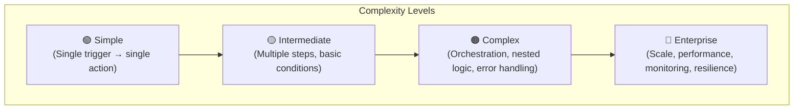
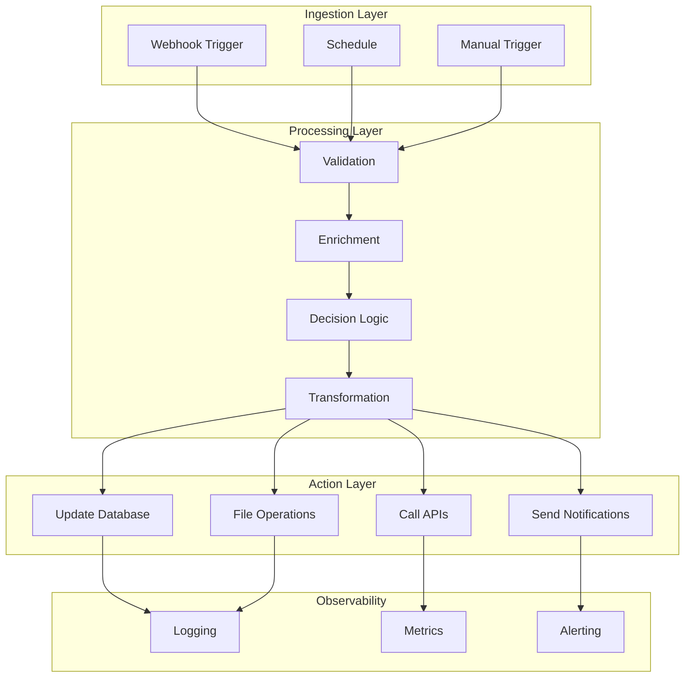
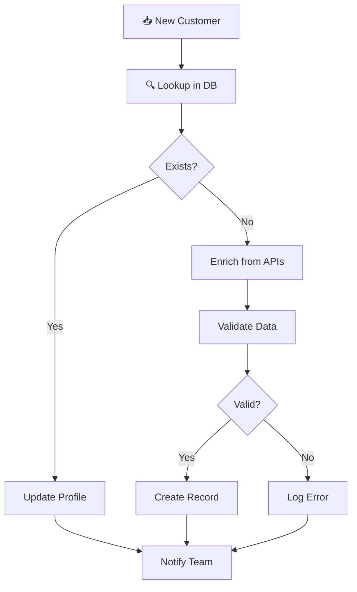
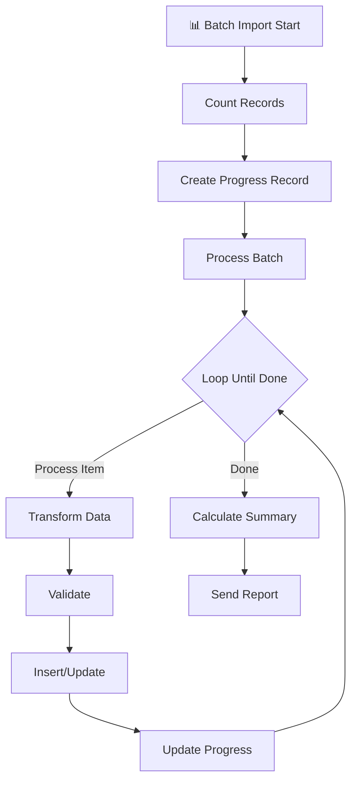
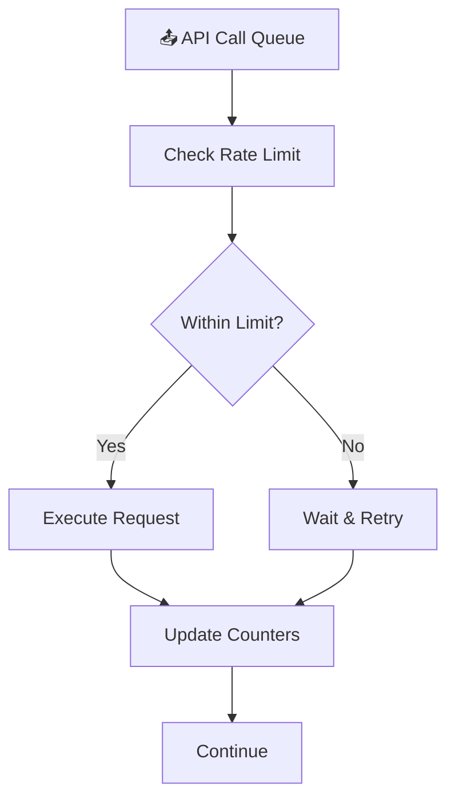
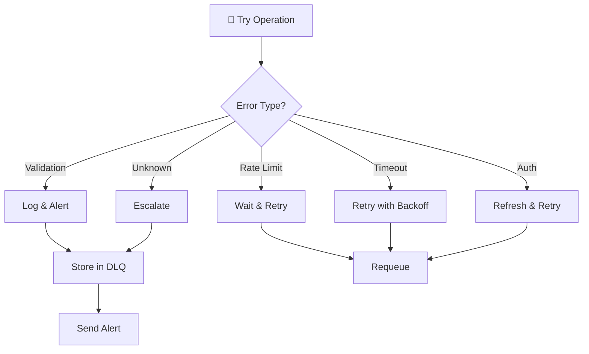
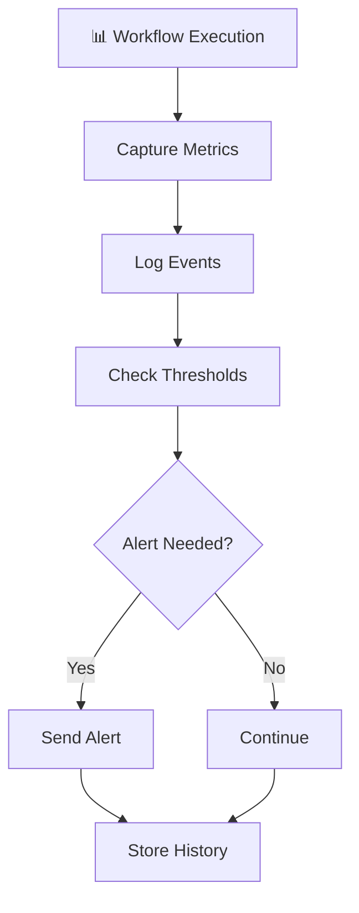

# Lab 012 - Complex Workflow Patterns & Real-World Integration

!!! hint "Overview"

    - In this lab, you will master complex workflow patterns used in production systems.
    - You will build real-world integration scenarios combining multiple data sources and APIs.
    - You will implement resilient patterns that handle scale, errors, and edge cases.
    - Learn how to orchestrate complex multi-step processes with conditional logic and branching.
    - By the end of this lab, you'll be able to build enterprise-grade automation workflows.

## Prerequisites

- n8n running (Lab 001)
- Understanding of basic workflows (Lab 002-004)
- PostgreSQL or Supabase configured (Lab 003)
- Multiple API keys available (GitHub, Slack, Stripe, etc.)

## What You Will Learn

- Building multi-step orchestration workflows
- Advanced conditional routing and branching patterns
- Batch processing with progress tracking
- Rate limiting and throttling strategies
- Complex error handling and retry patterns
- Workflow monitoring and alerting
- Performance optimization techniques
- Real-world integration scenarios

---

## Background

## Complexity Pyramid



## Real-World Workflow Architecture



---

## Lab Steps

## Step 1 - Multi-Step Data Processing Pipeline

Build a workflow that enriches customer data from multiple sources:



1. **Webhook Trigger** - New customer data arrives
2. **SQL Query** - Check if customer exists in database:

   ```sql
   SELECT id, name, email, created_at
   FROM customers
   WHERE email = {{ $json.email }}
   LIMIT 1
   ```

3. **Set Variable** - Create `customer_exists` flag:

   ```javascript
   return {
     exists: $json.length > 0,
     customerId: $json[0]?.id || null,
     lastUpdated: $json[0]?.created_at || null,
   };
   ```

4. **IF** - Branch on customer existence:
   - **IF BRANCH (Customer Exists):**
     - Update existing customer record
     - Skip enrichment step

   - **ELSE BRANCH (New Customer):**
     - Call enrichment APIs:
       - GitHub API (get user profile if GitHub username provided)
       - Company domain lookup (clearbit, hunter.io, or similar)
       - Geocoding (convert address to coordinates)
     - Merge results

5. **Code Node** - Validate and normalize data:

   ```javascript
   const customer = $json;

   // Validation rules
   const validations = {
     email: {
       pass: /^[^\s@]+@[^\s@]+\.[^\s@]+$/.test(customer.email),
       error: "Invalid email format",
     },
     phone: {
       pass: !customer.phone || /^\+?[\d\s\-\(\)]{10,}$/.test(customer.phone),
       error: "Invalid phone format",
     },
     zipcode: {
       pass:
         !customer.zipcode || /^[0-9A-Za-z\-]{3,10}$/.test(customer.zipcode),
       error: "Invalid zipcode",
     },
   };

   const errors = Object.entries(validations)
     .filter(([field, rule]) => !rule.pass)
     .map(([field, rule]) => rule.error);

   return {
     valid: errors.length === 0,
     errors,
     data: customer,
     timestamp: new Date().toISOString(),
   };
   ```

6. **IF** - Check validation results:
   - **IF VALID:**
     - Insert into database
     - Send success notification

   - **ELSE:**
     - Log validation errors
     - Send error alert to team
     - Store in error queue table

7. **End** - Workflow complete

## Step 2 - Advanced Conditional Routing

Implement smart routing based on multiple conditions:

```mermaid
graph TD
    A["🎟️ Ticket Received"] --> B["Extract Priority"]
    B --> C["Extract Category"]
    C --> D["Check Assignee Load"]
    D --> E{Priority?}

    E -->|Critical| F["Escalate to Manager"]
    E -->|High| G["Route by Category"}
    E -->|Medium/Low| H["Auto-Assign Queue"}

    G --> G1{Category?}
    G1 -->|Technical| G2["→ DevOps Team"]
    G1 -->|Billing| G2["→ Finance Team"]
    G1 -->|Sales| G2["→ Sales Team"]

    H --> H1["Queue with SLA 48h"]

    F --> I["Notify Manager"]
    G2 --> I
    H1 --> I
```

**Implementation:**

1. **HTTP Request** - Get ticket from support system
2. **Set Variables** - Extract routing criteria:

   ```javascript
   return {
     priority: $json.priority_level || "MEDIUM",
     category: $json.category || "GENERAL",
     assigneeLoad: $json.assignee_tickets_count || 0,
     isVIP: $json.customer?.lifetime_value > 50000,
     sla_hours: $json.sla_hours || 24,
   };
   ```

3. **Switch Node** - First level (by priority):

   ```
   Case 1: priority == "CRITICAL"
     → Escalation workflow

   Case 2: priority == "HIGH"
     → Standard routing

   Case 3: priority == "MEDIUM" OR "LOW"
     → Queue routing

   Default:
     → Manual review queue
   ```

4. **For Each Loop** - Process multiple conditions:
   - Check team availability
   - Calculate response time SLA
   - Apply business rules
   - Add to appropriate queue

5. **Parallel Execution** - Send notifications simultaneously:
   - Slack to team channel
   - Email to assignee
   - Update ticket status in database
   - Log routing decision

## Step 3 - Batch Processing with Progress Tracking

Process large datasets efficiently:



**Key Parameters:**

```javascript
const batchConfig = {
  BATCH_SIZE: 100, // Process 100 records at once
  MAX_RETRIES: 3, // Retry failed items 3 times
  RETRY_DELAY_MS: 5000, // Wait 5 seconds between retries
  CHUNK_SIZE: 10, // Chunk size for DB inserts
  TIMEOUT_MS: 60000, // 1 minute per batch
  RATE_LIMIT: 100, // 100 requests per minute to external API
};
```

**Implementation:**

1. **Split in Batches** - Divide records into manageable chunks:

   ```javascript
   const items = $json.items;
   const batchSize = 100;
   const batches = [];

   for (let i = 0; i < items.length; i += batchSize) {
     batches.push(items.slice(i, i + batchSize));
   }

   return batches.map((batch, idx) => ({
     batchNumber: idx + 1,
     totalBatches: batches.length,
     items: batch,
     itemCount: batch.length,
   }));
   ```

2. **For Each** - Process each batch:
   - Start time tracking
   - Process items
   - Handle errors
   - Update progress database table

3. **Error Recovery** - Implement retry logic:

   ```javascript
   const MAX_RETRIES = 3;
   let attempt = 0;
   let lastError = null;

   while (attempt < MAX_RETRIES) {
     try {
       // Attempt processing
       return await processItem(item);
     } catch (error) {
       lastError = error;
       attempt++;
       if (attempt < MAX_RETRIES) {
         await sleep(5000 * attempt); // Exponential backoff
       }
     }
   }

   throw lastError; // Final failure
   ```

4. **Progress Tracking** - Update database after each item:

   ```sql
   UPDATE batch_jobs
   SET
     processed_count = processed_count + 1,
     success_count = CASE WHEN {{ $json.success }} THEN success_count + 1 ELSE success_count END,
     error_count = CASE WHEN NOT {{ $json.success }} THEN error_count + 1 ELSE error_count END,
     last_processed_at = NOW(),
     completion_percent = ROUND((processed_count::float / total_count::float) * 100, 2)
   WHERE job_id = '{{ $json.jobId }}'
   ```

5. **Completion Handler** - Final summary:

   ```javascript
   const stats = {
     totalItems: $json.totalCount,
     processedItems: $json.processedCount,
     successfulItems: $json.successCount,
     failedItems: $json.errorCount,
     successRate: ((successCount / processedCount) * 100).toFixed(2),
     duration: endTime - startTime,
     itemsPerSecond: (processedCount / ((endTime - startTime) / 1000)).toFixed(
       2,
     ),
     averageTimePerItem: ((endTime - startTime) / processedCount).toFixed(0),
   };

   return stats;
   ```

## Step 4 - Rate Limiting & Throttling

Control API call rates to avoid hitting limits:



**Implementation using JavaScript:**

```javascript
// Sliding window rate limiter
class RateLimiter {
  constructor(maxRequests, windowMs) {
    this.maxRequests = maxRequests;
    this.windowMs = windowMs;
    this.requests = [];
  }

  async waitIfNeeded() {
    const now = Date.now();

    // Remove old requests outside the window
    this.requests = this.requests.filter((time) => now - time < this.windowMs);

    // If at limit, wait
    if (this.requests.length >= this.maxRequests) {
      const oldestRequest = this.requests[0];
      const waitTime = this.windowMs - (now - oldestRequest) + 100;
      await sleep(waitTime);
      return this.waitIfNeeded(); // Recursive check
    }

    this.requests.push(now);
  }
}

const limiter = new RateLimiter(100, 60000); // 100 requests per minute

// Use in workflow
for (const item of items) {
  await limiter.waitIfNeeded();
  // Make API call
}
```

**Alternative: Use a Rate Limiter Node Configuration:**

```
Max Requests: 100
Time Window: 60 seconds
Wait Strategy: Queue and retry
Max Queue Size: 1000
```

## Step 5 - Complex Error Handling

Implement comprehensive error handling:



**Error Classification Node:**

```javascript
const error = $json.error;

const errorMapping = {
  // Validation errors - don't retry
  validation: {
    pattern: /validation|required|invalid|malformed/i,
    strategy: "skip",
    severity: "warning",
  },

  // Rate limiting - retry with backoff
  rateLimit: {
    pattern: /rate limit|throttle|too many requests|429/i,
    strategy: "exponential_backoff",
    severity: "info",
    maxRetries: 5,
  },

  // Timeout - retry once
  timeout: {
    pattern: /timeout|socket hang|ECONNRESET/i,
    strategy: "retry_once",
    severity: "warning",
    retryDelay: 10000,
  },

  // Authentication - refresh token
  auth: {
    pattern: /unauthorized|forbidden|401|403/i,
    strategy: "refresh_auth",
    severity: "warning",
  },

  // Server errors - retry
  server: {
    pattern: /server error|500|502|503|internal error/i,
    strategy: "exponential_backoff",
    severity: "error",
    maxRetries: 3,
  },

  // Unknown - escalate
  unknown: {
    pattern: /.*/, // Match everything
    strategy: "escalate",
    severity: "critical",
  },
};

let classification = "unknown";
for (const [key, config] of Object.entries(errorMapping)) {
  if (config.pattern.test(error.message)) {
    classification = key;
    break;
  }
}

return {
  errorType: classification,
  ...errorMapping[classification],
  originalError: error.message,
  timestamp: new Date().toISOString(),
};
```

## Step 6 - Monitoring & Alerting

Add observability to workflows:



**Metrics to Capture:**

```javascript
const metrics = {
  execution: {
    workflow_name: "complex-order-processing",
    execution_id: context.executionId,
    start_time: new Date(),
    status: "running",
    trigger_type: "webhook",
  },

  performance: {
    step_durations: {},
    total_duration: null,
    memory_used: process.memoryUsage().heapUsed,
    api_calls_made: 0,
  },

  business: {
    records_processed: 0,
    records_failed: 0,
    revenue_impact: 0,
    users_affected: 0,
  },

  system: {
    error_count: 0,
    warning_count: 0,
    cpu_percent: 0,
    database_queries: 0,
  },
};
```

**Alert Conditions:**

```javascript
const ALERT_THRESHOLDS = {
  execution_duration: 300000, // > 5 minutes
  error_rate: 0.1, // > 10% failures
  api_failures: 3, // > 3 consecutive failures
  database_slowness: 5000, // Queries > 5 seconds
  workflow_failures_per_hour: 5, // > 5 failures per hour
  memory_usage: 0.85, // > 85% of heap
};

const shouldAlert = {
  duration:
    metrics.performance.total_duration > ALERT_THRESHOLDS.execution_duration,
  errorRate:
    metrics.business.records_failed / metrics.business.records_processed >
    ALERT_THRESHOLDS.error_rate,
  apiFailures: metrics.system.error_count > ALERT_THRESHOLDS.api_failures,
  slowQueries:
    metrics.system.db_query_max_duration > ALERT_THRESHOLDS.database_slowness,
};

if (Object.values(shouldAlert).some((v) => v)) {
  // Send alerts to Slack, PagerDuty, email
}
```

---

## Tasks

!!! note "Task 1: Build Multi-Source Customer Enrichment"

    **Objective:** Create a workflow that:

    - Receives customer data via webhook
    - Looks up existing customer in database
    - Enriches with external data (GitHub profile, company info, location)
    - Validates all data
    - Stores in database with audit trail
    - Sends notifications to team

    **Acceptance Criteria:**

    - Handles 10+ parallel requests without errors
    - Completes within 10 seconds per request
    - All validation errors logged and reported
    - Enrichment data stored in separate table

!!! note "Task 2: Implement Smart Ticket Routing System"

    **Objective:** Build intelligent ticket routing that:

    - Classifies tickets by priority and category
    - Routes to appropriate team based on current load
    - Sets SLA timers based on priority
    - Escalates critical issues to management
    - Provides real-time queue dashboard

    **Acceptance Criteria:**

    - All tickets routed within 2 seconds
    - SLA accuracy > 99%
    - Escalation triggers within 5 minutes
    - Dashboard shows live queue status

!!! note "Task 3: Build Large-Scale Batch Processing Pipeline"

    **Objective:** Process 10,000+ records efficiently:

    - Divide into batches of 100
    - Track progress in real-time
    - Handle errors with retry logic
    - Generate completion report with statistics
    - Clean up temporary data

    **Acceptance Criteria:**

    - Process 10,000 items in < 5 minutes
    - Error recovery success rate > 95%
    - Progress tracking accurate to ±1%
    - Memory usage remains stable

!!! note "Task 4: Build Multi-Service Data Aggregation"

    **Objective:** Aggregate data from multiple APIs and combine into unified view:

    - Fetch data from GitHub, GitLab, Bitbucket APIs in parallel
    - Normalize different data formats
    - Deduplicate entries across sources
    - Store consolidated view in database
    - Sync changes every 15 minutes

    **Acceptance Criteria:**

    - Completes aggregation within 30 seconds
    - Deduplication accuracy > 99%
    - Handles API failures gracefully
    - Maintains sync consistency across sources

!!! note "Task 5: Implement Webhook Deduplication & Idempotency"

    **Objective:** Handle duplicate webhooks and ensure idempotent operations:

    - Generate unique webhook IDs
    - Track processed webhook IDs in database with TTL
    - Skip already-processed duplicate events
    - Implement optimistic locking for concurrent updates
    - Log all deduplication attempts

    **Acceptance Criteria:**

    - Processes duplicate webhooks in < 100ms
    - Zero data corruption from concurrent operations
    - Duplicate detection accuracy 100%
    - TTL cleanup runs efficiently

!!! note "Task 6: Build Real-Time Data Transformation Pipeline"

    **Objective:** Transform structured data in real-time:

    - Receive raw event data
    - Apply multiple transformation rules sequentially
    - Validate transformed data against schema
    - Route to different destinations based on type
    - Archive original payload for audit trail

    **Acceptance Criteria:**

    - Transformation latency < 500ms
    - Schema validation accuracy > 99.9%
    - Handle 1000+ events per minute
    - Zero data loss with audit trail

---

## Solution Guide

## Solution 1: Multi-Source Customer Enrichment

```javascript
// Main orchestration
const customer = $json;
const enrichmentData = {
  github: null,
  company: null,
  location: null,
  enrichedAt: new Date().toISOString(),
};

// Parallel enrichment calls
const [github, company, geo] = await Promise.allSettled([
  githubLookup(customer.username),
  companyLookup(customer.domain),
  geocoding(customer.address),
]);

// Consolidate results
enrichmentData.github = github.status === "fulfilled" ? github.value : null;
enrichmentData.company = company.status === "fulfilled" ? company.value : null;
enrichmentData.location = geo.status === "fulfilled" ? geo.value : null;

return {
  customer,
  enrichment: enrichmentData,
  timestamp: new Date().toISOString(),
};
```

## Solution 2: Smart Ticket Routing

```sql
-- Create routing rules table
CREATE TABLE ticket_routing_rules (
  id SERIAL PRIMARY KEY,
  priority TEXT NOT NULL,
  category TEXT NOT NULL,
  team_id UUID NOT NULL,
  sla_hours INT DEFAULT 24,
  escalation_threshold INT DEFAULT 3,
  created_at TIMESTAMP DEFAULT NOW()
);

-- Find best team based on current load
SELECT
  r.team_id,
  t.name as team_name,
  COUNT(tk.id) as current_load,
  CASE
    WHEN COUNT(tk.id) < 10 THEN 'optimal'
    WHEN COUNT(tk.id) < 20 THEN 'moderate'
    ELSE 'overloaded'
  END as capacity_status
FROM ticket_routing_rules r
JOIN teams t ON r.team_id = t.id
LEFT JOIN tickets tk ON t.id = tk.assigned_team_id AND tk.status != 'closed'
WHERE r.priority = $1 AND r.category = $2
GROUP BY r.team_id, t.name
ORDER BY current_load ASC
LIMIT 1;
```

## Solution 3: Batch Processing with Progress

```javascript
// Configuration
const BATCH_SIZE = 100;
const RETRY_ATTEMPTS = 3;
const TIMEOUT_MS = 60000;

// Process in batches with progress tracking
async function processBatchJob(jobId, items) {
  const totalItems = items.length;
  const batches = [];

  // Split into batches
  for (let i = 0; i < totalItems; i += BATCH_SIZE) {
    batches.push({
      batchNum: Math.floor(i / BATCH_SIZE) + 1,
      items: items.slice(i, i + BATCH_SIZE),
      startTime: Date.now(),
    });
  }

  // Process with progress tracking
  let successCount = 0;
  let errorCount = 0;

  for (const batch of batches) {
    try {
      const results = await Promise.allSettled(
        batch.items.map((item, idx) =>
          processItemWithRetry(item, RETRY_ATTEMPTS),
        ),
      );

      results.forEach((result, idx) => {
        if (result.status === "fulfilled") {
          successCount++;
        } else {
          errorCount++;
          logError(batch.items[idx], result.reason);
        }
      });

      // Update progress
      const progress = ((batch.batchNum * BATCH_SIZE) / totalItems) * 100;
      await updateJobProgress(jobId, {
        processedCount: batch.batchNum * BATCH_SIZE,
        successCount,
        errorCount,
        completionPercent: Math.min(progress, 100),
        lastUpdated: new Date().toISOString(),
      });
    } catch (error) {
      logError(`Batch ${batch.batchNum} failed:`, error);
    }
  }

  return {
    jobId,
    totalItems,
    successCount,
    errorCount,
    successRate: ((successCount / totalItems) * 100).toFixed(2),
    completedAt: new Date().toISOString(),
  };
}

async function processItemWithRetry(item, maxRetries) {
  for (let attempt = 1; attempt <= maxRetries; attempt++) {
    try {
      return await processItem(item);
    } catch (error) {
      if (attempt === maxRetries) throw error;
      const backoffMs = 1000 * Math.pow(2, attempt - 1);
      await new Promise((resolve) => setTimeout(resolve, backoffMs));
    }
  }
}
```

## Solution 4: Multi-Service Aggregation

```javascript
// Aggregate from multiple sources
const sources = {
  github: { url: "https://api.github.com", auth: "token" },
  gitlab: { url: "https://gitlab.com/api/v4", auth: "token" },
  bitbucket: { url: "https://api.bitbucket.org", auth: "basic" },
};

async function aggregateRepositories(username) {
  const repos = [];
  const errors = [];

  for (const [source, config] of Object.entries(sources)) {
    try {
      const sourceRepos = await fetchFromSource(source, username, config);
      repos.push(...sourceRepos.map((r) => ({ ...r, source })));
    } catch (error) {
      errors.push({ source, error: error.message });
    }
  }

  // Normalize and deduplicate
  const normalized = normalizeRepos(repos);
  const deduplicated = deduplicateByName(normalized);

  return {
    repositories: deduplicated,
    totalFound: repos.length,
    totalUnique: deduplicated.length,
    errors,
    timestamp: new Date().toISOString(),
  };
}

function deduplicateByName(repos) {
  const seen = new Map();
  return repos.filter((repo) => {
    const key = `${repo.owner}/${repo.name}`.toLowerCase();
    if (seen.has(key)) return false;
    seen.set(key, true);
    return true;
  });
}
```

## Solution 5: Webhook Deduplication

```javascript
// Webhook deduplication
const crypto = require("crypto");

async function processWebhook(event, headers) {
  // Generate deterministic ID
  const webhookHash = crypto
    .createHash("sha256")
    .update(
      JSON.stringify({
        eventId: event.id,
        timestamp: event.timestamp,
        source: headers["x-webhook-source"],
      }),
    )
    .digest("hex");

  // Check if already processed (with 24-hour TTL)
  const cached = await redis.get(`webhook:${webhookHash}`);
  if (cached) {
    return {
      status: "duplicate",
      webhookHash,
      message: "Webhook already processed",
    };
  }

  // Mark as processed
  await redis.setex(`webhook:${webhookHash}`, 86400, Date.now());

  // Process the webhook
  const result = await processEvent(event);

  return {
    status: "processed",
    webhookHash,
    result,
  };
}

// Idempotent database update
async function updateCustomerIdempotent(customerId, updates) {
  const query = `
    UPDATE customers
    SET data = jsonb_set(
      COALESCE(data, '{}'),
      '{updates}',
      $1::jsonb
    ),
    updated_at = CURRENT_TIMESTAMP,
    version = version + 1
    WHERE id = $2 AND version = $3
    RETURNING *;
  `;

  try {
    const result = await db.query(query, [
      JSON.stringify(updates),
      customerId,
      currentVersion,
    ]);

    return result.rows[0];
  } catch (error) {
    if (error.message.includes("version")) {
      // Version mismatch - retry with exponential backoff
      throw new Error("Concurrent modification - retry");
    }
    throw error;
  }
}
```

## Solution 6: Real-Time Data Transformation

```javascript
// Transformation pipeline
const transformationRules = {
  email: (val) => val.toLowerCase().trim(),
  phone: (val) => val.replace(/\D/g, ""),
  date: (val) => new Date(val).toISOString(),
  currency: (val) => parseFloat(val).toFixed(2),
};

async function transformEvent(event) {
  const transformed = { ...event };
  const errors = [];

  // Apply transformations
  for (const [field, rule] of Object.entries(transformationRules)) {
    if (field in transformed) {
      try {
        transformed[field] = rule(transformed[field]);
      } catch (error) {
        errors.push({
          field,
          value: transformed[field],
          error: error.message,
        });
        transformed[field] = null;
      }
    }
  }

  // Validate against schema
  const validation = validateAgainstSchema(transformed);
  if (!validation.valid) {
    errors.push(...validation.errors);
  }

  // Route based on event type
  const destination = getDestination(transformed.eventType);

  // Archive original
  await archiveEvent({
    originalPayload: event,
    transformedPayload: transformed,
    destination,
    timestamp: new Date().toISOString(),
  });

  return {
    transformed,
    errors,
    destination,
    routeTime: Date.now(),
  };
}

function getDestination(eventType) {
  const routes = {
    "order.created": "queue_orders",
    "customer.updated": "queue_customers",
    "payment.processed": "queue_payments",
  };
  return routes[eventType] || "queue_default";
}
```

---

## Summary

✅ **Workflow Mastery Achieved:**

- [x] Multi-step orchestration patterns
- [x] Advanced conditional routing
- [x] Batch processing at scale
- [x] Rate limiting and throttling
- [x] Complex error handling
- [x] Monitoring and observability
- [x] Production-ready patterns
- [x] Real-world integration scenarios

**Next Steps:**

- Deploy patterns to production
- Monitor metrics continuously
- Iterate based on real usage data
- Share patterns with team
