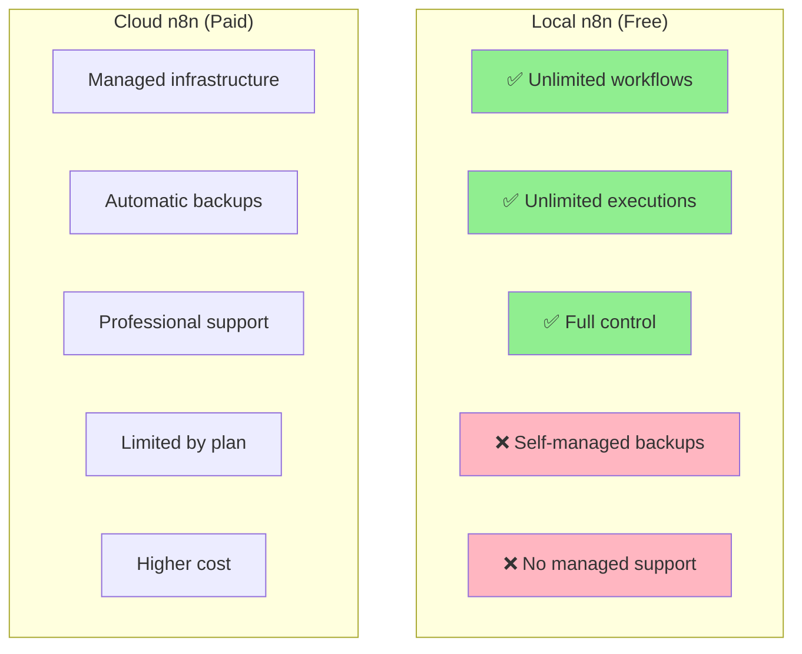
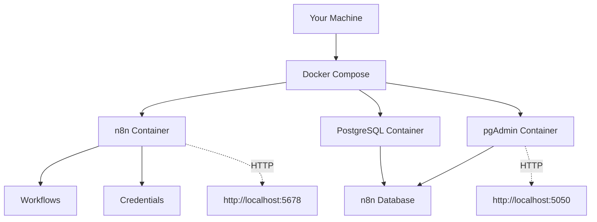
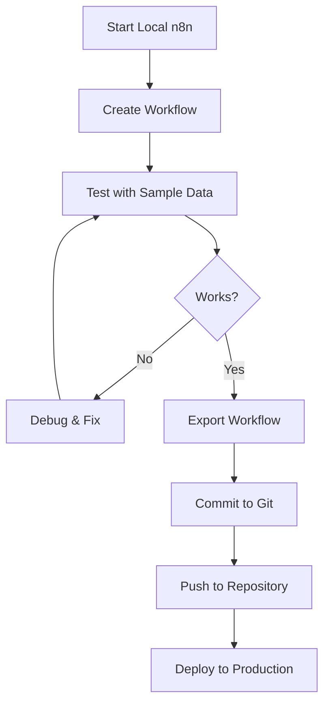

# Lab 013 - Local n8n Development & Setup

!!! hint "Overview"

    - In this lab, you will set up n8n locally on your machine for free.
    - You will run n8n with PostgreSQL database using Docker Compose.
    - You will learn development workflows, debugging, and local testing.
    - You will use provided scripts to easily start, stop, and manage your n8n instance.
    - By the end of this lab, you'll have a complete local development environment.

## Prerequisites

- Docker Desktop installed (free community edition)
- Docker Compose (usually included with Docker Desktop)
- 2GB+ available RAM
- 1GB+ free disk space
- Basic terminal/command line knowledge

## What You Will Learn

- Installing and configuring n8n locally
- Setting up PostgreSQL database with Docker Compose
- Using setup scripts for easy management
- Local development workflow
- Debugging workflows locally
- Backing up and restoring workflows
- Advanced local configuration
- Performance optimization for local development

---

## Background

## Local vs Cloud n8n



## Docker Compose Architecture



---

## Lab Steps

## Step 1 - Install Prerequisites

#### macOS

```bash
# Using Homebrew (easiest)
brew install docker

# Or download Docker Desktop from:
# https://www.docker.com/products/docker-desktop
```

#### Linux (Ubuntu/Debian)

```bash
# Update package list
sudo apt-get update

# Install Docker
sudo apt-get install docker.io docker-compose

# Add current user to docker group (avoid sudo)
sudo usermod -aG docker $USER

# Apply group membership (logout/login or use newgrp)
newgrp docker
```

#### Windows

1. Download Docker Desktop: https://www.docker.com/products/docker-desktop
2. Run installer and follow prompts
3. Restart your computer
4. Verify installation:
   ```powershell
   docker --version
   docker-compose --version
   ```

## Step 2 - Clone the n8n Lab Repository

```bash
# Clone the labs repository
git clone https://github.com/nirgeier/n8nLab.git
cd n8nLab

# Or if you already have it:
cd /Users/nirg/repositories/Labs/n8nLab
```

## Step 3 - Run the Setup Script

The setup script handles all configuration automatically:

```bash
# Make script executable (first time only)
chmod +x scripts/setup.sh

# Run setup
./scripts/setup.sh
```

**What the setup script does:**

1. ✅ Checks Docker and Docker Compose
2. ✅ Creates .env configuration file
3. ✅ Creates necessary directories
4. ✅ Validates docker-compose.yml
5. ✅ Starts n8n and PostgreSQL
6. ✅ Waits for services to be ready
7. ✅ Displays connection URLs

## Step 4 - Access n8n

Once setup completes, access n8n:

```
🌐 n8n Editor: http://localhost:5678
🗄️  pgAdmin:     http://localhost:5050
```

**First Time Setup:**

1. Open http://localhost:5678
2. Set admin email and password
3. You're ready to build workflows!

## Step 5 - Check Status

Monitor your n8n instance anytime:

```bash
# View service status
./scripts/status.sh

# Or use Docker directly
docker-compose ps
docker-compose logs -f n8n
```

## Step 6 - Create Your First Workflow

Let's build a simple test workflow:

1. **Create New Workflow**
   - Click "New" button
   - Name it "Test Workflow"

2. **Add Trigger**
   - Click "+" button
   - Search for "Manual"
   - Select "Manual Trigger"

3. **Add Action**
   - Click "+" button again
   - Search for "Set"
   - Select "Set Variable"
   - Set variable:
     ```
     Name: message
     Value: Hello from local n8n! 🎉
     ```

4. **Test**
   - Click "Save"
   - Click "Execute Workflow"
   - View output

## Step 7 - Manage Workflows Locally

#### Export Workflows

```bash
# Workflows are stored in ./workflows directory
ls -la workflows/

# Each workflow is a JSON file
cat workflows/your-workflow.json
```

#### Version Control Your Workflows

```bash
# Add workflows to git
git add workflows/
git commit -m "Add test workflow"
git push
```

#### Backup Everything

```bash
# Backup script (copy this to scripts/backup.sh)
#!/bin/bash
BACKUP_DIR="backups/backup_$(date +%Y%m%d_%H%M%S)"
mkdir -p $BACKUP_DIR

# Backup workflows
cp -r workflows $BACKUP_DIR/

# Export database
docker-compose exec -T postgres pg_dump -U n8n -d n8n > $BACKUP_DIR/database.sql

echo "✅ Backup created: $BACKUP_DIR"
```

## Step 8 - Configure PostgreSQL Access

Access database directly using pgAdmin:

1. **Open pgAdmin**

   ```
   URL: http://localhost:5050
   Email: admin@n8n.local
   Password: admin
   ```

2. **Add Server**
   - Right-click "Servers" → New → Server
   - **General Tab:**
     - Name: `n8n-local`
   - **Connection Tab:**
     - Host: `postgres`
     - Username: `n8n`
     - Password: `n8n_password`
     - Database: `n8n`

3. **Query Workflows**
   ```sql
   SELECT id, name, active FROM workflow WHERE 1=1;
   SELECT * FROM credentials_entity LIMIT 10;
   SELECT * FROM execution_entity ORDER BY startedAt DESC LIMIT 20;
   ```

## Step 9 - Local Development Workflow

#### Recommended Development Process



#### Debugging Locally

1. **View Logs**

   ```bash
   # Follow n8n logs in real-time
   docker-compose logs -f n8n

   # Follow PostgreSQL logs
   docker-compose logs -f postgres
   ```

2. **Use Browser DevTools**
   - Press F12 in n8n UI
   - Check Console for JavaScript errors
   - Monitor Network tab for API calls

3. **Access Container Shell**

   ```bash
   # Connect to n8n container
   docker-compose exec n8n /bin/sh

   # View n8n configuration
   ls -la /home/node/.n8n/
   ```

## Step 10 - Advanced Configuration

#### Custom Environment Variables

Edit `.env` file before starting:

```bash
# Performance tuning
N8N_EXECUTIONS_PROCESS=queue
N8N_EXECUTIONS_MODE=queue
N8N_DB_POOL_SIZE=10

# Webhook configuration
N8N_WEBHOOK_TUNNEL_URL=http://localhost:5678

# Custom ports
N8N_PORT=5678

# Email configuration (for notifications)
N8N_SMTP_HOST=smtp.gmail.com
N8N_SMTP_PORT=587
N8N_SMTP_USER=your-email@gmail.com
N8N_SMTP_PASS=your-app-password
```

#### Using External Services

To connect to external services from localhost:

**Option 1: Direct connection**

```javascript
// If service is on your machine
http://host.docker.internal:3000  // macOS/Windows
http://localhost:3000              // Linux
```

**Option 2: Docker network**

```bash
# Connect container to external service on your machine
docker network create external-services
docker-compose --network external-services up
```

#### Performance Optimization

```bash
# Increase database connection pool
sed -i 's/DB_POOL_SIZE=10/DB_POOL_SIZE=20/' .env

# Enable queue mode for better performance
echo "N8N_EXECUTIONS_MODE=queue" >> .env

# Restart to apply changes
docker-compose restart n8n
```

---

## Tasks

!!! note "Task 1: Set Up Local n8n with All Features"

    **Objective:** Complete a full local n8n setup:
    - Run setup.sh script successfully
    - Access n8n at http://localhost:5678
    - Access pgAdmin at http://localhost:5050
    - Connect pgAdmin to n8n database
    - Verify all containers are healthy

    **Acceptance Criteria:**
    - All 3 containers running (n8n, postgres, pgadmin)
    - n8n responds to health check
    - pgAdmin shows n8n database
    - No errors in logs

!!! note "Task 2: Create and Export Your First Workflow"

    **Objective:** Build and manage a workflow locally:
    - Create a workflow that reads from a JSON file
    - Process and transform the data
    - Export workflow as JSON
    - Commit to Git repository
    - Document the workflow purpose

    **Acceptance Criteria:**
    - Workflow executes successfully
    - JSON export is valid and readable
    - Git commit includes workflow file
    - README documents the workflow

!!! note "Task 3: Set Up Database Backup and Restore"

    **Objective:** Implement backup and restore procedures:
    - Create backup script for workflows and database
    - Run full backup successfully
    - Delete a workflow
    - Restore from backup
    - Verify restoration was successful

    **Acceptance Criteria:**
    - Backup script creates compressed archive
    - Database dump includes all tables
    - Workflows can be restored from backup
    - Restoration process takes < 1 minute

---

## Troubleshooting

## Docker Issues

**"Docker daemon is not running"**

```bash
# macOS/Windows: Start Docker Desktop
open -a Docker

# Linux: Start Docker service
sudo systemctl start docker
```

**"Cannot connect to Docker daemon"**

```bash
# Verify Docker is running
docker ps

# If still failing, restart Docker
sudo systemctl restart docker
```

## n8n Issues

**"n8n not responding at http://localhost:5678"**

```bash
# Check logs for errors
docker-compose logs n8n | tail -50

# Restart n8n
docker-compose restart n8n

# Wait 30 seconds and try again
sleep 30
curl http://localhost:5678/healthz
```

**"Port 5678 already in use"**

```bash
# Find process using port 5678
lsof -i :5678

# Or change port in docker-compose.yml
sed -i 's/5678:5678/5679:5678/' docker-compose.yml
docker-compose restart
```

## Database Issues

**"PostgreSQL connection refused"**

```bash
# Check if postgres container is running
docker-compose ps postgres

# View postgres logs
docker-compose logs postgres

# Restart postgres
docker-compose restart postgres
```

**"Database won't initialize"**

```bash
# Remove database volume and start fresh
docker-compose down -v
docker-compose up -d
```

## Performance Issues

**"n8n is slow"**

```bash
# Check resource usage
docker stats

# Increase memory allocation in Docker Desktop settings
# Or update docker-compose.yml:
# deploy:
#   resources:
#     limits:
#       memory: 2G
```

---

## Summary

✅ **Local Development Mastered:**

- [x] Docker and Docker Compose installed
- [x] n8n running locally with PostgreSQL
- [x] Setup scripts for easy management
- [x] Access to database via pgAdmin
- [x] First workflow created and exported
- [x] Development workflow established
- [x] Backup and restore procedures
- [x] Troubleshooting knowledge

**Next Steps:**

- Follow Labs 001-012 to build real workflows
- Use local environment for testing
- Version control your workflows
- Deploy to production when ready

**Useful Resources:**

- n8n Documentation: https://docs.n8n.io
- Docker Documentation: https://docs.docker.com
- PostgreSQL Documentation: https://www.postgresql.org/docs
- Community Forum: https://community.n8n.io
