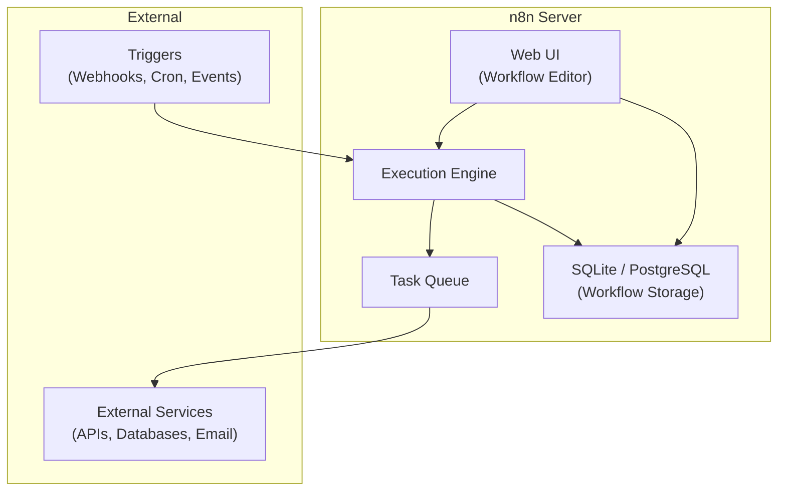
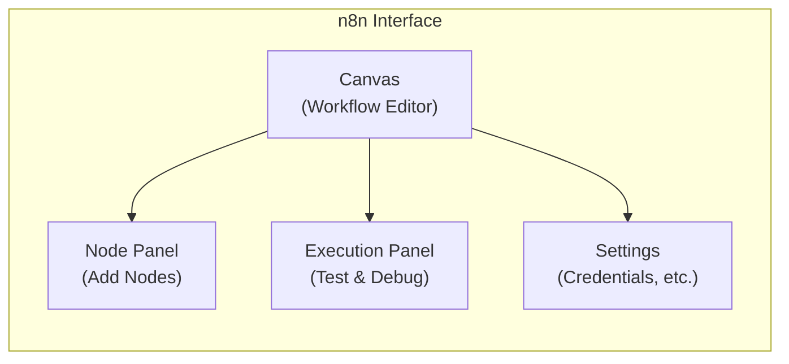

# Lab 031 – n8n Deep Dive: Installation & Architecture

!!! hint "Overview"

    - In this lab, you will install n8n locally and understand its architecture.
    - You will explore the n8n UI, workflow editor, and execution engine.
    - You will understand self-hosted vs. cloud deployment options.
    - By the end of this lab, you will have a running n8n instance ready for building workflows.

## Prerequisites

- Docker installed (or Node.js 18+)
- Basic terminal knowledge

## What You Will Learn

- n8n architecture and how it works internally
- Installing n8n with Docker and Docker Compose
- The n8n UI: canvas, node panel, execution log
- Configuration and environment variables
- Self-hosted vs. cloud considerations

---

## Background

### n8n Architecture



### Deployment Options

| Option         | Best For              | Difficulty | Cost        |
| -------------- | --------------------- | ---------- | ----------- |
| Docker         | Development, testing  | Easy       | Free        |
| Docker Compose | Production, self-host | Medium     | Free        |
| n8n Cloud      | Quick start, no ops   | Very easy  | From $24/mo |
| Kubernetes     | Enterprise scale      | Hard       | Varies      |

---

## Lab Steps

### Step 1 – Install with Docker

```bash
# Quick start with Docker (data persisted in volume)
docker run -d \
  --name n8n \
  --restart always \
  -p 5678:5678 \
  -v n8n_data:/home/node/.n8n \
  n8nio/n8n

# Open in browser
open http://localhost:5678
```

### Step 2 – Production Setup with Docker Compose

```yaml
# docker-compose.yml
version: "3.8"

services:
  n8n:
    image: n8nio/n8n:latest
    restart: always
    ports:
      - "5678:5678"
    environment:
      - N8N_BASIC_AUTH_ACTIVE=true
      - N8N_BASIC_AUTH_USER=admin
      - N8N_BASIC_AUTH_PASSWORD=elcon2026
      - DB_TYPE=postgresdb
      - DB_POSTGRESDB_HOST=postgres
      - DB_POSTGRESDB_DATABASE=n8n
      - DB_POSTGRESDB_USER=n8n
      - DB_POSTGRESDB_PASSWORD=n8n_password
      - N8N_ENCRYPTION_KEY=your-encryption-key-here
      - WEBHOOK_URL=https://n8n.elcon.local
    volumes:
      - n8n_data:/home/node/.n8n
    depends_on:
      - postgres

  postgres:
    image: postgres:16
    restart: always
    environment:
      POSTGRES_DB: n8n
      POSTGRES_USER: n8n
      POSTGRES_PASSWORD: n8n_password
    volumes:
      - postgres_data:/var/lib/postgresql/data

volumes:
  n8n_data:
  postgres_data:
```

```bash
docker compose up -d
```

### Step 3 – Explore the UI



**Key UI areas:**

| Area              | What It Does                                |
| ----------------- | ------------------------------------------- |
| **Canvas**        | Drag-and-drop workflow builder              |
| **Node Panel**    | Search and add nodes (400+ integrations)    |
| **Execution Log** | See past runs, inputs/outputs for each node |
| **Credentials**   | Securely store API keys and login info      |
| **Variables**     | Store environment-specific values           |
| **Tags**          | Organize workflows with labels              |

### Step 4 – Your First Workflow

Create a simple "Hello World" workflow:

1. Click **+** → Add **Schedule Trigger** (every minute for testing)
2. Add a **Set** node → Set `message` = "Hello from n8n!"
3. Add a **Function** node → Transform the message
4. Click **Execute Workflow** to test

### Step 5 – Important Configuration

```bash
# Environment variables for production
N8N_ENCRYPTION_KEY=       # Required! Encrypts credentials
WEBHOOK_URL=              # External URL for webhooks
N8N_LOG_LEVEL=info        # debug, info, warn, error
N8N_METRICS=true          # Enable Prometheus metrics
EXECUTIONS_DATA_PRUNE=true # Auto-delete old executions
EXECUTIONS_DATA_MAX_AGE=168 # Hours to keep (7 days)
```

---

## Tasks

!!! note "Task 1"
Install n8n using Docker. Verify you can access the UI at `localhost:5678`.

!!! note "Task 2"
Create your first workflow: Schedule → Set → Function → Log. Test it and examine the execution log.

!!! note "Task 3"
Set up the production Docker Compose configuration with PostgreSQL. Restart and verify data persists.

---

## Summary

In this lab you:

- [x] Understood n8n's architecture and components
- [x] Installed n8n with Docker and Docker Compose
- [x] Explored the UI: canvas, nodes, executions, credentials
- [x] Created your first workflow
- [x] Configured production environment variables
