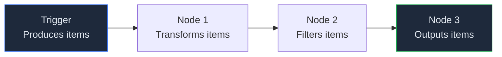
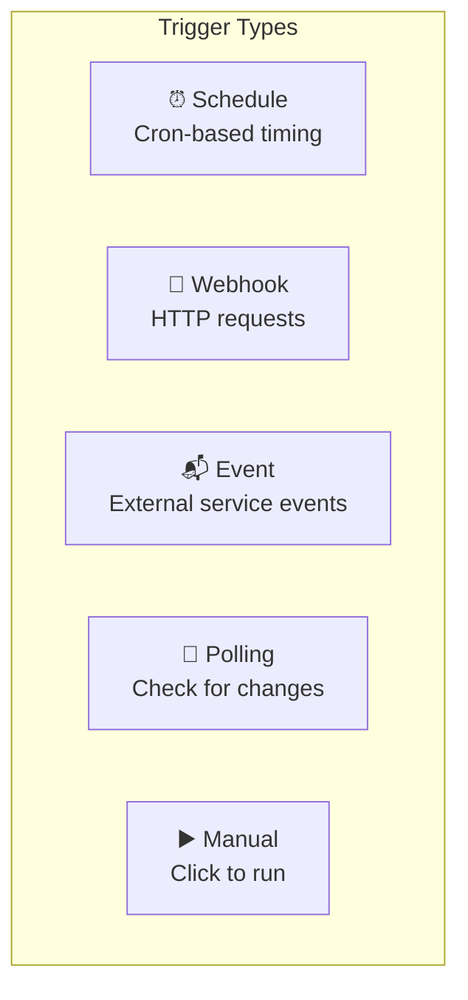
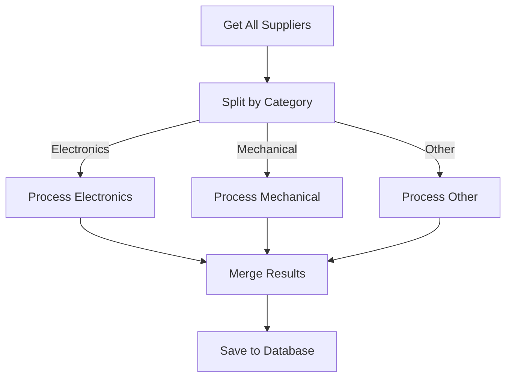

# Lab 032 – n8n: Triggers & Data Flow

!!! hint "Overview"

    - In this lab, you will master all n8n trigger types and understand how data flows between nodes.
    - You will learn expressions, data mapping, and transformation techniques.
    - You will build workflows with multiple trigger types.
    - By the end of this lab, you will understand the data flow model that powers all n8n workflows.

## Prerequisites

- n8n running (Lab 031)
- Basic JSON understanding

## What You Will Learn

- All trigger types: schedule, webhook, event, polling
- Data structure in n8n (items and fields)
- Expressions and data references
- Data transformation and mapping
- Splitting, merging, and looping

---

## Background

### Data Flow in n8n



Every node receives an **array of items** and outputs an **array of items**.

Each item is a JSON object:

```json
[
  { "name": "TechParts Ltd", "country": "USA", "rating": 4 },
  { "name": "MechSupply GmbH", "country": "Germany", "rating": 5 },
  { "name": "SensorWorld", "country": "China", "rating": 3 }
]
```

---

## Lab Steps

### Step 1 – Trigger Types



| Trigger Type    | When to Use                         | Example                    |
| --------------- | ----------------------------------- | -------------------------- |
| **Schedule**    | Run at specific times               | Daily report at 8 AM       |
| **Webhook**     | React to external HTTP requests     | Receive data from your app |
| **App Trigger** | Listen for events in connected apps | New email in Gmail         |
| **Polling**     | Check for changes periodically      | New rows in a spreadsheet  |
| **Manual**      | Run on-demand                       | Testing and debugging      |

#### Schedule Trigger Examples:

```
Every minute:        */1 * * * *
Every hour:          0 * * * *
Every day at 8 AM:   0 8 * * *
Every Monday 9 AM:   0 9 * * 1
First of month:      0 0 1 * *
```

### Step 2 – Expressions & References

n8n uses `{{ }}` for expressions:

| Expression                          | What It Returns                     |
| ----------------------------------- | ----------------------------------- |
| `{{ $json.name }}`                  | Current item's "name" field         |
| `{{ $json.rating > 3 }}`            | Boolean: true if rating > 3         |
| `{{ $('Node Name').item.json.id }}` | Specific field from a specific node |
| `{{ $now.format('YYYY-MM-DD') }}`   | Current date formatted              |
| `{{ $input.all() }}`                | All input items                     |
| `{{ $input.first() }}`              | First input item                    |

### Step 3 – Data Transformation

Build a workflow that transforms supplier data:

1. **Manual Trigger** → Start
2. **Set** node → Create sample data (3 suppliers)
3. **Code** node → Transform:
   ```javascript
   return items.map((item) => {
     const d = item.json;
     return {
       json: {
         displayName: `${d.name} (${d.country})`,
         ratingStars: "⭐".repeat(d.rating),
         isTopRated: d.rating >= 4,
         formattedDate: new Date().toLocaleDateString("en-GB"),
       },
     };
   });
   ```
4. **IF** node → Split by `isTopRated`
5. Two **Set** nodes → Add labels: "Premium Supplier" / "Standard Supplier"

### Step 4 – Split & Merge



### Step 5 – Webhook Deep Dive

Create a webhook workflow:

1. **Webhook** trigger → Configure POST method
2. **Code** node → Validate incoming data
3. **IF** node → Route based on data type
4. **Respond to Webhook** → Return confirmation

Test with curl:

```bash
curl -X POST http://localhost:5678/webhook/your-webhook-id \
  -H "Content-Type: application/json" \
  -d '{"supplier": "TechParts", "action": "new_order", "amount": 5000}'
```

---

## Tasks

!!! note "Task 1"
Build a workflow with a Schedule trigger that runs every 5 minutes and logs the current timestamp.

!!! note "Task 2"
Create a Webhook workflow that receives supplier data, validates it, and returns a success/error response.

!!! note "Task 3"
Build a data transformation pipeline: read 10 items → transform fields → filter by condition → output as formatted JSON.

---

## Summary

In this lab you:

- [x] Mastered all n8n trigger types
- [x] Understood the items-based data flow model
- [x] Used expressions and data references
- [x] Built data transformation pipelines
- [x] Created webhook endpoints with validation
