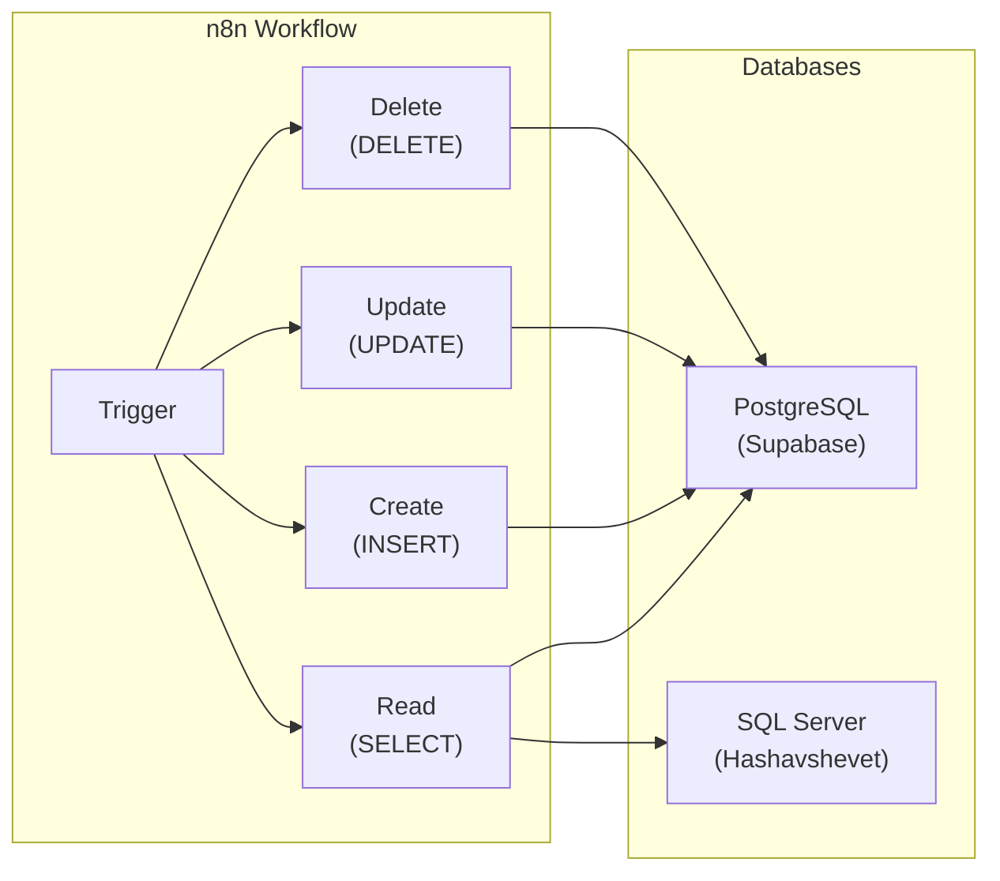
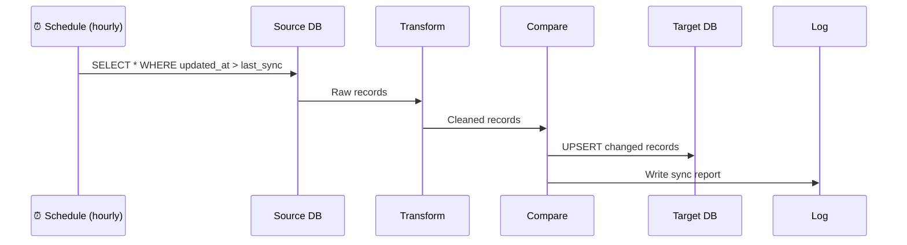

# Lab 033 – n8n: Database Operations

!!! hint "Overview"

    - In this lab, you will connect n8n to databases (PostgreSQL, Supabase, SQL Server).
    - You will build CRUD workflows: Create, Read, Update, Delete records.
    - You will implement data synchronization between databases.
    - By the end of this lab, you will be able to automate any database operation.

## Prerequisites

- n8n running (Lab 031)
- Supabase project with tables

## What You Will Learn

- Connecting n8n to PostgreSQL / Supabase
- CRUD operations as workflow nodes
- Bulk data operations
- Database-to-database sync
- SQL queries in n8n

---

## Background

### Database Operations in n8n



---

## Lab Steps

### Step 1 – Connect to Supabase

1. In n8n, go to **Credentials** → **Add Credential**
2. Search for **Supabase**
3. Enter:
   - Host: `https://your-project.supabase.co`
   - API Key: your service role key (not anon key)

### Step 2 – CRUD Operations

**Read all suppliers:**

1. Manual Trigger → Supabase node
2. Operation: **Get Many**
3. Table: `suppliers`
4. Filters: `is_active = true`

**Create a supplier:**

1. Webhook Trigger → Supabase node
2. Operation: **Create**
3. Table: `suppliers`
4. Map fields from webhook data

**Update a supplier:**

1. Webhook Trigger → Supabase node
2. Operation: **Update**
3. Table: `suppliers`
4. Match by `id`
5. Update specific fields

**Soft-delete a supplier:**

1. Webhook Trigger → Supabase node
2. Operation: **Update**
3. Set `is_active = false` where `id` matches

### Step 3 – Raw SQL Queries

For complex operations, use the PostgreSQL node with raw SQL:

```sql
-- Find suppliers with no orders in the last 6 months
SELECT s.name, s.email, MAX(po.order_date) as last_order
FROM suppliers s
LEFT JOIN purchase_orders po ON s.id = po.supplier_id
GROUP BY s.id, s.name, s.email
HAVING MAX(po.order_date) < CURRENT_DATE - INTERVAL '6 months'
   OR MAX(po.order_date) IS NULL
ORDER BY last_order NULLS FIRST;
```

### Step 4 – Database Sync Workflow

Build a sync from one database to another:



Build this workflow:

1. **Schedule Trigger** – Every hour
2. **PostgreSQL** – Read records updated since last sync
3. **Code** – Transform and clean data
4. **Supabase** – Upsert (insert or update) records
5. **Set** – Count processed records
6. **Supabase** – Log sync run to `sync_log` table

### Step 5 – Bulk Operations

```
Import 1000 suppliers from CSV:
1. Read CSV File → Parse rows
2. Split into batches of 50
3. For each batch: Insert to Supabase
4. Track success/failure count
5. Generate import report
```

---

## Tasks

!!! note "Task 1"
Build a CRUD workflow for suppliers: read, create, update, soft-delete. Test with webhook triggers.

!!! note "Task 2"
Create a database sync workflow that copies data from one Supabase table to another, handling updates and new records.

!!! note "Task 3"
Build a CSV import workflow: Read CSV → Validate → Batch insert → Report results.

---

## Summary

In this lab you:

- [x] Connected n8n to PostgreSQL and Supabase
- [x] Built CRUD workflows
- [x] Wrote raw SQL queries in n8n
- [x] Implemented database-to-database sync
- [x] Handled bulk data operations
