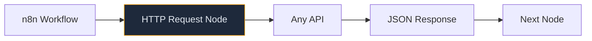
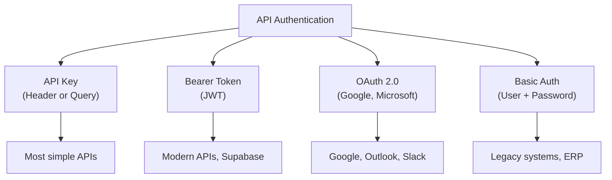
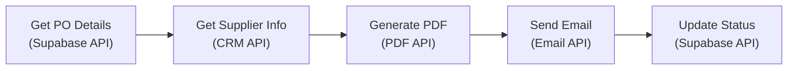
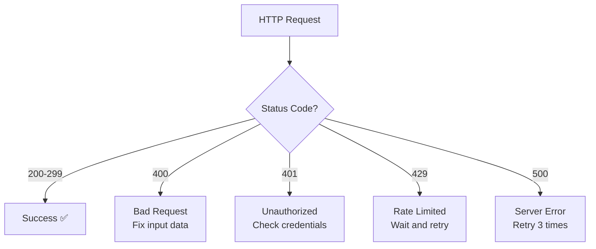

# Lab 034 – n8n: HTTP, APIs & Webhooks

!!! hint "Overview"

    - In this lab, you will use n8n's HTTP Request node to integrate with any API.
    - You will build webhook endpoints for receiving external data.
    - You will connect to real-world APIs (email, SMS, Slack).
    - By the end of this lab, you will be able to connect n8n to any system with an API.

## Prerequisites

- n8n running (Lab 031)
- API keys for services you want to connect

## What You Will Learn

- HTTP Request node for calling APIs
- Authentication methods (API key, OAuth, Bearer token)
- Building webhook receivers
- Chaining API calls
- Error handling for HTTP requests

---

## Background

### The HTTP Request Node



---

## Lab Steps

### Step 1 – GET Request: Fetch Data

Fetch exchange rates for multi-currency PO calculations:

1. **Manual Trigger**
2. **HTTP Request** node:
   - Method: GET
   - URL: `https://api.exchangerate-api.com/v4/latest/USD`
3. **Code** node – Extract ILS rate:
   ```javascript
   const rates = $input.first().json.rates;
   return [
     {
       json: {
         usd_to_ils: rates.ILS,
         eur_to_ils: rates.ILS / rates.EUR,
         updated: new Date().toISOString(),
       },
     },
   ];
   ```
4. **Supabase** node – Save rates

### Step 2 – POST Request: Send Data

Send a PO notification email via API:

1. **Webhook Trigger** – Receives PO data
2. **Supabase** – Fetch supplier email
3. **HTTP Request** node:
   - Method: POST
   - URL: `https://api.resend.com/emails`
   - Headers: `Authorization: Bearer YOUR_API_KEY`
   - Body:
   ```json
   {
     "from": "orders@elcon.co.il",
     "to": "{{ $json.supplier_email }}",
     "subject": "New PO #{{ $json.po_number }}",
     "html": "<h1>Purchase Order</h1><p>Please confirm.</p>"
   }
   ```

### Step 3 – Authentication Methods



### Step 4 – Chaining Multiple API Calls

Build a workflow that chains API calls:



### Step 5 – Building a Webhook API

Create a complete webhook API for your apps:

```
POST /webhook/po/create     → Create new PO
POST /webhook/po/update     → Update PO status
POST /webhook/po/notify     → Send PO to supplier
GET  /webhook/po/status/:id → Get PO status
```

For each endpoint:

1. **Webhook** trigger with appropriate path
2. **Code** node – Validate input
3. **Supabase** – Perform operation
4. **Respond to Webhook** – Return result

### Step 6 – Error Handling for HTTP



---

## Tasks

!!! note "Task 1"
Build a workflow that fetches exchange rates and stores them in Supabase. Schedule it to run daily.

!!! note "Task 2"
Create a webhook API with 3 endpoints for managing suppliers (create, update, list).

!!! note "Task 3"
Build a chained API workflow: fetch data → process → send notification → log result. Include error handling.

---

## Summary

In this lab you:

- [x] Used HTTP Request nodes for GET and POST calls
- [x] Connected to external APIs with various authentication methods
- [x] Built webhook endpoints as an API layer
- [x] Chained multiple API calls in a workflow
- [x] Implemented error handling for HTTP requests
