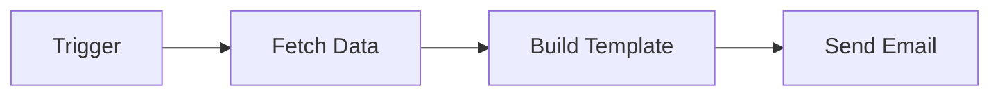
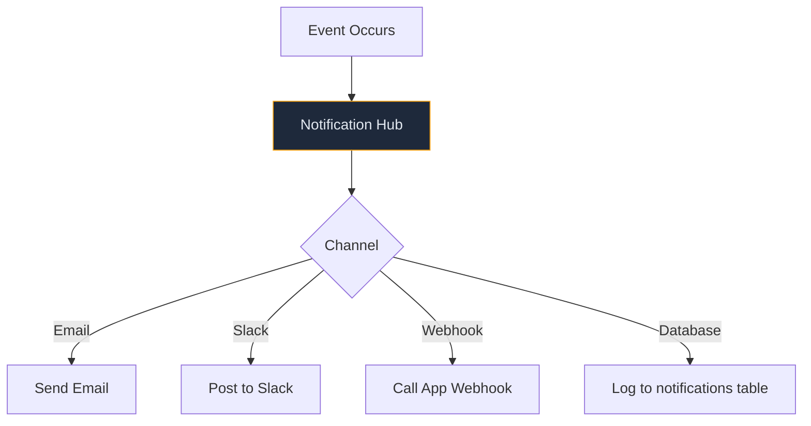
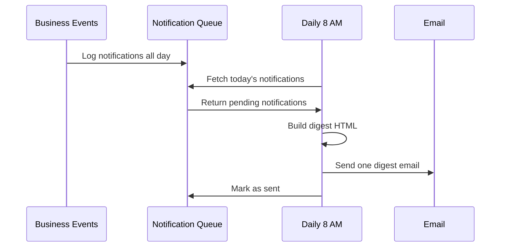

# Lab 035 – n8n: Email & Notifications

!!! hint "Overview"

    - In this lab, you will build email and notification workflows in n8n.
    - You will send templated emails, process incoming emails, and set up alerts.
    - You will create a notification system for Elcon's business processes.
    - By the end of this lab, your workflows will communicate with your team automatically.

## Prerequisites

- n8n running (Lab 031)
- Email account credentials (Gmail, Outlook, or SMTP)

## What You Will Learn

- Sending emails from n8n workflows
- Email templates with dynamic data
- Processing incoming emails
- Multi-channel notifications (email, Slack, webhook)
- Building an alert system

---

## Lab Steps

### Step 1 – Configure Email Credentials

1. Go to **Credentials** → **Add Credential**
2. Choose **SMTP** (or Gmail/Outlook)
3. Configure:
   - Host: `smtp.gmail.com`
   - Port: `465`
   - User: your email
   - Password: app-specific password

### Step 2 – Send a Templated Email



Build this workflow:

1. **Schedule Trigger** – Daily at 8 AM
2. **Supabase** – Get overdue POs:
   ```
   WHERE status NOT IN ('Received', 'Cancelled')
   AND expected_delivery < NOW()
   ```
3. **Code** – Build HTML email:

   ```javascript
   const overdue = $input.all().map((i) => i.json);
   const rows = overdue
     .map(
       (po) =>
         `<tr>
       <td>${po.po_number}</td>
       <td>${po.supplier_name}</td>
       <td style="color:red">${po.expected_delivery}</td>
       <td>${po.total_value} ${po.currency}</td>
     </tr>`,
     )
     .join("");

   return [
     {
       json: {
         subject: `⚠️ ${overdue.length} Overdue Purchase Orders`,
         html: `
         <h2>Overdue PO Alert</h2>
         <p>The following ${overdue.length} purchase orders are past their expected delivery date:</p>
         <table border="1" cellpadding="8" style="border-collapse:collapse">
           <tr><th>PO#</th><th>Supplier</th><th>Expected</th><th>Value</th></tr>
           ${rows}
         </table>
         <p>Please follow up with suppliers.</p>
       `,
       },
     },
   ];
   ```

4. **Send Email** – To procurement team

### Step 3 – Notification Hub

Build a centralized notification system:



Create a reusable sub-workflow `Notification Hub`:

1. **Webhook** – Receives: `{ type, title, body, severity, recipients[] }`
2. **Switch** – Route by severity:
   - `critical`: Email + Slack + Database
   - `warning`: Email + Database
   - `info`: Database only
3. **Email** / **Slack** / **Supabase** – Send/save notification

### Step 4 – Process Incoming Emails

Build a workflow that reads incoming emails:

1. **Email Trigger (IMAP)** – Watch inbox for new emails
2. **Code** – Extract sender, subject, body
3. **IF** – Route by subject keywords:
   - Contains "order" → Forward to procurement
   - Contains "invoice" → Forward to accounting
   - Contains "complaint" → Forward to support + flag urgent
4. **Supabase** – Log the email

### Step 5 – Digest Notifications

Instead of individual alerts, send a daily digest:



---

## Tasks

!!! note "Task 1"
Build the overdue PO alert workflow. Test with sample data. Configure to run daily.

!!! note "Task 2"
Create the Notification Hub sub-workflow. Send a test notification through all channels.

!!! note "Task 3"
Build a weekly digest email that summarizes: new POs, completed deliveries, overdue items, and top activities.

---

## Summary

In this lab you:

- [x] Configured email credentials in n8n
- [x] Built templated email workflows with dynamic data
- [x] Created a centralized Notification Hub
- [x] Processed incoming emails with routing logic
- [x] Built digest notification workflows
