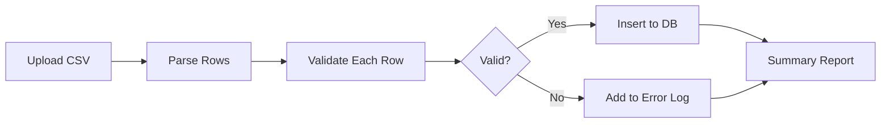
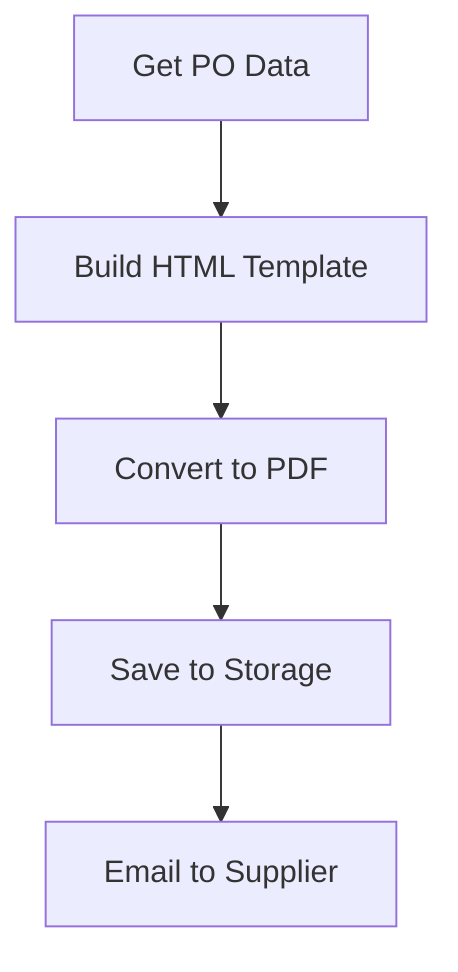
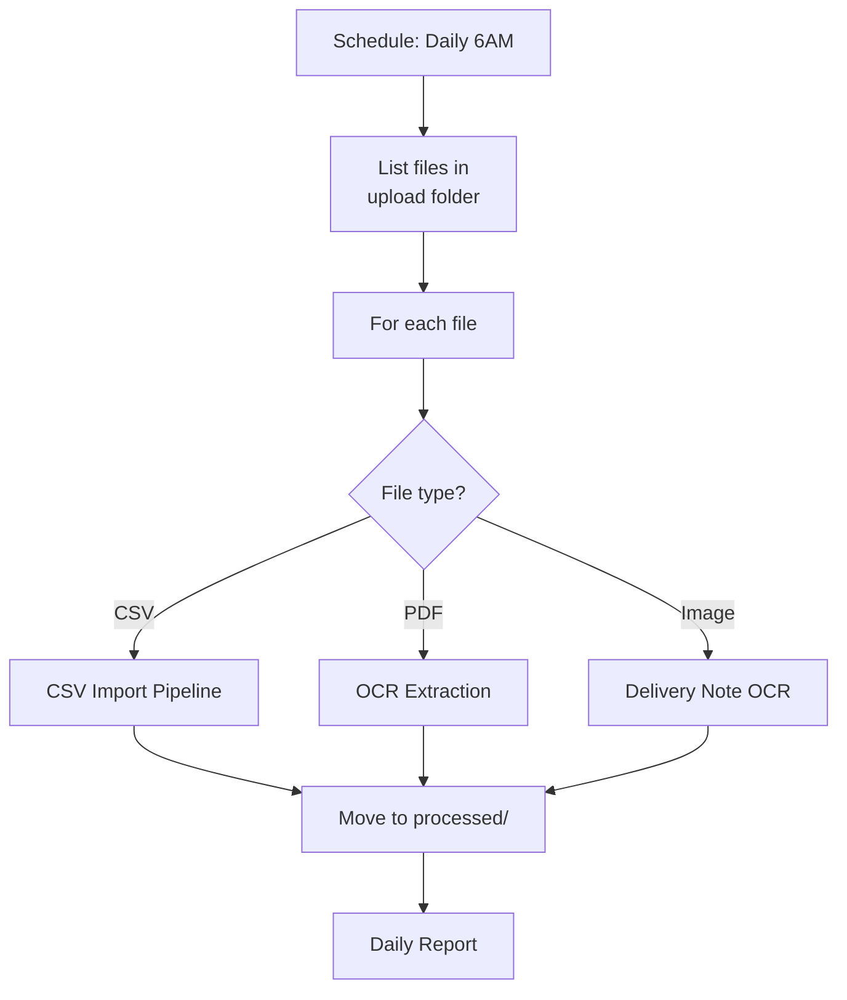

# Lab 036 – n8n: File Processing & Document Automation

!!! hint "Overview"

    - In this lab, you will use n8n to process files: CSV, PDF, Excel, and images.
    - You will build document generation and OCR extraction workflows.
    - You will automate Elcon's document-heavy processes.
    - By the end of this lab, you will eliminate manual document handling.

## Prerequisites

- n8n running (Lab 031)
- Sample files (CSV, PDF)

## What You Will Learn

- CSV and Excel file processing
- PDF generation from templates
- OCR document extraction
- File storage and management
- Batch file processing

---

## Lab Steps

### Step 1 – CSV Processing Pipeline



Build this workflow:

1. **Webhook** – Receives file upload
2. **Spreadsheet File** node – Parse CSV
3. **Code** – Validate each row:

   ```javascript
   const valid = [];
   const errors = [];

   for (const item of $input.all()) {
     const row = item.json;
     const rowErrors = [];

     if (!row.name) rowErrors.push("Name is required");
     if (row.email && !row.email.includes("@")) rowErrors.push("Invalid email");
     if (row.phone && !/^[\d\-\+\s]+$/.test(row.phone))
       rowErrors.push("Invalid phone");

     if (rowErrors.length === 0) {
       valid.push({ json: row });
     } else {
       errors.push({ json: { ...row, errors: rowErrors.join("; ") } });
     }
   }

   // Pass both arrays to different outputs
   return [valid, errors];
   ```

4. **Supabase** – Bulk insert valid records
5. **Spreadsheet File** – Generate error report CSV
6. **Respond to Webhook** – Return summary

### Step 2 – Generate Purchase Order PDF



Build a PO document generator:

1. **Webhook** – Receives PO ID
2. **Supabase** – Fetch PO details + line items + supplier info
3. **Code** – Generate HTML template:

   ```javascript
   const po = $("Get PO").item.json;
   const items = $("Get Line Items")
     .all()
     .map((i) => i.json);

   const itemRows = items
     .map(
       (item) => `
     <tr>
       <td>${item.part_number}</td>
       <td>${item.description}</td>
       <td>${item.quantity}</td>
       <td>${item.unit_price} ${po.currency}</td>
       <td>${item.total_price} ${po.currency}</td>
     </tr>
   `,
     )
     .join("");

   return [
     {
       json: {
         html: `
         <html>
         <head><style>
           body { font-family: Arial; padding: 40px; }
           h1 { color: #2563eb; }
           table { width: 100%; border-collapse: collapse; }
           th, td { border: 1px solid #ddd; padding: 8px; text-align: left; }
           th { background: #2563eb; color: white; }
           .footer { margin-top: 40px; color: #666; }
         </style></head>
         <body>
           <h1>ELCON - Purchase Order #${po.po_number}</h1>
           <p><strong>Supplier:</strong> ${po.supplier_name}</p>
           <p><strong>Date:</strong> ${po.order_date}</p>
           <p><strong>Delivery:</strong> ${po.expected_delivery}</p>
           <table>
             <tr><th>Part#</th><th>Description</th><th>Qty</th><th>Unit Price</th><th>Total</th></tr>
             ${itemRows}
             <tr><td colspan="4"><strong>Total</strong></td><td><strong>${po.total_value} ${po.currency}</strong></td></tr>
           </table>
           <div class="footer">
             <p>Elcon Ltd. | Instrumentation & Control</p>
           </div>
         </body>
         </html>
       `,
       },
     },
   ];
   ```

4. **HTML to File** / **HTTP Request** to PDF API – Convert to PDF
5. **Email** – Send PDF to supplier

### Step 3 – OCR: Delivery Note Extraction

Use Claude's Vision API for OCR:

1. **Webhook** – Receives image file (delivery note scan)
2. **HTTP Request** – Call Claude API with image:
   ```json
   {
     "model": "claude-sonnet-4-20250514",
     "messages": [
       {
         "role": "user",
         "content": [
           {
             "type": "image",
             "source": { "type": "base64", "data": "{{ $binary.data }}" }
           },
           {
             "type": "text",
             "text": "Extract from this delivery note: PO number, delivery date, item list (part number, quantity received). Return as JSON."
           }
         ]
       }
     ]
   }
   ```
3. **Code** – Parse AI response
4. **Supabase** – Match to existing PO
5. **Supabase** – Update PO status to "Received"
6. **Notification Hub** – Notify team

### Step 4 – Batch File Processing

Process multiple files from a folder:



---

## Tasks

!!! note "Task 1"
Build the CSV import pipeline with validation. Test with a CSV of 50 suppliers (include some invalid rows).

!!! note "Task 2"
Create the PO PDF generator. Generate a sample PO document and verify it looks professional.

!!! note "Task 3"
Build the OCR delivery note extractor using Claude's Vision API. Test with a sample delivery note image.

---

## Summary

In this lab you:

- [x] Built CSV import pipelines with validation
- [x] Generated professional PDF documents from templates
- [x] Used AI (Claude Vision) for OCR document extraction
- [x] Processed files in batch workflows
