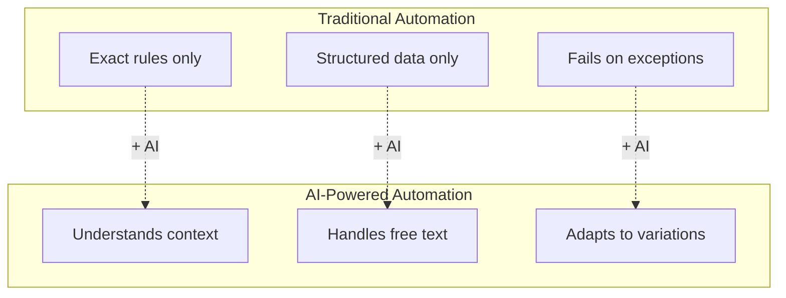
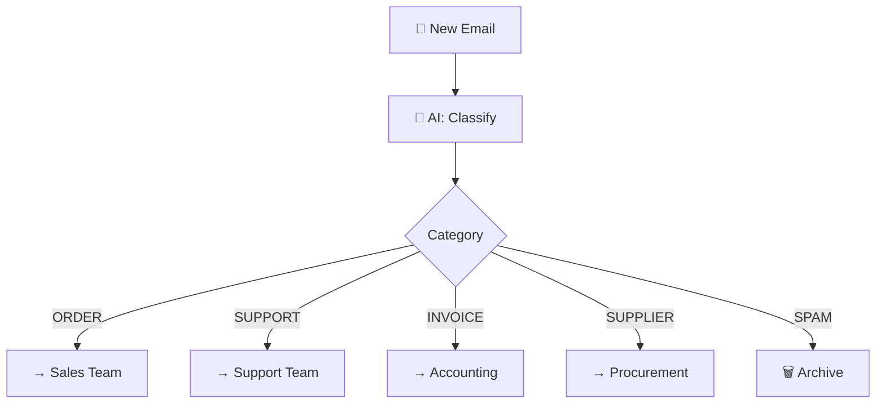
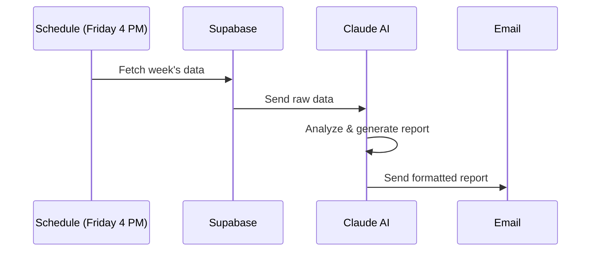
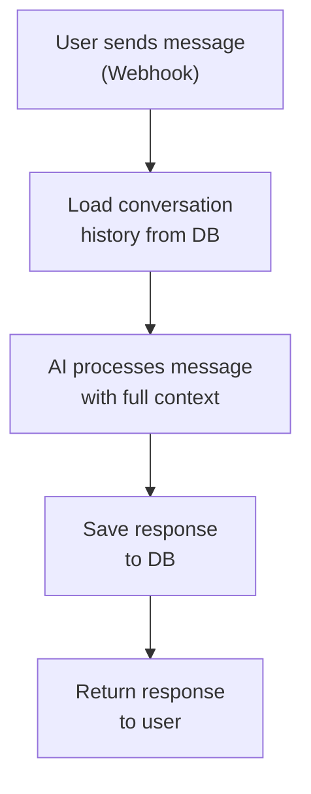

# Lab 037 – n8n: AI Integration (Claude & OpenAI)

!!! hint "Overview"

    - In this lab, you will integrate AI language models directly into n8n workflows.
    - You will use Claude and OpenAI nodes for classification, extraction, and generation.
    - You will build intelligent automation that understands context and makes decisions.
    - By the end of this lab, your workflows will have AI superpowers.

## Prerequisites

- n8n running (Lab 031)
- Claude API key or OpenAI API key

## What You Will Learn

- Using AI Chat nodes in n8n
- Prompt engineering for automation
- Classification and routing with AI
- Data extraction from unstructured text
- AI-generated reports and summaries

---

## Background

### AI in Automation



---

## Lab Steps

### Step 1 – Set Up AI Credentials

1. **Credentials** → **Add Credential** → **Anthropic** (or OpenAI)
2. Enter your API key
3. Test the connection

### Step 2 – Email Classification

Build an AI-powered email router:



1. **Email Trigger** – New email arrives
2. **AI Agent** node – Classify:

   ```
   System: You are an email classifier for Elcon, an instrumentation company.
   Classify emails into: ORDER, SUPPORT, INVOICE, SUPPLIER, SPAM, OTHER.
   Also extract: sender_company, urgency (LOW/MEDIUM/HIGH), summary (one line).
   Return JSON only.

   User: Subject: {{ $json.subject }}
   Body: {{ $json.body }}
   From: {{ $json.from }}
   ```

3. **Code** – Parse JSON response
4. **Switch** – Route by category
5. **Email** – Forward to appropriate team

### Step 3 – Supplier Data Extraction

Extract structured data from unstructured supplier communications:

```
System: Extract supplier information from this text.
Return a JSON object with:
- company_name
- contact_name
- email
- phone
- products[] (list of products/services they offer)
- pricing_mentioned (boolean)
- delivery_time (if mentioned)
- payment_terms (if mentioned)

If a field is not found, set it to null.

User: {{ $json.email_body }}
```

### Step 4 – AI-Powered Report Generation



Build the weekly report:

1. **Schedule** – Friday 4 PM
2. **Supabase** – Fetch this week's POs, deliveries, issues
3. **AI Agent** – Generate report:

   ```
   System: You are a business analyst at Elcon.
   Write a concise weekly management report based on the data provided.

   Format:
   1. Executive Summary (3 sentences max)
   2. Key Metrics (table format)
   3. Highlights (top 3 achievements)
   4. Issues Requiring Attention (urgent items)
   5. Upcoming Deliveries (next week)
   6. Recommendations (2-3 actionable items)

   Keep it professional and under 500 words.

   Data: {{ JSON.stringify($input.all().map(i => i.json)) }}
   ```

4. **Code** – Wrap in HTML email template
5. **Email** – Send to management

### Step 5 – AI Quality Control

Use AI to check data quality:

```
Analyze this list of supplier records and identify:
1. Likely duplicate entries (similar names, same email/phone)
2. Incomplete records (missing critical fields)
3. Invalid data (malformed emails, impossible phone numbers)
4. Inconsistencies (same company with different spellings)

Return a JSON report with issues found and suggested fixes.
```

### Step 6 – Conversational AI Workflow

Build a workflow that handles multi-turn conversations:



---

## Tasks

!!! note "Task 1"
Build the email classification workflow. Test with 10 sample emails of different types.

!!! note "Task 2"
Create the AI weekly report generator. Generate a sample report with mock data.

!!! note "Task 3"
Build an AI data quality checker. Run it against your supplier table and fix the issues it finds.

---

## Summary

In this lab you:

- [x] Integrated Claude/OpenAI into n8n workflows
- [x] Built AI-powered email classification
- [x] Extracted structured data from unstructured text
- [x] Generated AI-powered management reports
- [x] Used AI for data quality control
