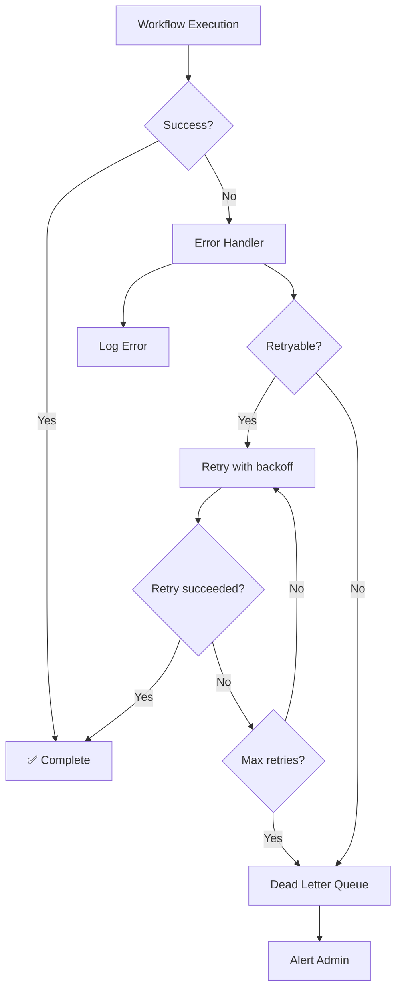
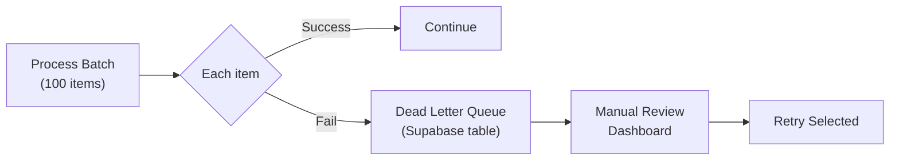

# Lab 038 – n8n: Error Handling & Monitoring

!!! hint "Overview"

    - In this lab, you will build production-ready workflows with proper error handling.
    - You will set up monitoring, logging, and alerting for all your automations.
    - You will learn retry strategies and dead letter queues.
    - By the end of this lab, your workflows will be resilient and self-monitoring.

## Prerequisites

- n8n running (Lab 031)
- Existing workflows from previous labs

## What You Will Learn

- Error handling strategies in n8n
- Retry logic and backoff patterns
- Dead letter queues for failed items
- Workflow monitoring and alerting
- Logging best practices

---

## Background

### Error Handling Architecture



---

## Lab Steps

### Step 1 – Node-Level Error Handling

Every n8n node has error handling options:

| Setting              | What It Does                                |
| -------------------- | ------------------------------------------- |
| **Continue on Fail** | Don't stop the workflow, pass error to next |
| **Retry on Fail**    | Retry N times with delay                    |
| **Error Output**     | Route errors to a different branch          |

Configure retry for an HTTP Request node:

- Retries: 3
- Wait between: 1000ms
- Backoff: Exponential (1s → 2s → 4s)

### Step 2 – Global Error Workflow

Create a workflow that catches ALL errors:

1. **Error Trigger** – Fires when any workflow fails
2. **Code** – Extract error details:
   ```javascript
   const error = $input.first().json;
   return [
     {
       json: {
         workflow_name: error.workflow.name,
         workflow_id: error.workflow.id,
         error_message: error.execution.error.message,
         node_name: error.execution.lastNodeExecuted,
         timestamp: new Date().toISOString(),
         execution_id: error.execution.id,
       },
     },
   ];
   ```
3. **Supabase** – Log to `workflow_errors` table
4. **IF** – Check severity
5. **Email** – Alert admin for critical errors

Set this as the **Error Workflow** in n8n Settings.

### Step 3 – Dead Letter Queue

For batch operations, handle individual item failures:



```sql
CREATE TABLE dead_letter_queue (
    id          UUID DEFAULT gen_random_uuid() PRIMARY KEY,
    created_at  TIMESTAMPTZ DEFAULT now(),
    workflow_id TEXT,
    node_name   TEXT,
    item_data   JSONB,
    error_msg   TEXT,
    retry_count INTEGER DEFAULT 0,
    status      TEXT DEFAULT 'pending'
                CHECK (status IN ('pending', 'retrying', 'resolved', 'abandoned'))
);
```

### Step 4 – Monitoring Dashboard

Build a monitoring workflow:

1. **Schedule** – Every 5 minutes
2. **n8n API** – Fetch recent executions:
   ```
   GET /executions?status=error&limit=10
   ```
3. **Code** – Calculate metrics:
   - Success rate (last hour)
   - Error count by workflow
   - Average execution time
4. **Supabase** – Save metrics
5. **IF** – Error rate > 20% → Alert

### Step 5 – Structured Logging

Add logging to every workflow:

```javascript
// At workflow start:
const logEntry = {
  workflow: $workflow.name,
  execution_id: $execution.id,
  started_at: new Date().toISOString(),
  trigger: "schedule", // or 'webhook', 'manual'
  status: "started",
};

// At workflow end:
logEntry.completed_at = new Date().toISOString();
logEntry.status = "success";
logEntry.items_processed = $input.all().length;
logEntry.duration_ms = Date.now() - startTime;
```

---

## Tasks

!!! note "Task 1"
Add error handling to 3 existing workflows: retry logic on HTTP nodes, error outputs, and logging.

!!! note "Task 2"
Create the global error workflow that logs all failures and alerts on critical errors.

!!! note "Task 3"
Build the monitoring dashboard data collection workflow. Generate a health report.

---

## Summary

In this lab you:

- [x] Implemented node-level error handling (retry, continue, error output)
- [x] Created a global error workflow
- [x] Built a dead letter queue for failed items
- [x] Set up monitoring and metrics collection
- [x] Learned structured logging best practices
