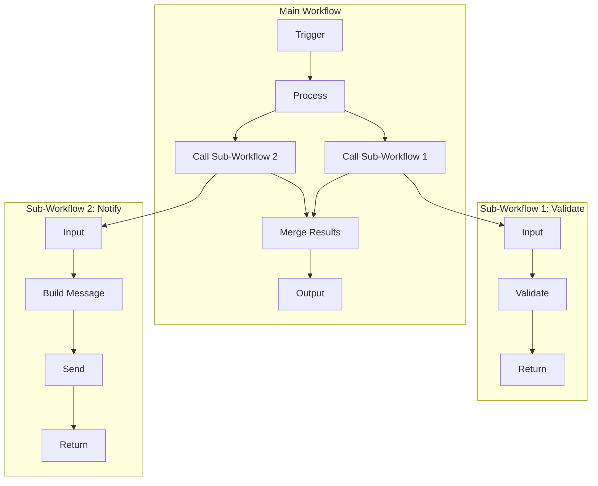
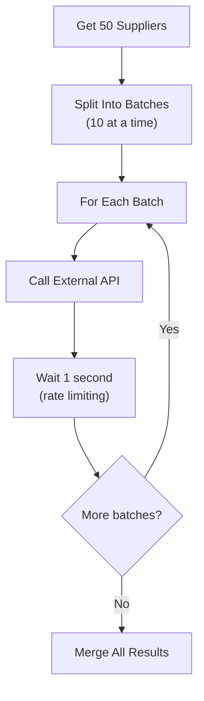
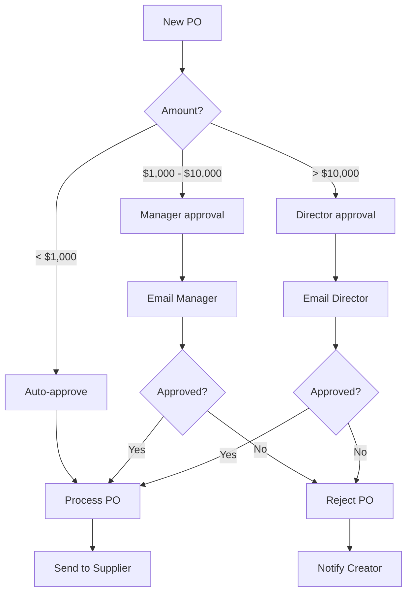

# Lab 039 – n8n: Sub-Workflows & Advanced Patterns

!!! hint "Overview"

    - In this lab, you will learn advanced n8n patterns: sub-workflows, loops, and branching.
    - You will build reusable workflow components.
    - You will implement complex business logic with conditional routing.
    - By the end of this lab, you will design enterprise-grade workflow architectures.

## Prerequisites

- n8n running (Lab 031)
- Completed Labs 032-038

## What You Will Learn

- Sub-workflows and how to call them
- Looping and iteration patterns
- Complex conditional routing
- Workflow versioning and management
- Performance optimization

---

## Background

### Workflow Architecture

---

## Lab Steps

### Step 1 – Sub-Workflows

Create reusable sub-workflows:

**Sub-Workflow: Validate Supplier**

1. **Execute Workflow Trigger** – Receives supplier data
2. **Code** – Validate all fields
3. **Return** – Success/failure with error messages

**Sub-Workflow: Send Notification**

1. **Execute Workflow Trigger** – Receives notification request
2. **Switch** – Route by channel (email/slack/webhook)
3. **Send** – Via appropriate channel
4. **Return** – Delivery confirmation

**Main Workflow:**

1. **Webhook** – New supplier data
2. **Execute Workflow** – Call "Validate Supplier"
3. **IF** – Check validation result
4. **Supabase** – Save valid supplier
5. **Execute Workflow** – Call "Send Notification"

### Step 2 – Looping Patterns

Process items one at a time with external calls:

Build using the **Split In Batches** node:

- Batch size: 10
- Process each batch
- Wait between batches (avoid rate limits)

### Step 3 – Complex Conditional Routing

### Step 4 – Workflow Templates

Create template workflows for common patterns:

| Template               | Pattern                                  | Use Case               |
| ---------------------- | ---------------------------------------- | ---------------------- |
| **CRUD API**           | Webhook → Validate → DB → Respond        | Any entity management  |
| **Scheduled Report**   | Schedule → Query → AI Summary → Email    | Weekly/monthly reports |
| **Data Sync**          | Schedule → Read → Compare → Upsert → Log | System-to-system sync  |
| **Document Processor** | Webhook → OCR → Match → Update → Notify  | Invoice/delivery notes |
| **Alert Monitor**      | Schedule → Check → IF Threshold → Alert  | KPI monitoring         |

### Step 5 – Performance Optimization

| Problem                    | Solution                                   |
| -------------------------- | ------------------------------------------ |
| Workflow takes too long    | Parallelize independent branches           |
| Too many API calls         | Batch operations, use bulk endpoints       |
| Large data sets            | Use pagination, process in chunks          |
| Memory issues              | Stream data instead of loading all at once |
| Repeated expensive queries | Cache results in variables or temp table   |

---

## Tasks

!!! note "Task 1"
Create 2 reusable sub-workflows (validation + notification) and call them from a main workflow.

!!! note "Task 2"
Build the PO approval routing workflow with amount-based conditional logic.

!!! note "Task 3"
Create a workflow template library: build at least 3 template workflows that can be copied and customized.

---

## Summary

In this lab you:

- [x] Built and called sub-workflows for reusable logic
- [x] Implemented looping with batch processing
- [x] Designed complex conditional routing
- [x] Created reusable workflow templates
- [x] Optimized workflow performance
