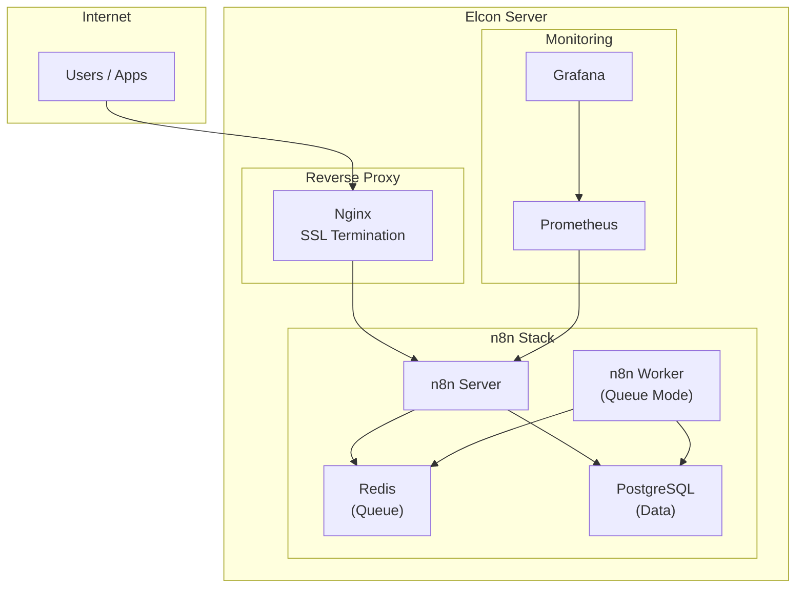
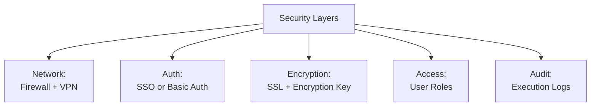
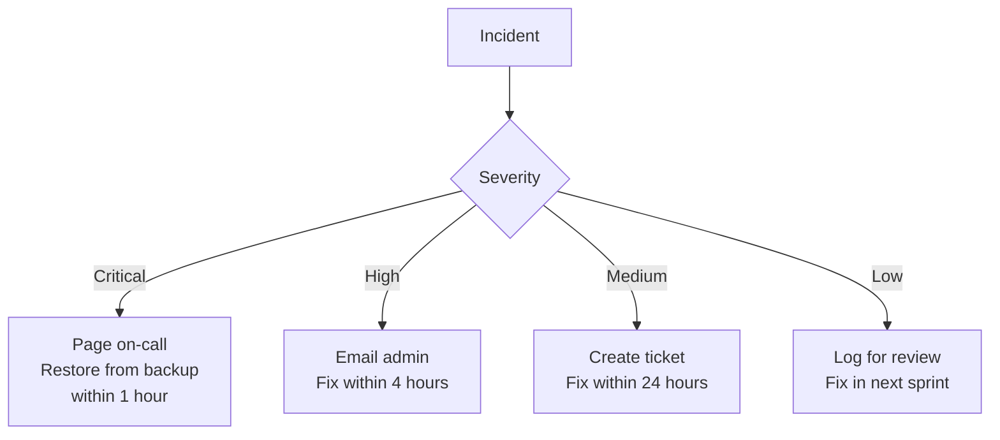

# Lab 040 – n8n: Production Deployment & Operations

!!! hint "Overview"

    - In this lab, you will prepare n8n for production deployment on Elcon's server.
    - You will configure backups, security, and high availability.
    - You will build operational dashboards and maintenance procedures.
    - By the end of this lab, you will have a production-ready n8n deployment.

## Prerequisites

- n8n running with Docker Compose (Lab 031)
- All n8n labs completed (031-039)

## What You Will Learn

- Production configuration for n8n
- Security hardening
- Backup and disaster recovery
- Monitoring and alerting
- Operational runbooks

---

## Background

### Production Architecture



---

## Lab Steps

### Step 1 – Production Docker Compose

```yaml
# docker-compose.production.yml
version: "3.8"

services:
  nginx:
    image: nginx:alpine
    restart: always
    ports:
      - "80:80"
      - "443:443"
    volumes:
      - ./nginx/nginx.conf:/etc/nginx/nginx.conf:ro
      - ./nginx/certs:/etc/nginx/certs:ro
    depends_on:
      - n8n

  n8n:
    image: n8nio/n8n:latest
    restart: always
    environment:
      - DB_TYPE=postgresdb
      - DB_POSTGRESDB_HOST=postgres
      - DB_POSTGRESDB_DATABASE=n8n
      - DB_POSTGRESDB_USER=n8n
      - DB_POSTGRESDB_PASSWORD=${N8N_DB_PASSWORD}
      - N8N_ENCRYPTION_KEY=${N8N_ENCRYPTION_KEY}
      - WEBHOOK_URL=https://n8n.elcon.local
      - N8N_METRICS=true
      - EXECUTIONS_DATA_PRUNE=true
      - EXECUTIONS_DATA_MAX_AGE=336
      - N8N_LOG_LEVEL=warn
      - N8N_LOG_OUTPUT=console,file
      - N8N_LOG_FILE_LOCATION=/home/node/.n8n/logs/n8n.log
    volumes:
      - n8n_data:/home/node/.n8n
    depends_on:
      - postgres
      - redis

  postgres:
    image: postgres:16
    restart: always
    environment:
      POSTGRES_DB: n8n
      POSTGRES_USER: n8n
      POSTGRES_PASSWORD: ${N8N_DB_PASSWORD}
    volumes:
      - postgres_data:/var/lib/postgresql/data
    healthcheck:
      test: ["CMD-SHELL", "pg_isready -U n8n"]
      interval: 10s
      timeout: 5s
      retries: 5

  redis:
    image: redis:7-alpine
    restart: always
    volumes:
      - redis_data:/data

  # Backup service
  backup:
    image: postgres:16
    environment:
      PGHOST: postgres
      PGUSER: n8n
      PGPASSWORD: ${N8N_DB_PASSWORD}
      PGDATABASE: n8n
    volumes:
      - ./backups:/backups
    entrypoint: /bin/sh
    command: >
      -c 'while true; do
        pg_dump -Fc > /backups/n8n_$$(date +%Y%m%d_%H%M%S).dump;
        find /backups -name "*.dump" -mtime +30 -delete;
        sleep 86400;
      done'

volumes:
  n8n_data:
  postgres_data:
  redis_data:
```

### Step 2 – Security Hardening



**Security checklist:**

!!! warning "Production Security"

    - [ ] Strong `N8N_ENCRYPTION_KEY` (32+ random characters)
    - [ ] HTTPS only (SSL certificates configured)
    - [ ] Firewall: only allow necessary ports (443)
    - [ ] Database not exposed to internet
    - [ ] Regular password rotation
    - [ ] Execution logs enabled and reviewed
    - [ ] Credential access limited to workflow owners

### Step 3 – Backup & Recovery

**Automated backup schedule:**

| Backup Type     | Frequency  | Retention | What                         |
| --------------- | ---------- | --------- | ---------------------------- |
| Database dump   | Daily 2 AM | 30 days   | All workflows + credentials  |
| Workflow export | Daily 3 AM | 90 days   | JSON export of all workflows |
| Full server     | Weekly     | 4 weeks   | Docker volumes snapshot      |

Build a backup verification workflow:

1. **Schedule** – Daily 4 AM (after backups complete)
2. **Execute Command** – Check backup file exists and size > 0
3. **IF** – Backup missing or too small → Alert
4. **Email** – Send backup report

### Step 4 – Operational Runbook



**Common operations:**

| Operation            | Command / Action                                             |
| -------------------- | ------------------------------------------------------------ |
| Restart n8n          | `docker compose restart n8n`                                 |
| View logs            | `docker compose logs -f n8n`                                 |
| Backup now           | `docker compose exec backup pg_dump -Fc > backup.dump`       |
| Restore from backup  | `docker compose exec postgres pg_restore -d n8n backup.dump` |
| Export all workflows | n8n API: `GET /workflows`                                    |
| Import workflow      | n8n API: `POST /workflows`                                   |
| Check health         | `curl https://n8n.elcon.local/healthz`                       |

### Step 5 – Monitoring with n8n Itself

Build a self-monitoring workflow:

1. **Schedule** – Every 5 minutes
2. **HTTP Request** – Health check endpoints
3. **Code** – Calculate metrics:
   - Uptime
   - Failed executions in last hour
   - Queue length
   - Response time
4. **IF** – Any metric out of range → Alert
5. **Supabase** – Store metrics for dashboard

---

## Tasks

!!! note "Task 1"
Deploy n8n with the production Docker Compose configuration. Verify all services start correctly.

!!! note "Task 2"
Set up automated daily backups and a backup verification workflow.

!!! note "Task 3"
Build the self-monitoring workflow. Test by intentionally causing a failure and verifying the alert fires.

---

## Summary

In this lab you:

- [x] Deployed n8n with production Docker Compose
- [x] Hardened security (SSL, encryption, firewall)
- [x] Set up automated backups and verification
- [x] Created an operational runbook
- [x] Built self-monitoring workflows

---

!!! success "n8n Section Complete 🎉"

    You now have comprehensive n8n skills.
    Next: Final Project – building a complete CRM with Claude Code + n8n.
