# n8n Workflow Tasks

- Hands-on n8n exercises covering triggers, data transformation, HTTP calls, database operations, file processing, AI integration, and production patterns.
- Each task includes a clear scenario, helpful hints, and detailed solutions with explanations.
- Practice these tasks to master building automated workflows for Elcon's business processes.

---

## Table of Contents

- [01. Hello World Workflow](#01-hello-world-workflow)
- [02. Schedule Trigger with Logging](#02-schedule-trigger-with-logging)
- [03. Webhook Receiver](#03-webhook-receiver)
- [04. Data Transformation Pipeline](#04-data-transformation-pipeline)
- [05. IF/Switch Conditional Routing](#05-ifswitch-conditional-routing)
- [06. HTTP GET: Fetch External Data](#06-http-get-fetch-external-data)
- [07. HTTP POST: Send Data to API](#07-http-post-send-data-to-api)
- [08. Database Read: Query Supabase](#08-database-read-query-supabase)
- [09. Database Write: Insert Records](#09-database-write-insert-records)
- [10. Database Sync: Two-Way](#10-database-sync-two-way)
- [11. Send Email with Template](#11-send-email-with-template)
- [12. Send Email with Attachment](#12-send-email-with-attachment)
- [13. CSV Import Pipeline](#13-csv-import-pipeline)
- [14. PDF Document Generation](#14-pdf-document-generation)
- [15. AI Classification Node](#15-ai-classification-node)
- [16. AI Data Extraction](#16-ai-data-extraction)
- [17. AI Report Generation](#17-ai-report-generation)
- [18. Error Handling: Retry and Fallback](#18-error-handling-retry-and-fallback)
- [19. Error Workflow: Global Catcher](#19-error-workflow-global-catcher)
- [20. Sub-Workflow: Reusable Component](#20-sub-workflow-reusable-component)
- [21. Batch Processing with Split](#21-batch-processing-with-split)
- [22. Webhook API: CRUD Endpoints](#22-webhook-api-crud-endpoints)
- [23. Scheduled Report Pipeline](#23-scheduled-report-pipeline)
- [24. Multi-Channel Notification Hub](#24-multi-channel-notification-hub)
- [25. Complete Order Processing Workflow](#25-complete-order-processing-workflow)

---

## 01. Hello World Workflow

- Create a workflow with a Manual Trigger, a Set node that creates a message, and a Function node that transforms it.

## Scenario:

- Your first n8n workflow. Learn the basic building blocks: triggers, data nodes, and testing.

Hint: Manual Trigger → Set node (add a `message` field) → Code node (transform the message) → Execute to test.

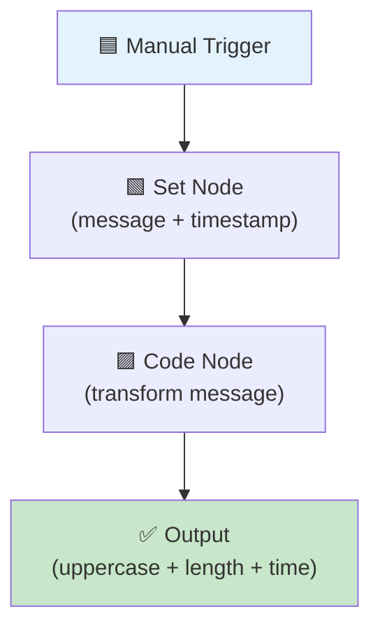
```mermaid
graph TD
    A["🟦 Manual Trigger"] --> B["🟩 Set Node<br/>(message + timestamp)"]
    B --> C["🟪 Code Node<br/>(transform message)"]
    C --> D["✅ Output<br/>(uppercase + length + time)"]

    style A fill:#e3f2fd
    style D fill:#c8e6c9
```

??? success "Solution"

    1. Add **Manual Trigger**
    2. Add **Set** node:
       - Field: `message` = `Hello from Elcon n8n!`
       - Field: `timestamp` = `{{ $now.toISO() }}`
    3. Add **Code** node:
       ```javascript
       return items.map(item => ({
         json: {
           original: item.json.message,
           uppercase: item.json.message.toUpperCase(),
           length: item.json.message.length,
           processed_at: new Date().toISOString()
         }
       }));
       ```
    4. Click **Execute Workflow**
    5. Check each node's output in the execution panel

---

## 02. Schedule Trigger with Logging

- Create a workflow that runs every 5 minutes and logs the current time, day of week, and a counter to a Supabase table.

## Scenario:

- You need a heartbeat monitor to verify n8n is running and workflows execute on schedule.

Hint: Use Schedule Trigger (cron) → Code node (build log entry) → Supabase node (insert).

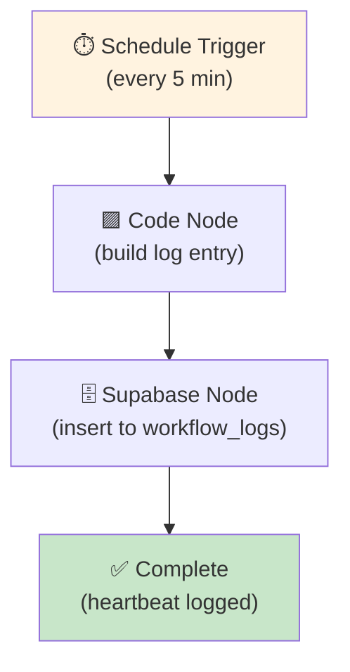
```mermaid
graph TD
    A["⏱️ Schedule Trigger<br/>(every 5 min)"] --> B["🟪 Code Node<br/>(build log entry)"]
    B --> C["🗄️ Supabase Node<br/>(insert to workflow_logs)"]
    C --> D["✅ Complete<br/>(heartbeat logged)"]

    style A fill:#fff3e0
    style D fill:#c8e6c9
```

??? success "Solution"

    1. **Schedule Trigger**: Every 5 minutes (`*/5 * * * *`)
    2. **Code** node:
       ```javascript
       return [{
         json: {
           workflow: $workflow.name,
           execution_id: $execution.id,
           timestamp: new Date().toISOString(),
           day_of_week: new Date().toLocaleDateString('en', {weekday: 'long'}),
           status: 'heartbeat'
         }
       }];
       ```
    3. **Supabase** node: Insert into `workflow_logs` table

---

## 03. Webhook Receiver

- Create a webhook endpoint that receives JSON data, validates it, and returns a success/error response.

## Scenario:

- External systems (your frontend, other tools) need to trigger n8n workflows via HTTP.

Hint: Webhook node (POST) → Code node (validate) → IF node (valid?) → Respond to Webhook.

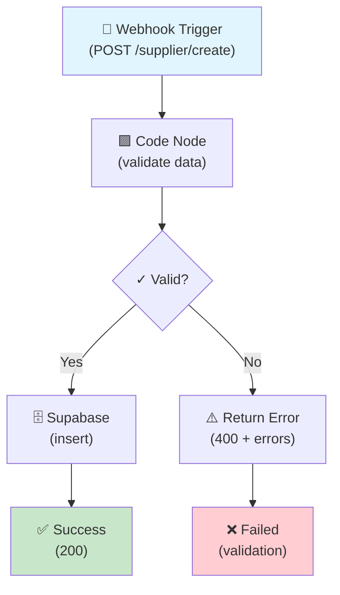
```mermaid
graph TD
    A["🔗 Webhook Trigger<br/>(POST /supplier/create)"] --> B["🟪 Code Node<br/>(validate data)"]
    B --> C{"✓ Valid?"}
    C -->|Yes| D["🗄️ Supabase<br/>(insert)"]
    C -->|No| E["⚠️ Return Error<br/>(400 + errors)"]
    D --> F["✅ Success<br/>(200)"]
    E --> G["❌ Failed<br/>(validation)"]

    style A fill:#e1f5fe
    style F fill:#c8e6c9
    style G fill:#ffcdd2
```

??? success "Solution"

    1. **Webhook** node:
       - Method: POST
       - Path: `/supplier/create`
    2. **Code** node (validate):
       ```javascript
       const body = $input.first().json.body;
       const errors = [];
       if (!body.name) errors.push('name is required');
       if (!body.email) errors.push('email is required');
       if (body.email && !body.email.includes('@')) errors.push('invalid email');

       return [{
         json: {
           valid: errors.length === 0,
           data: body,
           errors: errors
         }
       }];
       ```
    3. **IF** node: `{{ $json.valid }}` equals `true`
    4. **True** → Supabase Insert → **Respond to Webhook** (200, `{ "status": "created" }`)
    5. **False** → **Respond to Webhook** (400, `{ "errors": $json.errors }`)

---

## 04. Data Transformation Pipeline

- Build a workflow that takes raw supplier data, cleans it, normalizes formats, and enriches it with calculated fields.

## Scenario:

- Data from CSV imports or external systems is messy. You need a cleaning pipeline.

Hint: Manual Trigger → Set (sample data) → Code (clean) → Code (enrich) → output.

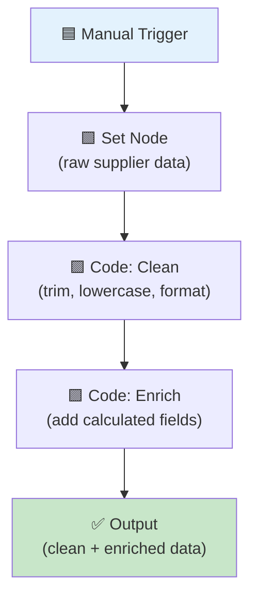
```mermaid
graph TD
    A["🟦 Manual Trigger"] --> B["🟩 Set Node<br/>(raw supplier data)"]
    B --> C["🟪 Code: Clean<br/>(trim, lowercase, format)"]
    C --> D["🟪 Code: Enrich<br/>(add calculated fields)"]
    D --> E["✅ Output<br/>(clean + enriched data)"]

    style A fill:#e3f2fd
    style E fill:#c8e6c9
```

??? success "Solution"

    1. **Manual Trigger**
    2. **Set** node (sample raw data):
       ```
       name = "  techsensors LTD.  "
       email = "CONTACT@Techsensors.COM"
       phone = "+972-50-123-4567"
       country = "israel"
       ```
    3. **Code** node (clean):
       ```javascript
       return items.map(item => {
         const d = item.json;
         return {
           json: {
             name: d.name.trim().replace(/\s+/g, ' '),
             email: d.email.toLowerCase().trim(),
             phone: d.phone.replace(/[^\d+]/g, ''),
             country: d.country.charAt(0).toUpperCase() + d.country.slice(1).toLowerCase(),
             name_normalized: d.name.trim().toLowerCase().replace(/[^a-z0-9]/g, '')
           }
         };
       });
       ```
    4. **Code** node (enrich):
       ```javascript
       return items.map(item => ({
         json: {
           ...item.json,
           is_local: item.json.country === 'Israel',
           domain: item.json.email.split('@')[1],
           imported_at: new Date().toISOString()
         }
       }));
       ```

---

## 05. IF/Switch Conditional Routing

- Build a workflow that routes purchase orders to different processing paths based on amount and urgency.

## Scenario:

- POs under $1K auto-approve, $1K-$10K need manager approval, over $10K need director approval. Urgent orders skip the queue.

Hint: Use Switch node with multiple outputs based on amount ranges.

??? success "Solution"

    1. **Webhook** (receives PO data)
    2. **Switch** node on `{{ $json.amount }}`:
       - Output 1: `amount < 1000` → Auto-approve path
       - Output 2: `amount >= 1000 AND amount < 10000` → Manager path
       - Output 3: `amount >= 10000` → Director path
    3. **IF** node on each path: `{{ $json.urgent }}` equals `true`
       - True → Skip approval, go directly to processing
       - False → Send approval email
    4. Each path ends with Supabase update (set status)

---

## 06. HTTP GET: Fetch External Data

- Build a workflow that fetches exchange rates from a public API and stores them in Supabase.

## Scenario:

- Elcon deals with multiple currencies (USD, EUR, ILS). Daily rate updates are needed for PO calculations.

Hint: Schedule Trigger → HTTP Request (GET) → Code (extract rates) → Supabase (upsert).

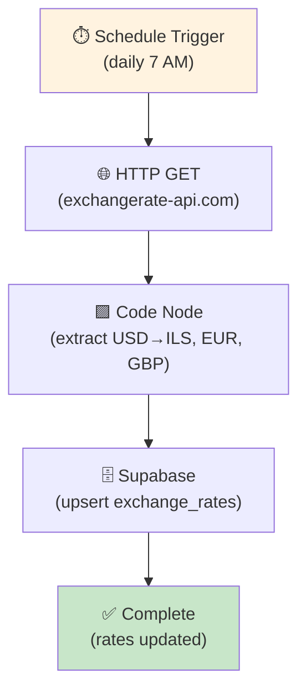
```mermaid
graph TD
    A["⏱️ Schedule Trigger<br/>(daily 7 AM)"] --> B["🌐 HTTP GET<br/>(exchangerate-api.com)"]
    B --> C["🟪 Code Node<br/>(extract USD→ILS, EUR, GBP)"]
    C --> D["🗄️ Supabase<br/>(upsert exchange_rates)"]
    D --> E["✅ Complete<br/>(rates updated)"]

    style A fill:#fff3e0
    style E fill:#c8e6c9
```

??? success "Solution"

    1. **Schedule Trigger**: Daily at 7 AM
    2. **HTTP Request** node:
       - Method: GET
       - URL: `https://api.exchangerate-api.com/v4/latest/USD`
    3. **Code** node:
       ```javascript
       const rates = $input.first().json.rates;
       return ['ILS', 'EUR', 'GBP'].map(currency => ({
         json: {
           base: 'USD',
           target: currency,
           rate: rates[currency],
           fetched_at: new Date().toISOString()
         }
       }));
       ```
    4. **Supabase** node: Upsert into `exchange_rates` (match on `base` + `target`)

---

## 07. HTTP POST: Send Data to API

- Build a workflow that sends a PO notification to an external API (simulate with webhook.site or a second n8n workflow).

## Scenario:

- When a PO is approved, you need to notify the supplier's system via their API.

Hint: Webhook Trigger → Supabase (get details) → HTTP Request (POST) → Log result.

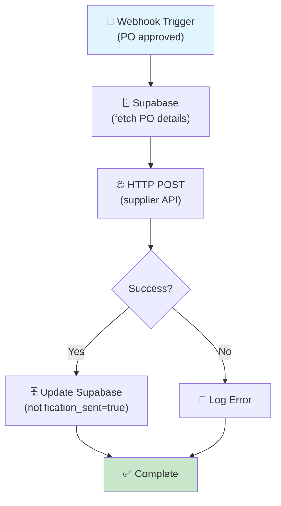
```mermaid
graph TD
    A["🔗 Webhook Trigger<br/>(PO approved)"] --> B["🗄️ Supabase<br/>(fetch PO details)"]
    B --> C["🌐 HTTP POST<br/>(supplier API)"]
    C --> D{"Success?"}
    D -->|Yes| E["🗄️ Update Supabase<br/>(notification_sent=true)"]
    D -->|No| F["📝 Log Error"]
    E --> G["✅ Complete"]
    F --> G

    style A fill:#e1f5fe
    style G fill:#c8e6c9
```

??? success "Solution"

    1. **Webhook** trigger (PO approved event)
    2. **Supabase** node: Get PO details + supplier API endpoint
    3. **HTTP Request** node:
       - Method: POST
       - URL: `{{ $json.supplier_api_url }}/orders`
       - Headers: `Authorization: Bearer {{ $json.supplier_api_key }}`
       - Body:
         ```json
         {
           "po_number": "{{ $json.po_number }}",
           "items": "{{ JSON.stringify($json.line_items) }}",
           "delivery_date": "{{ $json.expected_delivery }}"
         }
         ```
    4. **IF** node: Check response status code
    5. **Supabase**: Update PO with `notification_sent = true`

---

## 08. Database Read: Query Supabase

- Build a workflow that reads overdue purchase orders and groups them by supplier.

## Scenario:

- Procurement needs a daily summary of overdue POs grouped by which supplier is causing delays.

Hint: Schedule Trigger → Supabase (filter overdue) → Code (group by supplier) → output.

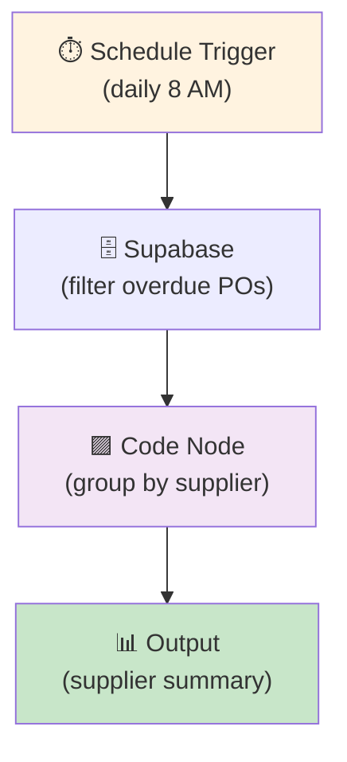
```mermaid
graph TD
    A["⏱️ Schedule Trigger<br/>(daily 8 AM)"] --> B["🗄️ Supabase<br/>(filter overdue POs)"]
    B --> C["🟪 Code Node<br/>(group by supplier)"]
    C --> D["📊 Output<br/>(supplier summary)"]

    style A fill:#fff3e0
    style D fill:#c8e6c9
    style C fill:#f3e5f5
```

??? success "Solution"

    1. **Schedule Trigger**: Daily at 8 AM
    2. **Supabase** node:
       - Operation: Get Many
       - Table: `purchase_orders`
       - Filters: `status` not in `[Received, Cancelled]` AND `expected_delivery` < today
    3. **Code** node (group by supplier):
       ```javascript
       const grouped = {};
       for (const item of $input.all()) {
         const supplier = item.json.supplier_name;
         if (!grouped[supplier]) {
           grouped[supplier] = { supplier, orders: [], total_value: 0 };
         }
         grouped[supplier].orders.push(item.json.po_number);
         grouped[supplier].total_value += item.json.total_value;
       }
       return Object.values(grouped).map(g => ({ json: g }));
       ```

---

## 09. Database Write: Insert Records

- Build a workflow that creates a new supplier record from webhook data with duplicate detection.

## Scenario:

- When a new supplier is onboarded via a form, check if they already exist before creating.

Hint: Webhook → Supabase (check existing by email) → IF (exists?) → Create or Update.

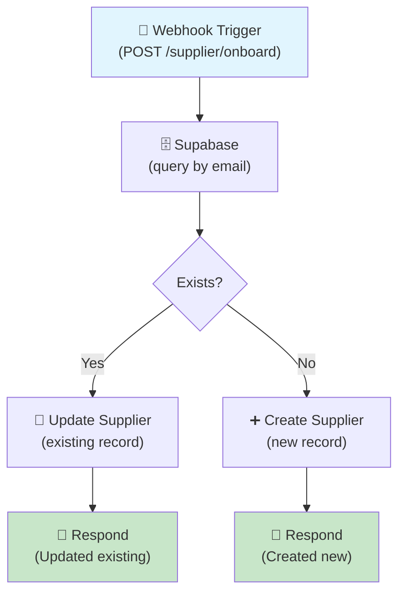
```mermaid
graph TD
    A["🔗 Webhook Trigger<br/>(POST /supplier/onboard)"] --> B["🗄️ Supabase<br/>(query by email)"]
    B --> C{"Exists?"}
    C -->|Yes| D["🔄 Update Supplier<br/>(existing record)"]
    C -->|No| E["➕ Create Supplier<br/>(new record)"]
    D --> F["🔗 Respond<br/>(Updated existing)"]
    E --> G["🔗 Respond<br/>(Created new)"]

    style A fill:#e1f5fe
    style F fill:#c8e6c9
    style G fill:#c8e6c9
```

??? success "Solution"

    1. **Webhook** (POST `/supplier/onboard`)
    2. **Supabase** node: Get Many where `email` = `{{ $json.body.email }}`
    3. **IF** node: `{{ $json.length }}` > 0
       - **True** (exists): Supabase Update → Respond with "Updated existing"
       - **False** (new): Supabase Create → Respond with "Created new"
    4. **Respond to Webhook** on both paths with the result

---

## 10. Database Sync: Two-Way

- Build a workflow that syncs supplier data between two Supabase tables (e.g., `suppliers` and `supplier_archive`), handling conflicts.

## Scenario:

- You maintain an archive table. Changes in either table should be reflected in the other.

Hint: Schedule → Read both → Code (compare by updated_at) → Upsert changes in both directions.

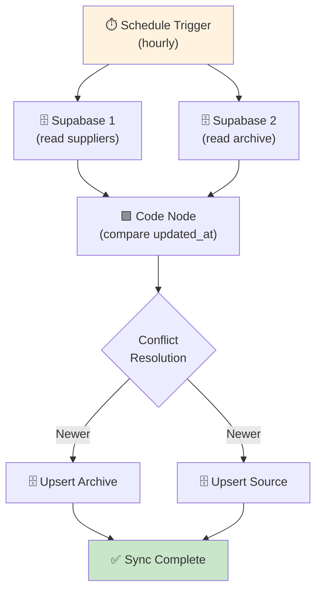
```mermaid
graph TD
    A["⏱️ Schedule Trigger<br/>(hourly)"] --> B1["🗄️ Supabase 1<br/>(read suppliers)"]
    A --> B2["🗄️ Supabase 2<br/>(read archive)"]
    B1 --> C["🟪 Code Node<br/>(compare updated_at)"]
    B2 --> C
    C --> D{"Conflict<br/>Resolution"}
    D -->|Newer| E["🗄️ Upsert Archive"]
    D -->|Newer| F["🗄️ Upsert Source"]
    E --> G["✅ Sync Complete"]
    F --> G

    style A fill:#fff3e0
    style G fill:#c8e6c9
```

??? success "Solution"

    1. **Schedule Trigger**: Every hour
    2. **Supabase** node 1: Get all from `suppliers` where `updated_at > last_sync`
    3. **Supabase** node 2: Get all from `supplier_archive` where `updated_at > last_sync`
    4. **Code** node (merge with conflict resolution):
       ```javascript
       // Newer updated_at wins
       const source = $('Supabase1').all().map(i => i.json);
       const archive = $('Supabase2').all().map(i => i.json);

       const toArchive = source.filter(s => {
         const a = archive.find(x => x.id === s.id);
         return !a || new Date(s.updated_at) > new Date(a.updated_at);
       });

       const toSource = archive.filter(a => {
         const s = source.find(x => x.id === a.id);
         return s && new Date(a.updated_at) > new Date(s.updated_at);
       });

       return [
         ...toArchive.map(r => ({ json: { ...r, direction: 'to_archive' } })),
         ...toSource.map(r => ({ json: { ...r, direction: 'to_source' } }))
       ];
       ```
    5. Split by `direction` → Upsert to appropriate table

---

## 11. Send Email with Template

- Build a workflow that sends a formatted PO confirmation email using HTML template with dynamic data.

## Scenario:

- Every approved PO triggers a confirmation email to the supplier with order details in a professional table format.

Hint: Webhook → Supabase (get PO + supplier) → Code (build HTML) → Send Email.

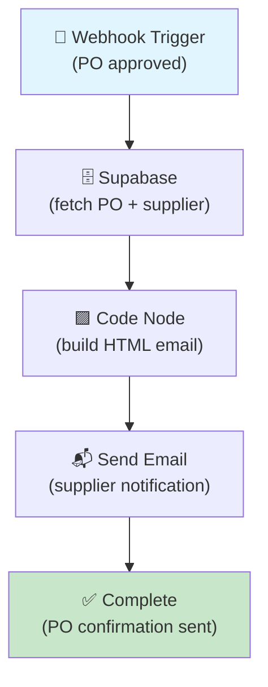
```mermaid
graph TD
    A["🔗 Webhook Trigger<br/>(PO approved)"] --> B["🗄️ Supabase<br/>(fetch PO + supplier)"]
    B --> C["🟪 Code Node<br/>(build HTML email)"]
    C --> D["📬 Send Email<br/>(supplier notification)"]
    D --> E["✅ Complete<br/>(PO confirmation sent)"]

    style A fill:#e1f5fe
    style E fill:#c8e6c9
```

??? success "Solution"

    1. **Webhook** (PO approved event)
    2. **Supabase**: Get PO details with line items
    3. **Code** node (HTML template):
       ```javascript
       const po = $input.first().json;
       const rows = po.items.map(i =>
         `<tr><td>${i.part}</td><td>${i.qty}</td><td>$${i.price}</td><td>$${i.qty * i.price}</td></tr>`
       ).join('');

       return [{
         json: {
           to: po.supplier_email,
           subject: `PO Confirmation: ${po.po_number}`,
           html: `<h2>Purchase Order ${po.po_number}</h2>
                  <p>Dear ${po.supplier_name},</p>
                  <p>We confirm the following order:</p>
                  <table border="1" cellpadding="8">
                    <tr><th>Item</th><th>Qty</th><th>Price</th><th>Total</th></tr>
                    ${rows}
                  </table>
                  <p><strong>Grand Total: $${po.total}</strong></p>
                  <p>Expected Delivery: ${po.delivery_date}</p>`
         }
       }];
       ```
    4. **Send Email** node with the built HTML

---

## 12. Send Email with Attachment

- Build a workflow that generates a CSV report and sends it as an email attachment.

## Scenario:

- Management receives a monthly supplier performance report as a CSV attachment.

Hint: Schedule → Query data → Code (build CSV) → Convert to binary → Email with attachment.

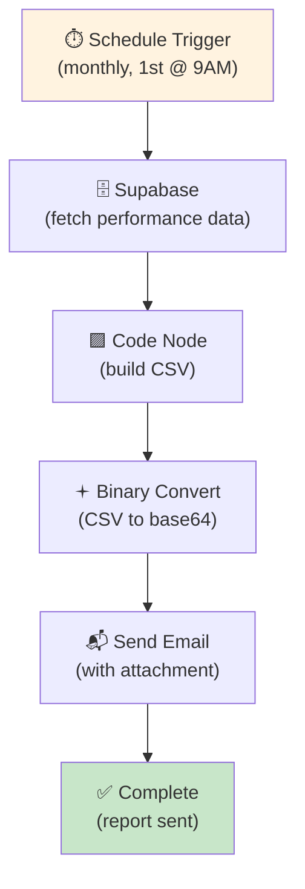
```mermaid
graph TD
    A["⏱️ Schedule Trigger<br/>(monthly, 1st @ 9AM)"] --> B["🗄️ Supabase<br/>(fetch performance data)"]
    B --> C["🟪 Code Node<br/>(build CSV)"]
    C --> D["🟄 Binary Convert<br/>(CSV to base64)"]
    D --> E["📬 Send Email<br/>(with attachment)"]
    E --> F["✅ Complete<br/>(report sent)"]

    style A fill:#fff3e0
    style F fill:#c8e6c9
```

??? success "Solution"

    1. **Schedule Trigger**: Monthly, 1st at 9 AM
    2. **Supabase**: Get supplier performance data
    3. **Code** node (build CSV):
       ```javascript
       const data = $input.all().map(i => i.json);
       const header = 'Supplier,Orders,On Time %,Avg Rating,Total Value\n';
       const rows = data.map(d =>
         `"${d.name}",${d.order_count},${d.on_time_pct}%,${d.avg_rating},${d.total_value}`
       ).join('\n');

       return [{
         json: { subject: 'Monthly Supplier Report' },
         binary: {
           data: {
             data: Buffer.from(header + rows).toString('base64'),
             mimeType: 'text/csv',
             fileName: `supplier-report-${new Date().toISOString().slice(0,7)}.csv`
           }
         }
       }];
       ```
    4. **Send Email** with binary attachment

---

## 13. CSV Import Pipeline

- Build a complete CSV import pipeline: upload via webhook, parse, validate, insert valid rows, report errors.

## Scenario:

- Procurement staff upload CSV files of new suppliers. The workflow must validate and import them safely.

Hint: Webhook (file upload) → Spreadsheet File → Code (validate) → Split (valid/invalid) → DB + Error report.

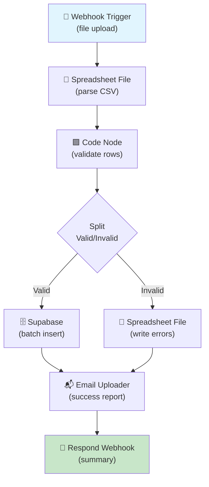
```mermaid
graph TD
    A["🔗 Webhook Trigger<br/>(file upload)"] --> B["📄 Spreadsheet File<br/>(parse CSV)"]
    B --> C["🟪 Code Node<br/>(validate rows)"]
    C --> D{"Split<br/>Valid/Invalid"}
    D -->|Valid| E["🗄️ Supabase<br/>(batch insert)"]
    D -->|Invalid| F["📄 Spreadsheet File<br/>(write errors)"]
    E --> G["📬 Email Uploader<br/>(success report)"]
    F --> G
    G --> H["🔗 Respond Webhook<br/>(summary)"]

    style A fill:#e1f5fe
    style H fill:#c8e6c9
```

??? success "Solution"

    1. **Webhook** (POST, receives file as binary)
    2. **Spreadsheet File** node: Parse CSV
    3. **Code** node (validate each row):
       ```javascript
       const valid = [], errors = [];
       for (const item of $input.all()) {
         const row = item.json;
         const issues = [];
         if (!row.name) issues.push('name required');
         if (row.email && !/^[^\s@]+@[^\s@]+\.[^\s@]+$/.test(row.email))
           issues.push('invalid email');

         if (issues.length === 0) valid.push({ json: row });
         else errors.push({ json: { ...row, _errors: issues.join('; ') } });
       }
       return [valid, errors]; // Two outputs
       ```
    4. **Output 1** (valid): Supabase batch insert
    5. **Output 2** (errors): Spreadsheet File (write CSV) → Email to uploader
    6. **Respond to Webhook**: `{ imported: X, errors: Y }`

---

## 14. PDF Document Generation

- Build a workflow that generates a PO document as a PDF using an HTML-to-PDF service.

## Scenario:

- Approved POs need to be converted to PDF format for sending to suppliers.

Hint: Webhook → Build HTML → HTTP Request to PDF API → Save binary → Email.

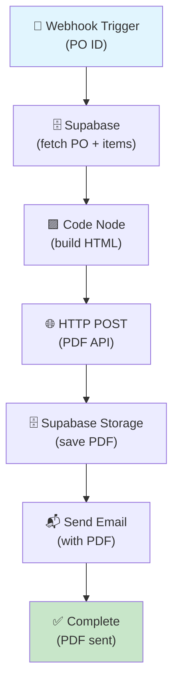
```mermaid
graph TD
    A["🔗 Webhook Trigger<br/>(PO ID)"] --> B["🗄️ Supabase<br/>(fetch PO + items)"]
    B --> C["🟪 Code Node<br/>(build HTML)"]
    C --> D["🌐 HTTP POST<br/>(PDF API)"]
    D --> E["🗄️ Supabase Storage<br/>(save PDF)"]
    E --> F["📬 Send Email<br/>(with PDF)"]
    F --> G["✅ Complete<br/>(PDF sent)"]

    style A fill:#e1f5fe
    style G fill:#c8e6c9
```

??? success "Solution"

    1. **Webhook** (PO ID)
    2. **Supabase**: Get PO + line items + supplier
    3. **Code**: Build professional HTML document (see Lab 006)
    4. **HTTP Request** to a PDF API (e.g., `https://api.pdfshift.io/v3/convert/pdf`):
       - Method: POST
       - Auth: API key
       - Body: `{ "source": "{{ $json.html }}" }`
       - Response format: Binary
    5. **Supabase Storage**: Upload PDF to `po-documents` bucket
    6. **Send Email**: Attach PDF to supplier notification

---

## 15. AI Classification Node

- Build a workflow that uses Claude to classify incoming support tickets by category and priority.

## Scenario:

- Support tickets arrive in free text. AI classifies them so they're automatically routed.

Hint: Webhook → AI Agent node → Code (parse response) → Switch (route by category).

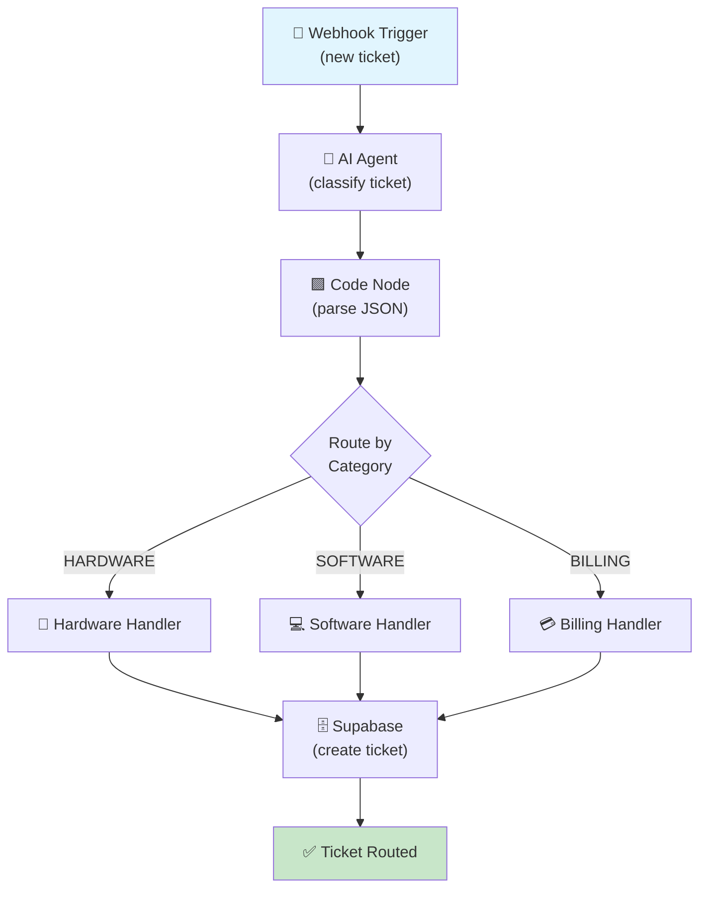
```mermaid
graph TD
    A["🔗 Webhook Trigger<br/>(new ticket)"] --> B["🤖 AI Agent<br/>(classify ticket)"]
    B --> C["🟪 Code Node<br/>(parse JSON)"]
    C --> D{"Route by<br/>Category"}
    D -->|HARDWARE| E["🚧 Hardware Handler"]
    D -->|SOFTWARE| F["💻 Software Handler"]
    D -->|BILLING| G["💳 Billing Handler"]
    E --> H["🗄️ Supabase<br/>(create ticket)"]
    F --> H
    G --> H
    H --> I["✅ Ticket Routed"]

    style A fill:#e1f5fe
    style I fill:#c8e6c9
```

??? success "Solution"

    1. **Webhook** (new ticket)
    2. **AI Agent** (Claude):
       ```
       Classify this support ticket for an instrumentation company.

       Categories: HARDWARE, SOFTWARE, CALIBRATION, DELIVERY, BILLING, OTHER
       Priority: LOW, MEDIUM, HIGH, CRITICAL

       Ticket: {{ $json.body.description }}
       Customer: {{ $json.body.company }}

       Return JSON only: { "category": "...", "priority": "...", "summary": "..." }
       ```
    3. **Code**: Parse JSON from AI response
    4. **Switch** on `category` → Route to different handlers
    5. **Supabase**: Create ticket record with AI classification

---

## 16. AI Data Extraction

- Build a workflow that extracts structured supplier info from unstructured email text using AI.

## Scenario:

- Supplier introduction emails contain contact info, product catalogs, and pricing scattered in free text.

Hint: Email Trigger → AI Agent (extract to JSON schema) → Validate → Supabase insert.

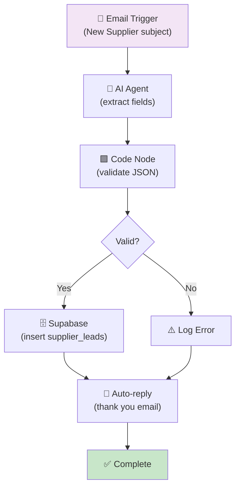
```mermaid
graph TD
    A["📧 Email Trigger<br/>(New Supplier subject)"] --> B["🤖 AI Agent<br/>(extract fields)"]
    B --> C["🟪 Code Node<br/>(validate JSON)"]
    C --> D{"Valid?"}
    D -->|Yes| E["🗄️ Supabase<br/>(insert supplier_leads)"]
    D -->|No| F["⚠️ Log Error"]
    E --> G["📧 Auto-reply<br/>(thank you email)"]
    F --> G
    G --> H["✅ Complete"]

    style A fill:#f3e5f5
    style H fill:#c8e6c9
```

??? success "Solution"

    1. **Email Trigger** (IMAP, watch for "New Supplier" subject)
    2. **AI Agent** (Claude):
       ```
       Extract supplier information from this email.
       Return a JSON object:
       {
         "company_name": "",
         "contact_name": "",
         "email": "",
         "phone": "",
         "country": "",
         "products": ["list of products mentioned"],
         "pricing_mentioned": true/false,
         "website": ""
       }
       Set null for fields not found. Email body:
       {{ $json.text }}
       ```
    3. **Code**: Parse and validate extracted JSON
    4. **Supabase**: Insert into `supplier_leads` table
    5. **Email**: Auto-reply with "Thank you, we'll review your info"

---

## 17. AI Report Generation

- Build a workflow that generates a natural-language weekly procurement report using AI.

## Scenario:

- Management wants a human-readable report, not raw data dumps.

Hint: Schedule → Query multiple tables → Merge → AI Agent (generate report) → Email.

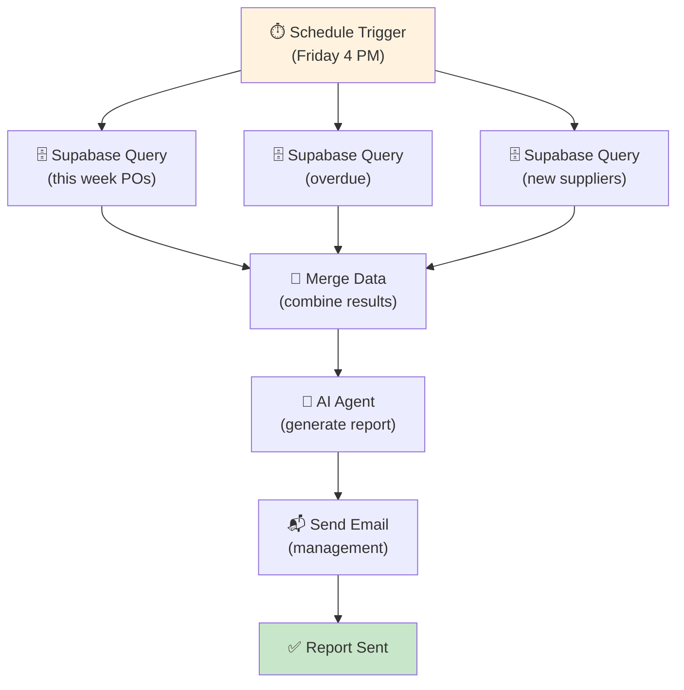
```mermaid
graph TD
    A["⏱️ Schedule Trigger<br/>(Friday 4 PM)"] --> B1["🗄️ Supabase Query<br/>(this week POs)"]
    A --> B2["🗄️ Supabase Query<br/>(overdue)"]
    A --> B3["🗄️ Supabase Query<br/>(new suppliers)"]
    B1 --> C["🤗 Merge Data<br/>(combine results)"]
    B2 --> C
    B3 --> C
    C --> D["🤖 AI Agent<br/>(generate report)"]
    D --> E["📬 Send Email<br/>(management)"]
    E --> F["✅ Report Sent"]

    style A fill:#fff3e0
    style F fill:#c8e6c9
```

??? success "Solution"

    1. **Schedule Trigger**: Friday 4 PM
    2. **Supabase** (parallel queries):
       - This week's POs (count, total value)
       - Overdue deliveries
       - New suppliers added
       - Top 5 spending categories
    3. **Merge** all data
    4. **AI Agent** (Claude):
       ```
       Write a weekly procurement report for Elcon management.
       Be concise and professional. Use this structure:
       1. Executive Summary (3 sentences)
       2. Key Metrics (use a table)
       3. Highlights
       4. Concerns
       5. Recommended Actions

       Data: {{ JSON.stringify($json) }}
       ```
    5. **Code**: Wrap in HTML email template
    6. **Send Email**: To management distribution list

---

## 18. Error Handling: Retry and Fallback

- Build a workflow that calls an external API with retry logic and a fallback when all retries fail.

## Scenario:

- External APIs are unreliable. Your workflow must handle failures gracefully.

Hint: Configure retry on the HTTP node, add an Error branch that routes to a fallback.

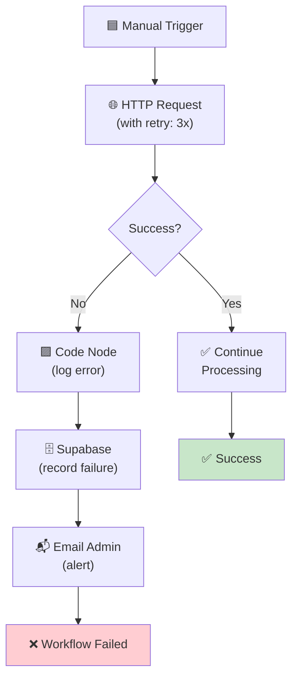
```mermaid
graph TD
    A["🟦 Manual Trigger"] --> B["🌐 HTTP Request<br/>(with retry: 3x)"]
    B --> C{"Success?"}
    C -->|Yes| D["✅ Continue<br/>Processing"]
    C -->|No| E["🟪 Code Node<br/>(log error)"]
    E --> F["🗄️ Supabase<br/>(record failure)"]
    F --> G["📬 Email Admin<br/>(alert)"]
    G --> H["❌ Workflow Failed"]
    D --> I["✅ Success"]

    style I fill:#c8e6c9
    style H fill:#ffcdd2
```

??? success "Solution"

    1. **Manual Trigger**
    2. **HTTP Request** node:
       - Settings → On Error: **Continue (Using Error Output)**
       - Retry on Fail: **3 times**
       - Wait Between Retries: **1000ms** (exponential backoff)
    3. **IF** node: Check `{{ $json.error }}` exists
       - **True** (error):
         - **Code**: Log error details
         - **Supabase**: Insert into `failed_api_calls` table
         - **Email**: Alert admin
       - **False** (success): Continue normal processing

---

## 19. Error Workflow: Global Catcher

- Create a global error workflow that catches failures from ALL workflows and sends alerts.

## Scenario:

- You need centralized error monitoring across all n8n workflows.

Hint: Use the Error Trigger node. Set this workflow as the error workflow in n8n Settings.

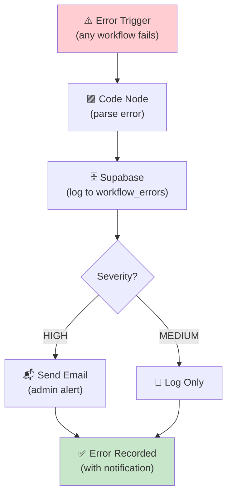
```mermaid
graph TD
    A["⚠️ Error Trigger<br/>(any workflow fails)"] --> B["🟪 Code Node<br/>(parse error)"]
    B --> C["🗄️ Supabase<br/>(log to workflow_errors)"]
    C --> D{"Severity?"}
    D -->|HIGH| E["📬 Send Email<br/>(admin alert)"]
    D -->|MEDIUM| F["📝 Log Only"]
    E --> G["✅ Error Recorded<br/>(with notification)"]
    F --> G

    style A fill:#ffcdd2
    style G fill:#c8e6c9
```

??? success "Solution"

    1. **Error Trigger** (fires on any workflow failure)
    2. **Code** node:
       ```javascript
       const error = $input.first().json;
       return [{
         json: {
           workflow_name: error.workflow.name,
           error_message: error.execution.error.message,
           failed_node: error.execution.lastNodeExecuted,
           execution_id: error.execution.id,
           timestamp: new Date().toISOString(),
           severity: error.execution.error.message.includes('timeout') ? 'HIGH' : 'MEDIUM'
         }
       }];
       ```
    3. **Supabase**: Insert into `workflow_errors` table
    4. **IF** severity is HIGH → **Send Email** to admin
    5. Set in **n8n Settings** → Error Workflow → Select this workflow

---

## 20. Sub-Workflow: Reusable Component

- Create a reusable "Send Notification" sub-workflow that can be called from any other workflow.

## Scenario:

- Multiple workflows need to send notifications. Instead of duplicating logic, create a reusable component.

Hint: Use Execute Workflow Trigger in the sub-workflow, and Execute Workflow node in callers.

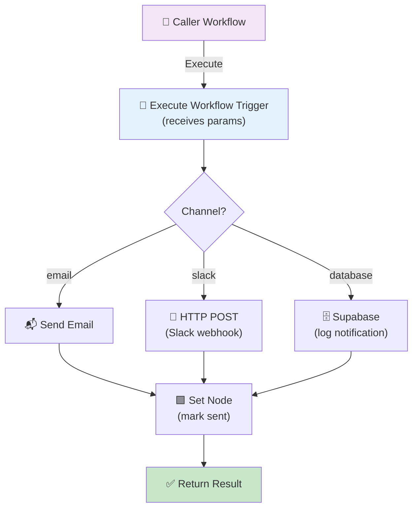
```mermaid
graph TD
    A["🔗 Execute Workflow Trigger<br/>(receives params)"] --> B{"Channel?"}
    B -->|email| C["📬 Send Email"]
    B -->|slack| D["💬 HTTP POST<br/>(Slack webhook)"]
    B -->|database| E["🗄️ Supabase<br/>(log notification)"]
    C --> F["🟩 Set Node<br/>(mark sent)"]
    D --> F
    E --> F
    F --> G["✅ Return Result"]

    style A fill:#e3f2fd
    style G fill:#c8e6c9

    H["🔗 Caller Workflow"] -->|Execute| A

    style H fill:#f3e5f5
```

??? success "Solution"

    **Sub-Workflow: "Send Notification"**
    1. **Execute Workflow Trigger**: Receives `{ channel, to, subject, body, severity }`
    2. **Switch** on `channel`:
       - `email` → **Send Email** node
       - `slack` → **HTTP Request** (Slack webhook)
       - `database` → **Supabase** insert into `notifications`
    3. Each branch → **Set** node with `{ sent: true, channel, timestamp }`

    **Caller Workflow:**
    1. ... your workflow logic ...
    2. **Execute Workflow** node:
       - Workflow: "Send Notification"
       - Input: `{ channel: "email", to: "admin@elcon.co.il", subject: "PO Alert", body: "..." }`

---

## 21. Batch Processing with Split

- Build a workflow that processes 500 supplier records in batches of 50, with a pause between batches.

## Scenario:

- Bulk API calls need rate limiting. Process in batches to avoid overwhelming the target system.

Hint: Use Split In Batches node with batch size 50, add a Wait node between batches.

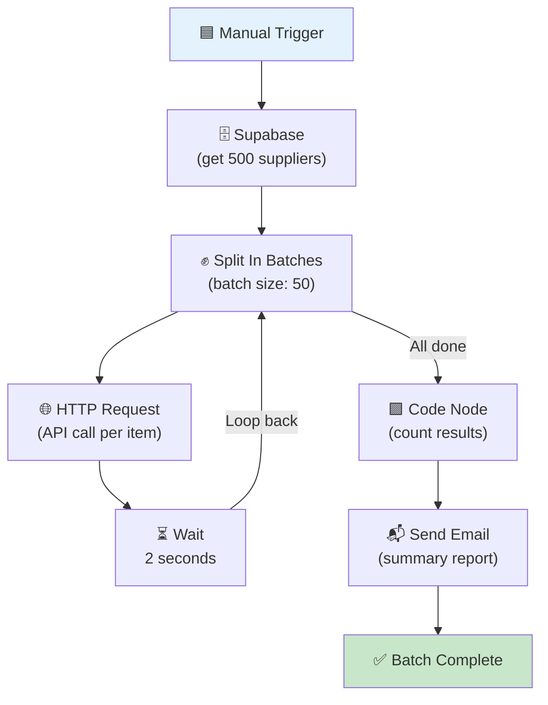
```mermaid
graph TD
    A["🟦 Manual Trigger"] --> B["🗄️ Supabase<br/>(get 500 suppliers)"]
    B --> C["✊ Split In Batches<br/>(batch size: 50)"]
    C --> D["🌐 HTTP Request<br/>(API call per item)"]
    D --> E[⏳ Wait<br/>2 seconds]
    E -->|Loop back| C
    C -->|All done| F["🟪 Code Node<br/>(count results)"]
    F --> G["📬 Send Email<br/>(summary report)"]
    G --> H["✅ Batch Complete"]

    style A fill:#e3f2fd
    style H fill:#c8e6c9
```

??? success "Solution"

    1. **Manual Trigger**
    2. **Supabase**: Get all 500 suppliers
    3. **Split In Batches**: Batch size = 50
    4. **HTTP Request**: Call external API for each batch item
    5. **Wait**: 2 seconds (between batches)
    6. Loop back to **Split In Batches** (automatic)
    7. After all batches: **Code** (count results) → **Email** (summary report)

---

## 22. Webhook API: CRUD Endpoints

- Build 4 webhook workflows that together form a complete REST API for suppliers.

## Scenario:

- Your frontend needs API endpoints. Use n8n webhooks as a lightweight API layer.

Hint: Create 4 separate workflows, one for each CRUD operation.

```mermaid
graph TD
    A1["🔗 GET /api/suppliers"] --> B1["🗄️ Supabase Query"] --> C1["🔗 Response 200<br/>(data + meta)"]
    A2["🔗 POST /api/suppliers"] --> B2["🟪 Validate"] --> C2["🗄️ Insert"] --> D2["🔗 Response 201"]
    A3["🔗 PATCH /api/suppliers"] --> B3["🟪 Extract ID"] --> C3["🗄️ Update"] --> D3["🔗 Response 200"]
    A4["🔗 DELETE /api/suppliers"] --> B4["🟪 Soft Delete"] --> C4["🗄️ Mark Inactive"] --> D4["🔗 Response 200"]

    style A1 fill:#e1f5fe
    style A2 fill:#e1f5fe
    style A3 fill:#e1f5fe
    style A4 fill:#e1f5fe
    style C1 fill:#c8e6c9
    style D2 fill:#c8e6c9
    style D3 fill:#c8e6c9
    style D4 fill:#c8e6c9
```

??? success "Solution"

    **Workflow 1: List Suppliers**
    1. **Webhook**: GET `/api/suppliers`
    2. **Supabase**: Get Many with pagination (`?page=1&limit=20`)
    3. **Respond to Webhook**: `{ data: [...], meta: { total, page, limit } }`

    **Workflow 2: Create Supplier**
    1. **Webhook**: POST `/api/suppliers`
    2. **Code**: Validate input
    3. **Supabase**: Insert
    4. **Respond to Webhook**: 201 `{ data: {...} }`

    **Workflow 3: Update Supplier**
    1. **Webhook**: PATCH `/api/suppliers`
    2. **Supabase**: Update where `id` matches body.id
    3. **Respond to Webhook**: 200 `{ data: {...} }`

    **Workflow 4: Delete Supplier**
    1. **Webhook**: DELETE `/api/suppliers`
    2. **Supabase**: Update `is_active = false` where `id` matches
    3. **Respond to Webhook**: 200 `{ message: "Deleted" }`

---

## 23. Scheduled Report Pipeline

- Build a complete reporting pipeline: daily data collection → weekly aggregation → monthly summary email.

## Scenario:

- Elcon needs multi-level reporting: daily snapshots feed weekly reports, which feed monthly summaries.

Hint: 3 workflows: Daily Collector → Weekly Aggregator → Monthly Report.

```mermaid
graph TD
    A["⏱️ Daily Collector<br/>(11 PM)"] --> B1["🗄️ Supabase<br/>(count today)"]
    B1 --> C1["🗄️ Insert daily_metrics"]

    D["⏱️ Weekly Aggregator<br/>(Sun midnight)"] --> B2["🗄️ Supabase<br/>(read 7 days)"]
    B2 --> C2["🟪 Code<br/>(calculate trends)"]
    C2 --> D2["🗄️ Insert weekly_metrics"]

    E["⏱️ Monthly Report<br/>(1st @ 8 AM)"] --> B3["🗄️ Supabase<br/>(read 4-5 weeks)"]
    B3 --> C3["🤖 AI Agent<br/>(generate summary)"]
    C3 --> D3["📬 Send Email<br/>(management)"]

    C1 --> D
    D2 --> E

    style A fill:#fff3e0
    style D fill:#fff3e0
    style E fill:#fff3e0
    style D3 fill:#c8e6c9
```

??? success "Solution"

    **Workflow 1: Daily Collector (runs daily 11 PM)**
    1. **Schedule**: Daily 11 PM
    2. **Supabase**: Count today's POs, deliveries, issues
    3. **Supabase**: Insert into `daily_metrics` table

    **Workflow 2: Weekly Aggregator (runs Sunday midnight)**
    1. **Schedule**: Sundays midnight
    2. **Supabase**: Get `daily_metrics` for past 7 days
    3. **Code**: Calculate averages, trends, totals
    4. **Supabase**: Insert into `weekly_metrics` table

    **Workflow 3: Monthly Summary (runs 1st of month)**
    1. **Schedule**: 1st of month, 8 AM
    2. **Supabase**: Get `weekly_metrics` for past 4-5 weeks
    3. **AI Agent**: Generate natural language summary
    4. **Send Email**: Monthly management report with charts

---

## 24. Multi-Channel Notification Hub

- Build a centralized notification system that routes alerts to email, Slack, and database based on severity.

## Scenario:

- Different events need different notification channels. Critical goes everywhere, info just gets logged.

Hint: Webhook input → Switch on severity → Parallel sends → Log all.

```mermaid
graph TD
    A["🔗 Webhook Trigger<br/>(POST /notify)"] --> B["🗄️ Supabase<br/>(log all)"] --> C{"Severity?"}

    C -->|CRITICAL| D["📬 Email ALL<br/>+ 💬 Slack<br/>+ 🗄️ DB"]
    C -->|HIGH| E["📬 Email<br/>+ 🗄️ DB"]
    C -->|MEDIUM| F["📬 Email<br/>(primary only)"]
    C -->|LOW| G["🗄️ DB Only<br/>(logged)"]

    D --> H["🗄️ Update Status<br/>(delivery tracked)"]
    E --> H
    F --> H
    G --> H
    H --> I["✅ Complete"]

    style A fill:#e1f5fe
    style I fill:#c8e6c9
```

??? success "Solution"

    1. **Webhook**: POST `/notify` with `{ type, title, body, severity, recipients }`
    2. **Supabase**: Always log to `notifications` table
    3. **Switch** on `severity`:
       - `critical`: Email ALL recipients + Slack #alerts + Supabase
       - `high`: Email recipients + Supabase
       - `medium`: Email primary recipient + Supabase
       - `low`: Supabase only (logged but no active notification)
    4. Each email/Slack branch runs in parallel
    5. **Merge** all results → **Supabase**: Update notification with delivery status

---

## 25. Complete Order Processing Workflow

- Build an end-to-end order processing workflow: receive order → validate → check inventory → approve → notify supplier → track delivery.

## Scenario:

- This is a real-world production workflow combining everything you've learned.

Hint: Chain all the patterns: webhook, validation, database, conditional routing, email, error handling.

```mermaid
graph TD
    A["🔗 Webhook: POST /order"] --> B["🟪 Code<br/>(validate)"] --> C{"Valid?"}
    C -->|No| Z1["🔗 Response 400"]
    C -->|Yes| D["🗄️ Supabase<br/>(check inventory)"]

    D --> E["🟪 Code<br/>(check stock)"] --> F{"Sufficient?"}

    F -->|No| G["🗄️ Create Backorder<br/>+ 📬 Notify Procurement"]
    F -->|Yes| H["🟪 Code<br/>(gen PO #)"]

    H --> I["🗄️ Insert PO<br/>+ Insert Items"]

    I --> J{"Amount?"}
    J -->|<$1K| K1["✅ Auto-approve"]
    J -->|$1K-$10K| K2["💬 Manager Approval"]
    J -->|>$10K| K3["💬 Director Approval"]

    K1 --> L["🌐 HTTP: Notify Supplier<br/>+ 📬 Confirmation Email"]
    K2 --> L
    K3 --> L
    G --> L

    L --> M["🗄️ Update Status<br/>(PO Sent)"]
    M --> N["🔗 Response 200<br/>(order accepted)"]

    style A fill:#e1f5fe
    style N fill:#c8e6c9
    style Z1 fill:#ffcdd2
```

??? success "Solution"

    1. **Webhook**: POST `/order/submit`
    2. **Code**: Validate order (items, quantities, required fields)
    3. **IF** invalid → **Respond to Webhook** (400, validation errors)
    4. **Supabase**: Check inventory for all items
    5. **Code**: Flag items below stock threshold
    6. **IF** stock sufficient:
       - **True**: Auto-generate PO number → Insert PO → Insert line items
       - **False**: Create backorder record → Notify procurement team
    7. **Switch** on PO amount (approval routing):
       - < $1K → Auto-approve
       - $1K-$10K → Email manager for approval (with approval webhook link)
       - > $10K → Email director
    8. After approval: **HTTP Request** → Notify supplier API
    9. **Supabase**: Update PO status to "Sent"
    10. **Schedule Trigger** (separate workflow): Daily check for delivery updates
    11. **Error Workflow**: Global catcher logs and alerts on any failure
    12. **Respond to Webhook**: `{ po_number, status, estimated_delivery }`
